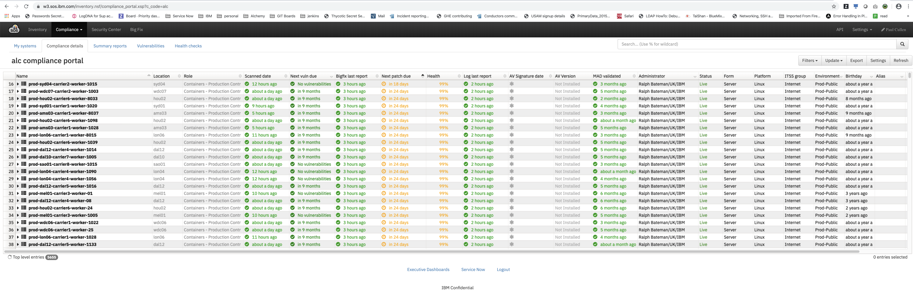
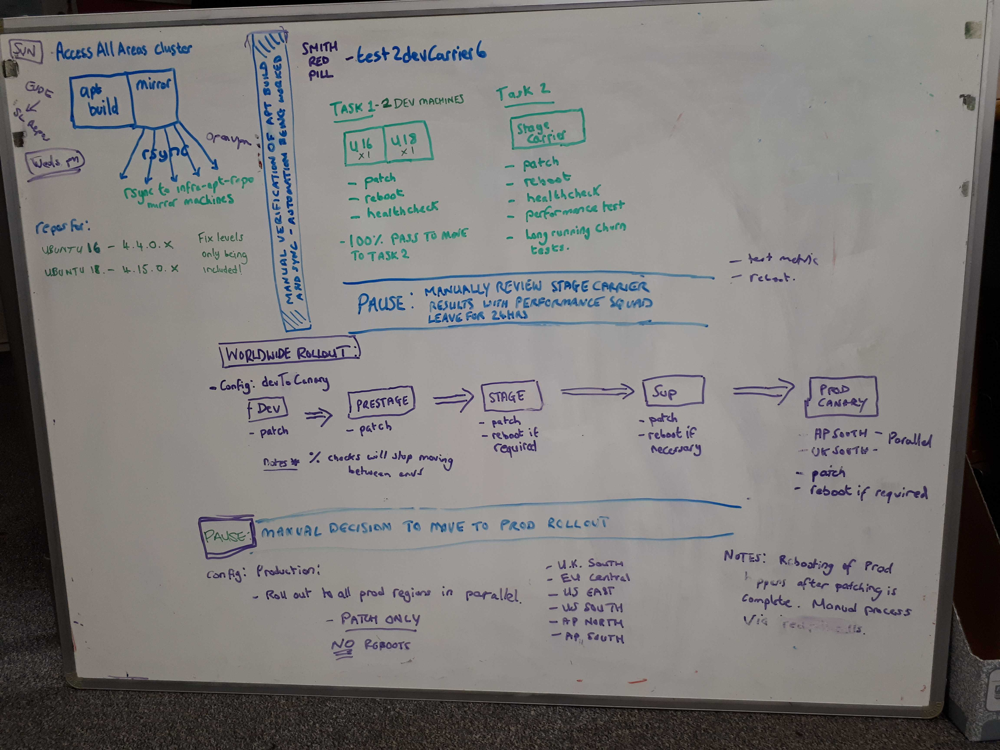

Informational
{: .label }

## Overview/Purpose of Runbook

This runbook describes the Patch Process for Armada/Alchemy machines.

## Introduction

Patching is critical process for keeping the OS stable and secure, but if not implemented in a controlled manner can create lots of problems with the applications running on the machine. This process defines a patching strategy to minimize disruption to customers and increase the stability of our application. 

The patch process is implemented for debian based machines, primarily focussed on ubuntu.

## Objectives
- **Fast** - We should be able to create a new set of patches, test them, patch the entire fleet of production machines within 7 days.
- **fully automated** - As we need to patching frequently (at least weekly), we cannot spare the headcount to dedicate to this all the time.
- **massively parallel** - to patch all the machines in production in the timescale needed
- **resilient to failure** - failures are normal and expected, we should handle failures with retries and then call for human help if some machines look broken.
- **environment sensitive** - so that only 1 machine in a cluster is patched at a time, to minimise the risk of multiple machines going offline at the same time.
- **persist state** - tolerate patch process crashes or terminations, allowing state to be recovered and patching to resume from where it stopped
- **auditable** - we need to be able to say what patches were applied to which machines when.
- **dynamic** - machines are being added to and removed from production all the time, we need to patch all machines that are present, and not miss any.


## How do we tell if we have patches nearly due?
The [SOS Inventory](https://w3.sos.ibm.com/inventory.nsf/compliance_portal.xsp?c_code=alc) should be reviewed each week

Example screenshot
{:height="75%" width="75%"}

Before following the patch procedure, it's recommended to review the status of all IKS machines to see what time scale we have to perform the patching in.
Sort the listing of `ALC` machine by `Next patch due` date to see the shortest time available.

We adhere to the timelines described in [ITSS Remediation and patching policy](https://pages.github.ibm.com/ciso-psg/main/standards/itss.html#673-remediation-and-patching).

## Monitoring for compliance

We have two jenkins jobs which run daily to assist keeping compliant.
Runbooks will be created to help deal with alerts/issues generated by these jobs

- [Check for overdue patches](https://alchemy-conductors-jenkins.swg-devops.com/view/Conductors/job/Conductors/job/Security-Compliance/job/compliance-bigfix-overdue-patches/)
- [Check for patches due within 7 days](https://alchemy-conductors-jenkins.swg-devops.com/view/Conductors/job/Conductors/job/Security-Compliance/job/compliance-bigfix-patches-approaching-due-date/)

## Summary
The Automated tool that manages this process is called `smith`  
_For a list of its components see: [GHE](https://github.ibm.com/alchemy-conductors?utf8=%E2%9C%93&q=smith&type=&language=)_

Smith consists of several major components:
- [smith-packages](https://github.ibm.com/alchemy-conductors/smith-packages)
   1. gathering the fixes needed
   1. packaging them up into an `apt` repo build
   1. syncing that build to mirrors across the world.
- [smith-trigger-service](https://github.ibm.com/alchemy-conductors/smith-trigger-service)
   1. upgrading the installed packages on machines to the specific set defined in the `apt` build.  
   _It records what machines have been patched, and when, in the associated ServiceNow change request ticket._
- [smith-agent](https://github.ibm.com/alchemy-conductors/smith-agent)
   1. short running agent started on the target machine (to be patched), responsible for running `apt` commands to achieve the patching
- [smith-red-pill](https://github.ibm.com/alchemy-conductors/smith-red-pill)
   1. for tying all the elements together
   1. automating the process end-to-end

### Deployment
The smith process is deployed as microservices in the AccessAllAreas cluster:

The following PODs make up the smith patching process.
1. `smith-trigger-service`
2. `smith-red-pill`

To access the `infra-accessallareas` cluster you require access to the 278445 IBM Cloud account.

- login with `ibmcloud login --sso`
- choose account:  
`IBM (800fae7a41e7d4a1ec1658cc0892d233) <-> 278445`
- run:  
`ibmcloud ks cluster config --cluster infra-accessallareas`
- then can run `kubectl` commands to check pods etc

## Detailed Information

This is the process form creating a new set of patches (smith build) to test and finally deploying across all IKS servers from dev through to production.

This should be performed *EVERY WEEK* in order to maintain security compliance.

### Build and sync

The build of a new apt-repo is triggered from the [smith package builder v2](https://alchemy-conductors-jenkins.swg-devops.com/job/Conductors/job/Conductors-Infrastructure/view/Smith%20Patching/job/SmithPackageBuilder-V2/) jenkins job  
_NB. The job is configured to run every week (Early hours of Sunday UTC)_

The job :
1. produces a numbered build with all the latest fixes in the resultant `apt` repo
1. syncs the builds to the worldwide `infra-apt-repo` mirrors

The build runs as a Kube job 

``` sh
$ kubectl get jobs
smith-builder-v2-1000   1/1           63m        110d
smith-sync-v2-11157     1/1           98m        2d18h
```

### Applying new patches

The deployment of a new set of patches is currently triggered manually by the SRE squad after the successful build and sync of a new apt repository (described above).

Each week, an engineer is assigned to co-ordinate and execute patching across our estate of machines.

The diagram shows the end-to-end strategy to safely test then roll out the new updates.

{:height="50%" width="50%"}

The following procedures are followed to roll out weekly patching;
- The procedure for triggering the patching/rebooting across all of our environments is detailed [here](./patching_rollout_procedure.html)
- Note that haproxy patching is no longer a separate step.

Here is a high level summary of the flow:

1. A new apt-repo is built, and synced to the `infra-apt-repo-mirror` servers
1. The sync process includes a verification step that the new build was successfully synced.
1. A build test phase is kicked off using config file `buildTestDevToStage`
   1. Patches a dev testing machine, reboots it and healthchecks it.
   1. Performs the following across a _subset (around 20-30 nodes, including carrier masters)_ of machines in each of dev, prestage, stgiks:
      - _patch, reboot if necessary, healthcheck_
   1. Performs patching + reboot if necessary for all remaining nodes in dev, prestage, stgiks
1. After test phase is complete we perform a **hard stop**
   1. Review the `buildTestDevToStage` results for any significant issues
   1. Wait for 24 hours before proceeding to patch production
   
#### Decision checkpoint
A decision is made to patch/reboot one production region.

- Patching and rebooting of `ap-south` is performed initially as a canary test.
  - This takes approximately 1 day.
  - Patch and reboot results are reviewed, and if no issues are found, we proceed to patch the rest of the production regions.

#### Decision checkpoint
A decision is made to patch/reboot the remainder of production.

- Rest of Production roll-out occurs in **parallel**
- Patching and rebooting of HA Proxy nodes is performed in two sets to avoid downtime:
  - The `*-haproxy01` nodes are patched and rebooted, in three phases of increasing numbers of carriers
  - The `*-haproxy02` nodes are patched and rebooted, in three phases of increasing numbers of carriers

## Audit requests

The [Patch Management Evidence for IDR Request](./patching_evidence_idr_request.html) runbook contains details on how to gather evidence for audit requests relating to patching.

## Escalation policy

Reach out in the [#sre-cfs-patching](https://ibm-argonauts.slack.com/archives/G53A0G8CU) channel.
