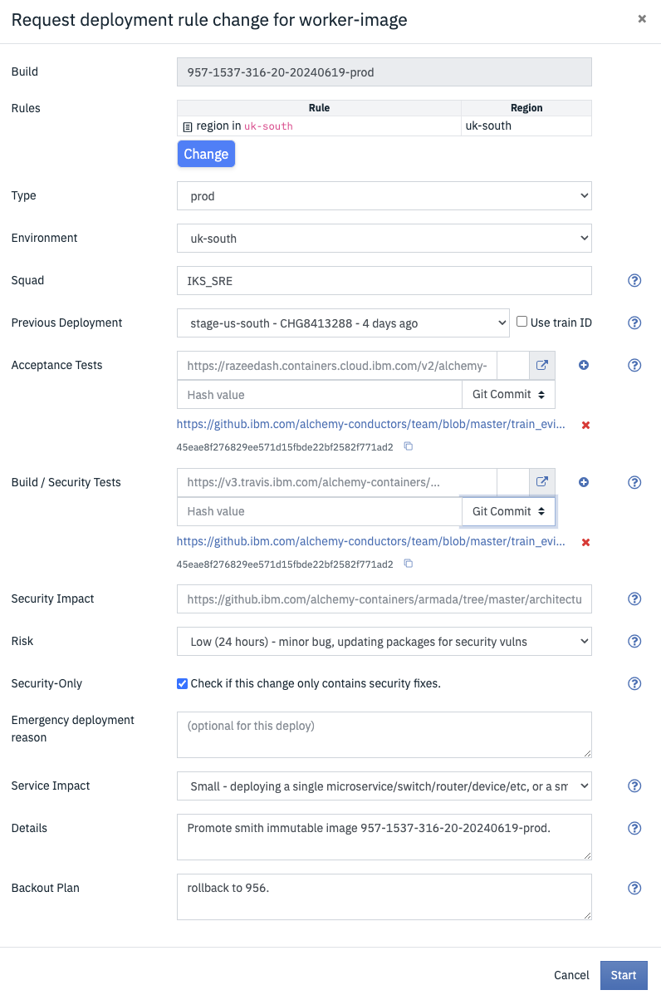

Informational
{: .label }

## Overview

This document describes the operations required for building and deploying carrier worker images (aka Immutable Image).

## Introduction

Building, promoting and deploying carrier worker images is a crucial part of the patching process, as the image used when reloading workers must be kept up to date and compliant.

The carrier worker image is used by chlorine when reloading workers, and is used by the [Carrier Auto-Recovery](https://github.ibm.com/alchemy-containers/ibm-worker-recovery) process to determine which worker nodes require a reload.

This document details the procedure to follow to complete the build and rollout of a carrier worker image.

## Detailed Information

## Carrier worker image build job

A new carrier worker image (aka Immutable Image) is built by the [oceanPI/job/immutable_image](https://alchemy-conductors-jenkins.swg-devops.com/job/Conductors/job/oceanPI/job/immutable_image/) jenkins job.


### When to build

The [oceanPI/job/immutable_image](https://alchemy-conductors-jenkins.swg-devops.com/job/Conductors/job/oceanPI/job/immutable_image/) jenkins job is automatically run as part of the smith build/sync process. It is triggered after a successful run of the [SmithPackageSync-v2](https://alchemy-conductors-jenkins.swg-devops.com/view/Conductors/job/Conductors/job/Conductors-Infrastructure/view/Smith%20Patching/job/SmithPackageSync-V2/) job.

If the scheduled job fails, review the failures and rebuild the job.

## Promotion flags

The image deployed to each environment is controlled via the [worker-image](https://razeeflags.containers.cloud.ibm.com/alchemy-containers/flags/default/production/worker-image) Razee flag.

The rules associated with the flag target different clusters and environments, to allow for a fully tested rollout through the following environments:

- `dev/prestage`
- `stage` (this is actually `stgiks` but is called `stage` in Razee)
- `prod`

Razee is a front-end to the Launch Darkly [worker-image/variations](https://app.launchdarkly.com/default/production/features/worker-image/variations) set.

The variation value is of this format:

```
{
  "dev": "8495980",
  "prod": "8496814",
  "prodfr2": "8496850",
  "stage": "8496586"
}
```

Each of the numbers above is the SoftLayer _image id_ corresponding to the immutable image build for that environment.

## Testing and promotion of a new image

After a successful build, the new immutable image is pushed to the `dev-sjc04-carrier12` rule in Razee. This is the first location for testing.

### Pre-stage testing

The following steps should be taken to complete pre-stage testing:

1. Three worker nodes in `dev-sjc04-carrier12` must be reloaded successfully with the new image
   - either using the `reload` command in `chlorine`
   - or wait for carrier autorecovery to reload workers (monitor [#bot-chlorine-logging](https://ibm-argonauts.slack.com/messages/CDG1R2D5Y))
1. Promote the new image to `dev-south` in [Razee](https://razeeflags.containers.cloud.ibm.com/alchemy-containers/flags/default/production/worker-image/multiregion).
1. Promote the new image to `prestage-mon01-carrier1` in [Razee](https://razeeflags.containers.cloud.ibm.com/alchemy-containers/flags/default/production/worker-image/multiregion).
1. Three worker nodes in `prestage-mon01-carrier1` must be reloaded successfully with the new image
   - either using the `reload` command in `chlorine`
   - or wait for carrier autorecovery to reload workers (monitor [#bot-chlorine-logging](https://ibm-argonauts.slack.com/messages/CDG1R2D5Y))
1. Promote the new image to `prestage-south` in [Razee](https://razeeflags.containers.cloud.ibm.com/alchemy-containers/flags/default/production/worker-image/multiregion).
1. Commit a new file in the [team/train_evidence/smith-immutable-image](https://github.ibm.com/alchemy-conductors/team/blob/master/train_evidence/smith-immutable-image/) directory of the Conductors Team repo.
   1. Use the following format for the name `immutableimage_532-1250-879-20210818_evidence.md` where `532-1250-879-20210818` is the immutable image build name.
   1. Populate the file with the following text, replacing the example values with the actual details used:
      - the actual image id for each environment
      - the actual machines used for testing the reloads
      - the actual train id raised for the reloads
      - the link to the correct `oceanPI/job/immutable_image` build
      - copy the console output from that job [evidence for successful build]
   
      `````
      ### Evidence for promotion of immutable image build `immutableimage_532-1250-879-20210818-prod`

      SoftLayer armada-worker image IDs:
      ```
      {
        "dev": "8495980",
        "prod": "8496814",
        "prodfr2": "8496850",
        "stage": "8496586"
      }
      ```
      
      All manual checks and tests have passed.
      
      ### Acceptance tests: dev/prestage reloads

      dev machines successfully reloaded:
      - CHG5530645: dev-sjc04-carrier12-worker-504
      - CHG5530651: dev-sjc04-carrier12-worker-1003
      - CHG5530653: dev-sjc04-carrier12-worker-8003
      
      prestage machines successfully reloaded:
      - CHG1317755: prestage-mon01-carrier1-worker-7005
      - CHG1317755: prestage-mon01-carrier1-worker-1011
      - CHG1317755: prestage-mon01-carrier1-worker-1002
      
      
      ### Image build and test log
      
      Immutable image bootstrap pipeline: https://alchemy-conductors-jenkins.swg-devops.com/job/Conductors/job/oceanPI/job/immutable_image/434/console
      
      ````
      <CONSOLE OUTPUT FROM THE JENKINS JOB>
      ````
      
      
      Razee promotion link: https://razeeflags.containers.cloud.ibm.com/alchemy-containers/flags/default/production/worker-image/multiregion
      
      Concept doc: https://github.ibm.com/alchemy-containers/armada/blob/master/architecture/guild/concept-docs/concept-doc-kernel-patching.md
      `````

### Stage testing

1. Promote the new image to `stage-dal10-carrier0` (this is actually `stgiks-dal10-carrier0`) in [Razee](https://razeeflags.containers.cloud.ibm.com/alchemy-containers/flags/default/production/worker-image/multiregion).
   1. In the Razee Request, fill in the following:
      - Use the link to the evidence file for `Acceptance Tests`
        - Fill in the `Hash value` as the commit hash from GHE
        - Change the `Hash type` drop-down to `Git Commit`
      - Use the link to the evidence file for `Build / Security Tests`
        - Fill in the `Hash value` as the commit hash from GHE
        - Change the `Hash type` drop-down to `Git Commit`
      - Security-Only please Check this box to include SecurityOnly on train.
        - Example screenshot
      
      - Use the following for the `Security Impact` link: `https://github.ibm.com/alchemy-containers/armada/blob/master/architecture/guild/concept-docs/concept-doc-kernel-patching.md`
      - In `Details`, use the following text: `Promoting immutable image build nnn-nnnn-nnn-nnnnnnnn-prod` (for example `532-1250-879-20210818-prod`)
      - In `Backout Plan`, use the following text: `Rollback to previous version`
   1. Click the `Start` button
   1. The train will be auto-approved, as it is a `stage` train
1. Three worker nodes in `stage-dal10-carrier0` must be reloaded successfully with the new image
   - either using the `reload` command in `chlorine`
   - or wait for carrier autorecovery to reload workers (monitor [#bot-chlorine-logging](https://ibm-argonauts.slack.com/messages/CDG1R2D5Y))
1. Update the evidence file to add in the following details after `prestage machines successfully reloaded`, replacing with the actual values:  
   
   ```
   ### Acceptance tests: stage reloads

   stage machines successfully reloaded:
   - CHG1321302: stgiks-dal10-carrier0-worker-1038
   - CHG1321302: stgiks-dal10-carrier0-worker-8004
   - CHG1321302: stgiks-dal10-carrier0-worker-1041
   ```
1. Promote the new image to `stage-south` in Razee.
   - In the Razee Request, use the same details as for the `stage-dal10-carrier0` promotion above, **EXCEPT** for the following difference:
   - Use the **latest** `Hash value` as the commit hash from GHE evidence file - this is the commit hash from adding the 3 `stgiks-dal10-carrier0-worker` worker nodes to the evidence file.

### Prod canary promotion

1. Wait 24 hours from the `stage-south` promotion in Razee.
1. Promote the new image to `ap-south` in Razee.
   1. As this is now a prod change, we must select a `Previous Deployment`
   1. Choose the `stage-us-south` deployment from above (the more recent of the two, corresponding to the `stage-south` promotion 24 hours ago)
   1. This should fill a value for both of the `Acceptance Tests` and `Build / Security Tests`
      - However since we have made a new commit to the evidence file, the git hash is no longer correct.
      - Delete the values for `Acceptance Tests` and `Build / Security Tests`
      - Add in links to the GHE evidence file, with the updated `Git Commit` hash from the stage commit.
   1. As this is a prod change, it will raise a prod train.
   1. Wait for the train to be approved, then start the deployment.
1. Wait a period of time (suggest 24 hours) 
   1. Monitor the [#bot-chlorine-logging](https://ibm-argonauts.slack.com/messages/CDG1R2D5Y) for `carrier autorecovery` entries in the `ap-south` region.
      - If there are failures, see below for help with investation.
   1. Monitor the [armada-infra - low - prod](https://ibm.pagerduty.com/services/PM2KE3Q?service_profile=1) PagerDuty service profile for `autorecovery_failed` alerts.
      - If there are alerts, see the associated [carrier-autorecovery-failure](https://pages.github.ibm.com/alchemy-conductors/documentation-pages/docs/runbooks/armada/carrier-autorecovery-failures.html) runbook.
   1. Check there there have been at least 10 successful reloads by carrier autorecovery before proceeding

### Promote to remainder of prod

1. If there are no issues with carrier autorecovery in `ap-south` in the time period, then proceed to promote to the remaining prod regions.

## Monitoring rollout

The [reportCarrierWorkerIaasImageCounts](https://alchemy-conductors-jenkins.swg-devops.com/view/Conductors/job/Conductors/job/Conductors-Infrastructure/job/reportCarrierWorkerIaasImageCounts/) Jenkins Job produces a simple report of how many images are active in each environment, and also breaks it down per-carrier. It runs every 6 hours.

For example the `prod-531277-counts.log` logfile below shows that a new image `8935154` has recently been promoted to prod:

```
# -----------------------------
# Image counts for this account
# -----------------------------
      7 8496814
   3232 8691272
   1532 8767160
     10 8935154
```

The corresponding per-carrier logfile `prod-531277-counts-per-carrier.log` shows all of the prod carriers, and in particular we can see `8935154` rolling out to `prod-syd carrier4`:

```
# CARRIER: prod-syd..-carrier4
     56 imageid:8691272
    151 imageid:8767160
     10 imageid:8935154
```

## Dealing with failures

Any failures must be investigated.

There may be issues at different stages:

- the immutable image build process:
  - we have seen timeouts being an issue here; sometimes a rebuild of the job will work
- worker reloads:
  - investigate as with any worker reload problems
  - check useful slack channels such as [#bot-chlorine-logging](https://ibm-argonauts.slack.com/messages/CDG1R2D5Y) and [#bootstrap-bot-alerts](https://ibm-argonauts.slack.com/archives/CCFDY4HDZ)

## Escalation policy

Post to the [sre-cfs-patching](https://ibm-argonauts.slack.com/archives/G53A0G8CU) channel or speak with the EU SRE squad who own this procedure.
