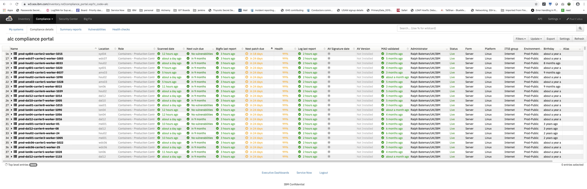

Informational
{: .label }

## Overview

This document describes the process for rebooting IKS servers after successfully completing patching through smith-red-pill.

## Introduction

Rebooting the IKS Servers is a crucial part of the patching process as a number of updates (for example: New kernel updates) will require a reboot before they are officially applied.

This document details the process we follow to complete the reboots.

It is perfectly safe to initiate the reboot at anytime as it is designed to reboot in a safe manner, and stop/halt at first failure in a set of machines it is tasked to reboot.

Unless decided otherwise (i.e. on going CIEs etc), reboots will be initiated concurrently as each reboot config file will safely reboot the machines within it in a pre-defined manner, stopping execution of reboots in a carrier at the first fatal error.

## Detailed Information

We use the [SOS compliance portal](https://w3.sos.ibm.com/inventory.nsf/compliance_portal.xsp?c_code=alc) to track patching status of our Alchemy servers.

We need to ensure that we apply patches before they go overdue.

The following screenshot is an example:

{:height="75%" width="75%"}

Before starting the reboot procedure, it's recommended to review the status of all IKS machines to see what time scale we have to perform the reboots in.
Sort the listing of `ALC` machine by patch due date to see the shortest time available.

We adhere to the timelimes described in [risk assessment policy](https://pages.github.ibm.com/ibmcloud/Security/policy/Risk-Assessment-Policy.html#vulnerability-management).

## Reboot strategy

We use the patching process to drive a safe set of reboots.  Separate configuration files exist which will first perform a repatch of all machines described in the bags, followed by a reboot request via igorina.

Multiple `smith-redpill` config files have been created which should **ONLY** be used with the `prod` apt-repo reference.

## The reboot config files explained

The config files for reboots are as follows and can be found [in red-pill-1337 GHE repo](https://github.ibm.com/alchemy-1337/smith-red-pill-creds/tree/master/smith-red-pill-test/smith-red-pill-test-configurations)

Below is part of a config file that is used by `smith redpill`.

The `smithbagname` is the name of the phases file in [smith-trigger-service phases](https://github.ibm.com/alchemy-conductors/smith-trigger-service/tree/master/phases) to be used for the regions in the list above it.

This example also shows that it'll attempt all of step 1, then if the tolerated error threshold is not exceeded, it'll move onto step 2 (rebooting hubs).
```
"steps": [
        {
            "stepName": "AP North - reboot spokes and patrols",
            "envName": "prod",
            "regions": [
                {
                    "name": "ap-north"
                }
            ],
            "stepToleratedFailureThreshold": 20,
            "smithbagname": "prod-reboot-spokes-patrols",
            "steptests": {
                "rebootifnecessary": true
            }
        },
        {
            "stepName": "AP North - reboot hubs",
            "envName": "prod",
            "regions": [
                {
                    "name": "ap-north"
                }
            ],
            "stepToleratedFailureThreshold": 20,
            "smithbagname": "prod-reboot-hubs",
            "steptests": {
                "rebootifnecessary": true
            }
        }

```

The [smith-trigger-service phase files which are defined here](https://github.ibm.com/alchemy-conductors/smith-trigger-service/tree/master/phases)

The reboots occur in each region in the following way:

- smith-trigger-service is called to patch and then reboot all `patrols and spokes` in parallel to the current `prod` level (which in theory should do nothing as we would have just completed patching and just updated the `prod` symlink)
- Once reboots complete, it will move onto re-patching and then rebooting the `hubs` in the region being targetted.  The hubs in each region run in series.  This phase takes the most amount of time.
- Once patching and reboots are completed for `hubs`, it will move onto re-patching and then rebooting the `master` machines in the region being targeted 
- Once re-patching and reboots are complete for `master` machines, `other/misc` nodes are targeted (i.e. infra, registry etc.).


## Invoking reboots

- Invoking the procedure creates GHEs in [smith-trigger-service](https://github.ibm.com/alchemy-conductors/smith-trigger-service) 

- The GHE will be updated by the smith-trigger-service application as patching and reboots complete.

- Example output written to a GHE will be similar to this.
```
Phase spoke_mil01-carrier8 started reboot of bag with machines: prod-mil01-carrier8-worker-1009, prod-mil01-carrier8-worker-8010, prod-mil01-carrier8-worker-1002, prod-mil01-carrier8-worker-1014, prod-mil01-carrier8-worker-1006, prod-mil01-carrier8-worker-1018, prod-mil01-carrier8-worker-02, prod-mil01-carrier8-worker-05, prod-mil01-carrier8-worker-8002, prod-mil01-carrier8-worker-1016, prod-mil01-carrier8-worker-1015, prod-mil01-carrier8-worker-8003, prod-mil01-carrier8-worker-1011, prod-mil01-carrier8-worker-04, prod-mil01-carrier8-worker-8009, prod-mil01-carrier8-worker-8007, prod-mil01-carrier8-worker-1004, prod-mil01-carrier8-worker-1013, prod-mil01-carrier8-worker-1012, prod-mil01-carrier8-worker-8012, prod-mil01-carrier8-worker-1017, prod-mil01-carrier8-worker-1001, prod-mil01-carrier8-worker-20, prod-mil01-carrier8-worker-1003, prod-mil01-carrier8-worker-01, prod-mil01-carrier8-worker-1008, prod-mil01-carrier8-worker-8001, prod-mil01-carrier8-worker-8011, prod-mil01-carrier8-worker-03, prod-mil01-carrier8-worker-8004, prod-mil01-carrier8-worker-8005, prod-mil01-carrier8-worker-1007, prod-mil01-carrier8-worker-19, prod-mil01-carrier8-worker-8008, prod-mil01-carrier8-worker-1010, prod-mil01-carrier8-worker-1005, prod-mil01-carrier8-worker-8006
Change ID: CHG0264425
```

- To manually follow status of reboots you can:
  - search for the Change ID in [#bot-igorina-logging](https://ibm-argonauts.slack.com/messages/CDG1R2D5Y)  - You should find a thread related to the change number where igorina will log progress of the reboot attempts; or
  - DM igorina with `task status [ChangeID]` - this will report the current status of the reboot


## Escalation policy

Reach out in the [#sre-cfs-patching](https://ibm-argonauts.slack.com/archives/G53A0G8CU) channel.