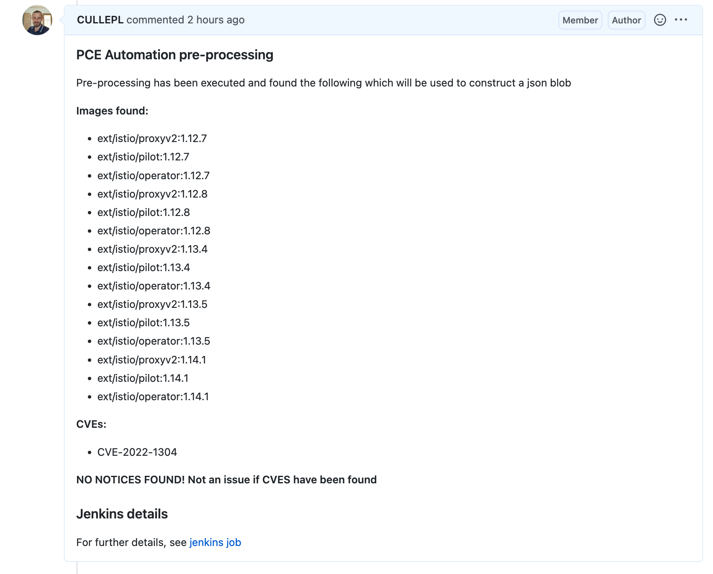
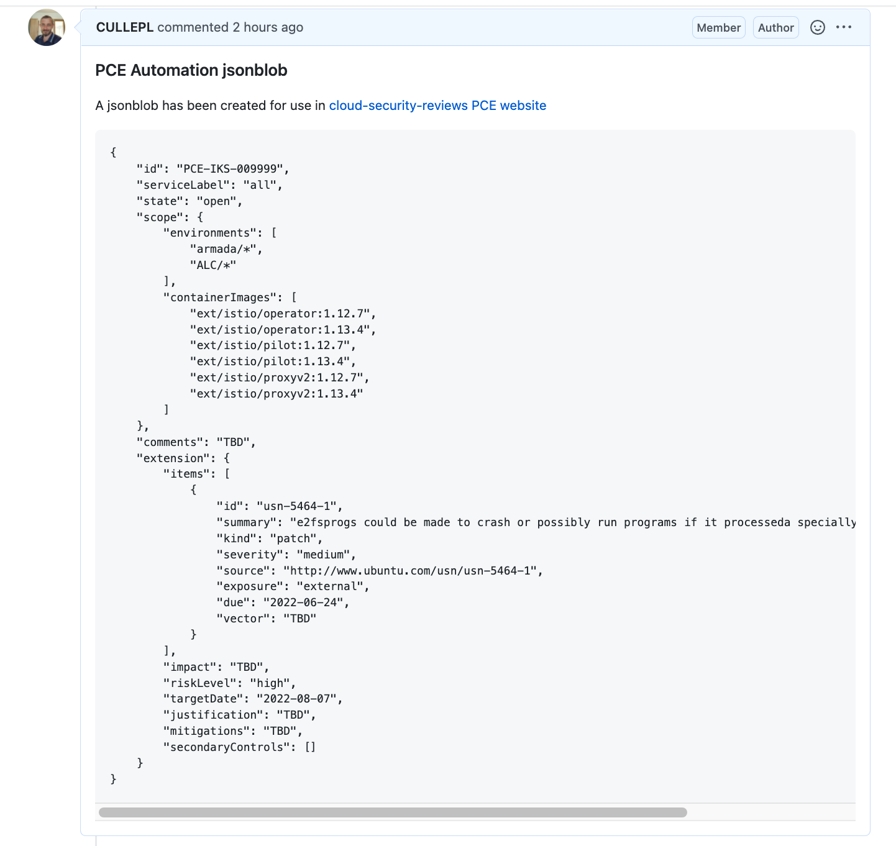
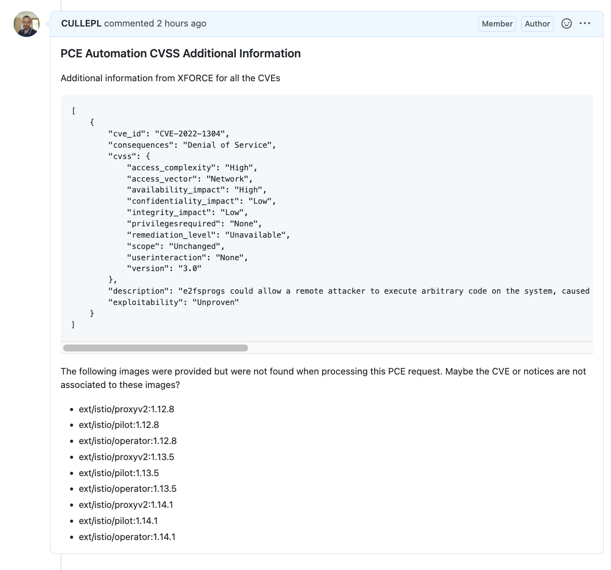

Informational
{: .label }

## Overview

This document details the automation created to parse Public Cloud Exception (PCE) requests raised in the [security repository].

## Detailed information

When a PCE is submitted by the development team, the IKS Security squad spend a lot of time manually gathering data from various sources in order to submit an official PCE request.

The aim of this automation is to perform as much of the data gathering as possible, and to construct a valid `json blob` that can be submitted into the [Cloud security reviews exceptions form]

### When does the tool run?

The [PCE json blob creation jenkins job] is setup to run on  a cron.  When it executes, it will read in all open issues from [security repository] which have `Compliance` and `PCE Request` labels set on them.

The job then produces a summary of the issues found and only processes issues which have never been processed before.
1. Tickets it intends to process
2. Tickets which have previously been skipped - these will have `pce_automation_skipped` label already assigned to the issue
3. Tickets which have previous failed processing - these will have `pce_automation_failed` label already assigned to the issue
4. Tickets previously successfully processed - these will have `processed_by_pce_automation` label already assigned to the issue

Example output:
```
Found an ocp-release ticket - skipping it - Issue(title="Exception request for image ocp-release:4.10.15-x86_64", number=5014)
Found an ocp-release ticket - skipping it - Issue(title="Exception request for image ocp-release:4.9.33-x86_64", number=5013)

 **** These are the tickets the automation will process on this execution ****
- Issue(title="CVE Exception Request for Istio usn-5473-1 and usn-5464-1 ", number=5022)

**** These tickets have been found but appear to have already been processed by automation - skipping these *****
- Issue(title="Exception request for image satellite-config", number=5017)

**** These tickets have been completely skipped whilst processing and may need a manual review to get them processed on a future run ****
- Issue(title="Exception request for update-squad UNSUPPORTED images", number=4648)
```

### How does the automation know what data to gather?

The tool reads in content from a GHE ticket submitted to the Security repo.
The template focuses on gathering just the required information a submitter should be providing for `Image Vulnerability PCE Requests`.  The remainder of data, where applicable, is automatically gathered from auditree.

The [PCE request template](https://github.ibm.com/alchemy-conductors/security/issues/new?assignees=&labels=Compliance%2C+Risk+Request%2C+PCE+Request&template=new-exception-risk-request.md&title=) can be found here.

Users of [armada-ansible-scan](https://github.ibm.com/alchemy-containers/armada-ansible-scan) will be presented with a partially filled template when this tool discovers new vulnerabilities, so it's advised to onboard to armada-ansible-scan if possible.

The template has been broken down into these sections;

- Why is a PCE being requested?  
    - As well as selecting a pre-defined reason, a detailed explanation is also required.
~~~
### Why do you need to raise a PCE?

Please select one of the following reasons and provide a detailed description below:
- [ ] Image unable to be updated using BOM process before due date
- [ ] Image unable to be updated via other method before due date 
- [ ] Third party hasn't supplied an update at this time
- [ ] Other technical issue  

Detailed description:
_Placeholder for the submitter to describe the reason for this PCE._  
</Detailed description>
~~~

- Dates need to be provided
    - Scan due date: When the image vulnerability needs to be fixed by to stay compliant.
    - The estimated fix date: When the submitter believes a fix will be rolled out by.
~~~
### Dates:

- Scan Due Date: YYYY-MM-DD _(This is the due date from the image vulnerability scan report)_
- Estimated Fix Date: YYYY-MM-DD _(Fill in when you plan to release a fix by)_

~~~

- An image list must be filled out.  Failure to have correct data under here will result in the job exiting
    - A description of the image is now required.  This should detail what the image is used for.
~~~
### Images:

- image: _insert image name_ 
- description: _Enter a description of the image and what it is used for_  

~~~

- Notices and CVEs need to both be provided in the format shown in the example.
    - These form part of the processing and help the Security Squad understand the impact each Notice and related CVE has.
    - If a notice has multiple CVEs, then the CVE section (CVE + questions about the CVE) should be repeated
    - If a submitter is wishing to submit multiple Notices in a PCE request, the Notice section should just be duplicated and the relevant CVEs detailed under the correct Notice.
~~~
### Notice and CVE details

_The following section is used to contain the notices and CVEs_

### Notice: _Notice-ID_
#### CVE: _CVE ID-1_

Is the vulnerable package/library called at container runtime?
- [ ] Yes 
- [ ] No
- [ ] Unknown

##### Mitigations:
- Mitigation description: _Fill in text here - For example: Can configuration be changed to mitigate the issue? Can a dependency be temporarily pinned to a version without the vulnerability?_
- Mitigation target date: _Fill in text here - when will identified mitigations be in place? (i.e. YYYY-MM-DD)_
</Mitigations>
~~~

### Related automation

[Armada-ansible-scan](https://github.ibm.com/alchemy-containers/armada-ansible-scan) is a tool that was developed by the IKS development squad to assist with image vulnerability tracking.  Anyone releasing image updates via the BOM process are encouraged to onboard to this tool.  If they use this tool, it will automatically created the correct template ready for PCE submission, resulting in less manual effort and less possibility of errors in the template formatting.

[Multiscanner](https://github.ibm.com/alchemy-containers/armada-frontdoor-vulnscan/tree/master/multiscanner) was developed by the Ingress squad.  This tool currently doesn't create the PCE submission template, but it may in the future.  The automation team will be working with the Ingress squad to look into adding this as a feature.  This tool is designed for squads that release their image updates via the razee deployment process.

### How do I get a issue reprocessed?

If errors within a PCE request have been corrected, remove the automation label which was added by the previous attempt.  This will allow the automation to re-process the ticket next time the cron runs in jenkins.

### Assumptions coded into the automation

Some assumptions and hard coded values are in the tool and will be replaced when a submission is reviewed by the Security squad before being submitted to CISO.

A summary is as follows:

1.  The PCE ID is always set to `PCE-IKS-009999` until such a time the next available number can be determined.  The Security team will have to change this themselves by reviewing a private repo where PCEs are created.
1.  `riskLevel` is always set to `high`
1.  When working out the due date, the tooling adds 60 days to the firstseen date.

### Some example output

1.  Initial processing comment

<a href="images/pce_automation_initial_comment.png">
</a>


2. Example json blob comment

<a href="images/pce_automation_json_blob.png">
</a>

3.  Example Additional Info comment

<a href="images/pce_automation_extra_info.png">
</a>

### Possible errors/warnings

If errors or warnings occur, the submitter is tagged and help is provided in the comment to guide the submitter to a solution.

## Useful links

Links to other documentation, jenkins and code

- [IKS vulnerability scan issue managment process]
- [PCE automation code]
- [PCE json blob creation jenkins job]

## Escalation Policy

There is no formal escalation policy.

Reach out to the IKS SRE Security and Compliance automation squad (`@compliance-dev`) in the [#iks-sre-compliance channel](https://ibm-argonauts.slack.com/archives/C02HNQGGM8V) if there are problems with the code.

If you are unsure about the PCE exception process, reach out to the `@iks-security` squad in the above channel.


[IKS vulnerability scan issue managment process]: ../process/iks_vulnerability_scan_issue_managment_process.html
[PCE automation code]: https://github.ibm.com/alchemy-conductors/automation-team/tree/master/utils/pce_data_gather
[PCE json blob creation jenkins job]: https://alchemy-conductors-jenkins.swg-devops.com/job/Conductors/job/Security-Compliance/job/pce-jsonblob-automation
[security repository]: https://github.ibm.com/alchemy-conductors/security/issues
[Cloud security reviews exceptions form]: https://pages.github.ibm.com/cloud-security-reviews/exceptions/
