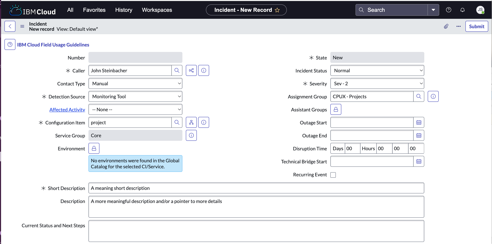
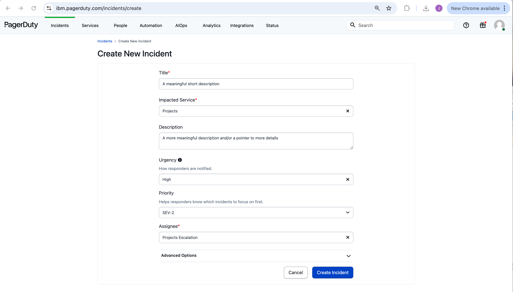

Ops
{: .label .label-green}

## Overview

If an issue with Projects is suspected or has occurred, there are various ways in which the Projects SRE team can be contacted.

## Detailed Information

An issue can be raised to Projects by either creating an incident on ServiceNow, on PagerDuty, or posting to the appropriate Slack channel.

## Detailed Procedure

### ServiceNow

1. Create a new incident in [ServiceNow](https://watson.service-now.com/now/nav/ui/classic/params/target/incident.do%3Fsys_id%3D-1%26sysparm_query%3Dactive%3Dtrue%26sysparm_stack%3Dincident_list.do%3Fsysparm_query%3Dactive%3Dtrue).
2. Fill in the mandatory fields:
  - `Detection Source`
  - `Configuration Item` = `project`
  - `Severity`
    - `Sev-1`: For **Critical** customer impacting issues
    - `Sev-2`: For time-sensitive important issues
  - `Short Description`
  

### PagerDuty

> Reserved for high-priority calls only

Create an incident against the [Projects service](https://ibm.pagerduty.com/service-directory/PQPPU4P).

| Escalation Policies                      | Sev            |
| ---------------------------------------- | -------------- |
| `Projects Escalation`                    | All severities |

### Slack

Reach out to the Projects team on Slack channel 
* [SRE: discuss issues `#project-issues`](https://ibm.enterprise.slack.com/archives/C05284WUXGR). 
* Ping `@epx-team` and/or `@jstein`.

Other relevant channels:
* [SRE: CIE discussions - `#project-cie`](https://ibm.enterprise.slack.com/archives/C04A4CDMHNZ)
* [SRE: Production synthetic monitoring - `#project-monitoring-production`](https://ibm.enterprise.slack.com/archives/C05284WUXGR)
* [SRE: Project pagerduty -`#project-monitoring-pagerduty`](https://ibm.enterprise.slack.com/archives/C04CTGYAV24)

## Further Information

* [AVM Services Overview](https://pages.github.ibm.com/toc-avm/avm/avmservices/)
* [AVM FAQ](https://pages.github.ibm.com/toc-avm/avm/faq/)
* [How to handle a CIE](https://pages.github.ibm.com/toc-avm/avm/star/2023/03/07/How-to-Handle-CIE/)
* [How to perform an RCA](https://pages.github.ibm.com/toc-avm/avm/star/2023/03/06/How-to-Perform-RCA/)
* [Customer Impacting Event (CIE) Process Overview](https://ibm.ent.box.com/v/WCPAVMProgramDocumentation/file/246138991386)
* [Incident Management “textbook” for ServiceNow](https://ibm.ent.box.com/v/WCPAVMProgramDocumentation/file/282457535354)
* [Problem Management “textbook” for ServiceNow](https://ibm.ent.box.com/v/WCPAVMProgramDocumentation/file/280206799154)
* [How to get access to CIEBOT](https://pages.github.ibm.com/cloud-sre/ciebot-docs/auth_request_privileges/)
* [CIEBot Practice : Pls use cietest bot in the #ciebot-practice channel or direct message to the bot cietest . Any issues using ciebot can be reported in #cie-bot-dev Guidance](https://ibm-cloudplatform.slack.com/archives/C9WA5T2PJ/p1579800581008500)
* [CIEBot Recorded Training](https://yourlearning.ibm.com/activity/URL-2AD833F96AD5)

 