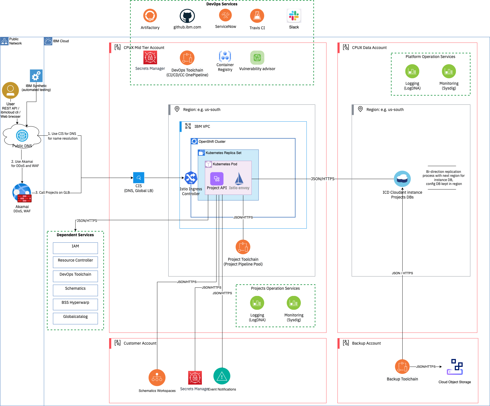
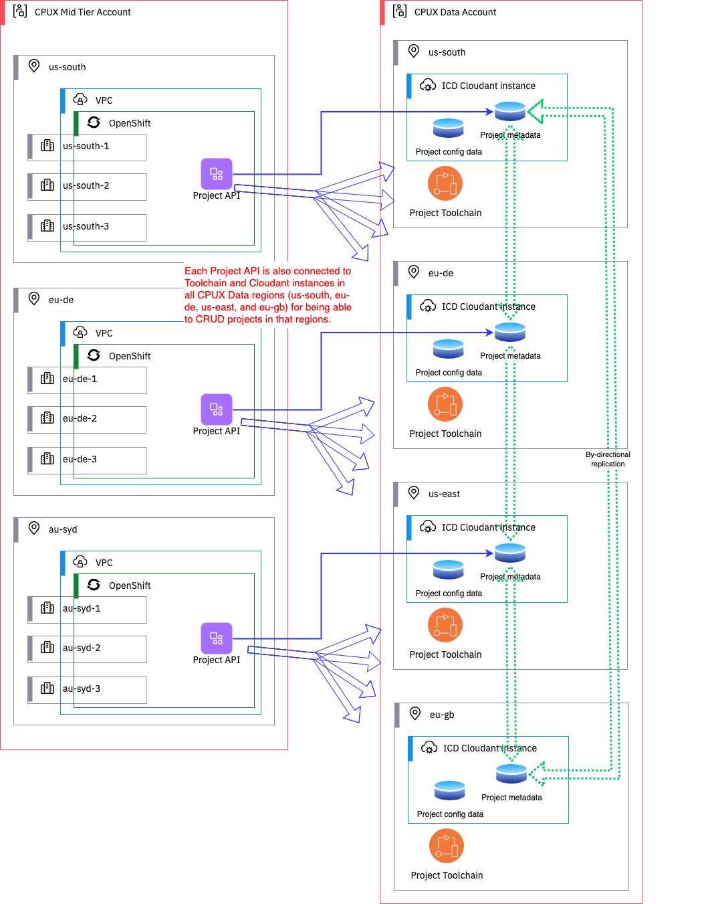

Informational
{: .label }

## Overview

The IBM Cloud Project service is a management tool that is designed to organize and provide visibility into a real-world project that exists in your organization. A project manages all of the configured instances of a deployable architecture (DA) and the resources that are related to the real-world reasons that they are deployed. Projects store versioned DA instances and organize the instances and resources into environments to help improve visibility into the development lifecycle. An environment is a group of related DA instances that share values for easier deployments. For example, development, test, or prod.

Projects are responsible for ensuring that only approved DAs can be deployed. Additionally, they can help to ensure that the architectures and the resources that they created are up-to-date, compliant, and that drift does not occur over time. For example, you might have an account management application project. This project is designed to manage all of the resources that the account management application needs to deploy into a development, test, or production environment. Each environment has the same variables, such as a region or prefix, but has different values. When a DA is assigned to an environment through a project, their input values can automatically reference any of the environment's properties that have the same name. While IBM Cloud projects are easy to create and update, they are not templatized or optimized for replication or sharing.

## Detailed Information

### Architecture

The IBM Cloud Projects component consists of several major sub-components:
1.	API, CLI, SDK – These are used to do CRUD operations and actions on:
    - Projects which are used to encapsulate a solution.
    - 0..n DA instances (called Configurations) within a project. Configurations consist of Ansible and Terraform scripts and a user-defined set of input parameters that can be validated, deployed, or undeployed.
    - 0..n Environments within a project. Environments are a set of input / output parameters and permissions that can be shared across Configurations. 
2.	A multi-tenant ‘Project Toolchain’ used to manage all the asynchronous job interactions Projects has with other components – ie Schematics, CRA, Security and Compliance Center, etc
3.	A best-of-breed user interface to simplify the assembly and maintenance of Enterprise Cloud solutions.

The picture below shows the Project API architecture diagram, including dependent services and deploying infrastructure.

The following picture shows the deployment diagram of Project API in the production environment.

### Team Members

| Name               | Slack Handle                                                          | Role                 | Responsibilities         |
| ------------------ | --------------------------------------------------------------------- | -------------------- | ------------------------ |
| John Steinbacher   | [@jstein](https://ibm.enterprise.slack.com/team/W4EAM5SHG)            | Manager              | Project mgmt, SRE        |
| Arn Hyndman        | [@arn](https://ibm.enterprise.slack.com/team/W4E8LPLLB)               | STSM, Architect      | Architecture             |
| Flannan Lo         | [@flannanl](https://ibm.enterprise.slack.com/team/W4DK8KLHW)          | Senior Developer     | Full stack               |
| Norman Seto        | [@seto](https://ibm.enterprise.slack.com/team/W4ED7M8H3)              | Senior Developer     | Backend                  |
| Holman Sze         | [@holmansze](https://ibm.enterprise.slack.com/team/W4F17SB0E)         | Senior Developer     | UI                       |
| Nancy Ching        | [@nching](https://ibm.enterprise.slack.com/team/W4DL36S49)            | Senior Developer     | Full stack               |
| Tony McGuckin      | [Tony McGuckin](https://ibm.enterprise.slack.com/team/W4A9YTAHG)      | Developer, DevOps    | Toolchain dev and devOps |
| Sendoo Sitsabesan  | [@Sendoo](https://ibm.enterprise.slack.com/team/U01JN9XC0QY)          | Developer, DevOps    | Backend dev, deploys     |
| Riccardo Angelilli | [@riccardo.angelilli](https://ibm.enterprise.slack.com/team/W4DK8LLJC)| DevOps               | DevOps                   |
| Ian He             | [@ianhe](https://ibm.enterprise.slack.com/team/W4E8LJGQK)             | QA                   | All aspects of testing   |
| Jonatan Bedard     | [@Jo](https://ibm.enterprise.slack.com/team/U028PAJQVK3)              | Sec/compliance focal | SF, BCDR, etc            |

## Further Information

* [Architecture: TRI](https://github.ibm.com/ibmcloud/platform-unification/blob/master/architecture/project_t/projects-service.md)
* [Architecture: SSAD](https://github.ibm.com/epx/projects/blob/main/architecture/ssad.md)
* [Docs: Project description](https://cloud.ibm.com/docs/secure-enterprise?topic=secure-enterprise-understanding-projects)
* [Docs: CLI](https://cloud.ibm.com/docs/cli?topic=cli-projects-cli)
* [Docs: API](https://cloud.ibm.com/apidocs/projects)
* [Git: Backend-API and models](https://github.ibm.com/epx/projects)
* [Git: User interface](https://github.ibm.com/epx/projects-ui)
* [Git: Service Framework compliance](https://github.ibm.com/ibmcloud/serviceframework-catmin-workflow-projects)

