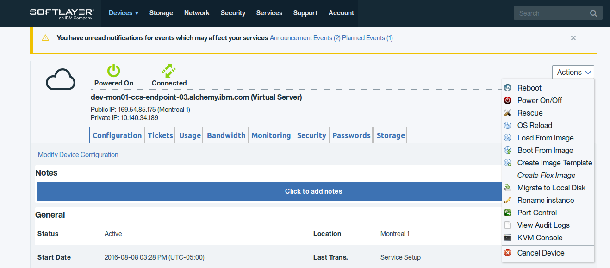

Troubleshooting
{: .label .label-red}

## Overview

This runbook describes the steps required to recover a corrupted filesystem.

This will be noticed by logging into a server and the filesystem being read-only.

## Example Alerts

There are many alerts that could bring you here. If you suspect a read only fs, log in and try creating a file.

## Investigation and Action

### Useful jobs

The following [jenkins job](https://alchemy-conductors-jenkins.swg-devops.com/job/Conductors/job/Conductors-Infrastructure/job/ansible-check-ro-filesystem/) can be used to discover the machines which have read-only filesystems.

NB:  The `/sys/fs/cgroup` filesystem is ignored.

### Instructions to fix

- Sign into [Softlayer portal](https://control.softlayer.com/)
- Find the device and reboot it into Rescue kernel by using option: `Device Details` -> `Actions` -> `Rescue`

  <a href="images/conductors/kvm_option.png">
  </a>

- To access the machine, try one of these methods:

  - Softlayer VPN connection and KVM console. Runbook for this [KVM Access](https://pages.github.ibm.com/alchemy-conductors/documentation-pages/docs/runbooks/kvm_access.html)
  - openVPN connection and ssh,

- You will **ONLY** be able to log in using the `root` userid and password.  The root password is stored in softlayer console in the details for that device. Root passwords for EU restricted servers can be found [here](https://pim.sos.ibm.com/dashboard.aspx#%7B%22tId%22:1047,%22fId%22:%223172%22,%22s%22:%22%22,%22inSub%22:false,%22tptId%22:null,%22status%22:%22Active%22%7D) (Note: 1. Only the EU SREs have access to this file. 2. EU conductor will need to add these passwords to Thycotic).

- Commands to run to correct the issues:

```
   fsck -C -c -k /dev/xvda2
   fsck -C -c -k /dev/xvda1
```

  Answer Y to any questions

**NOTE**: Some machines have more than one hard disk. In that case we need to do something like:

```
fsck -C -c -k /dev/xvdc (2nd disk)
fsck -C -c -k /dev/xvdc (3rd disk)
```

You can see how many Hard drives in a machine by looking at 'Storage' tab in the machine in SL GUI.

**NOTE**: For new Ubuntu 18 machines, you may get following error from `fsck` execution

   ```
   [linuxrescue -- **RESCUE**]# fsck -c /dev/xvda2
   fsck 1.39 (29-May-2006)
   e4fsck 1.41.12 (17-May-2010)
   /dev/xvda2 has unsupported feature(s): 64bit FEATURE_R10
   e4fsck: Get a newer version of e4fsck!
   ```

Please follow the instruction [here](https://github.ibm.com/alchemy-conductors/conductors-tools/blob/master/softlayer-utils/fsck-update.md#instruction) to upgrade `fsck` first before you fix anything.


- Once complete, reboot the server (either from the command line or from SL web interface)

### Verify It

```
grep "\sro," /proc/mounts
touch /tmp/hi; rm -f /tmp/hi
```
## Automation

Currently no automation to fix.

## Escalation Policy

If the above steps do not resolve the issue, you will likely have to raise a ticket with SL to investigate further.
