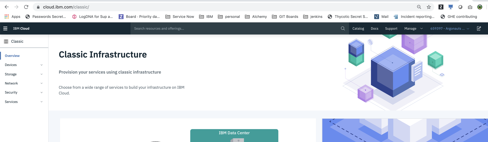
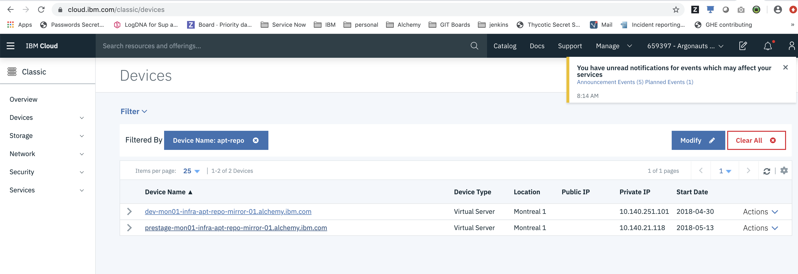
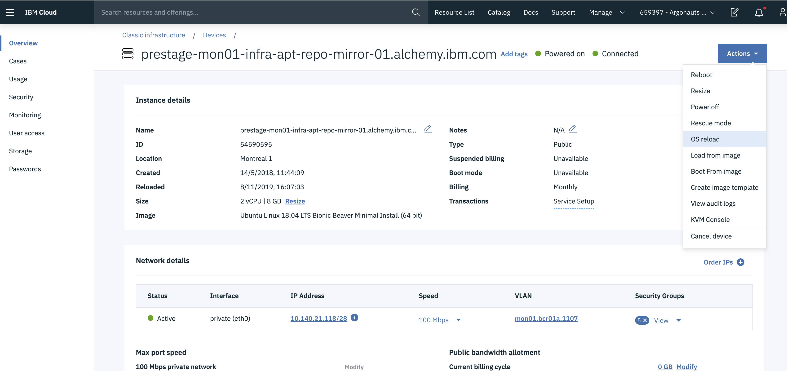
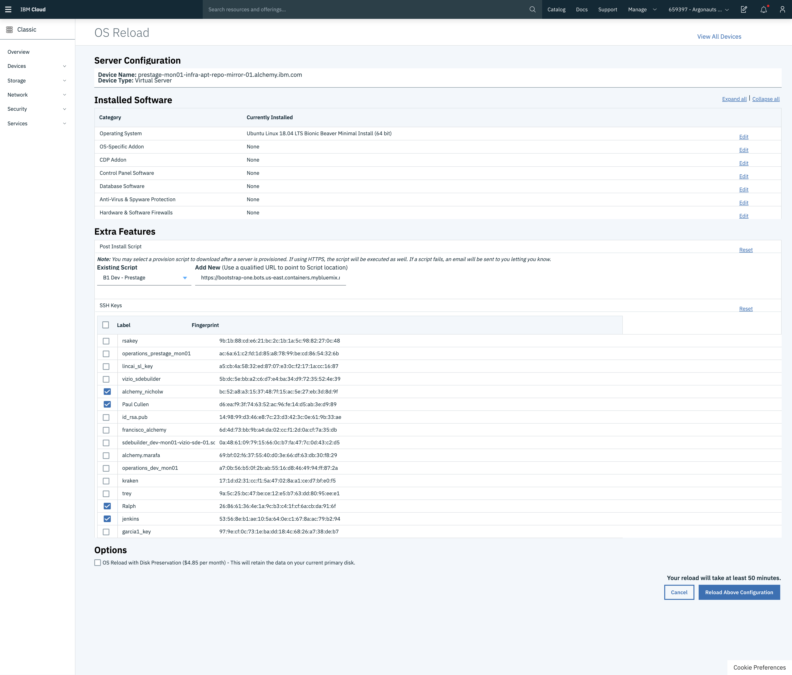
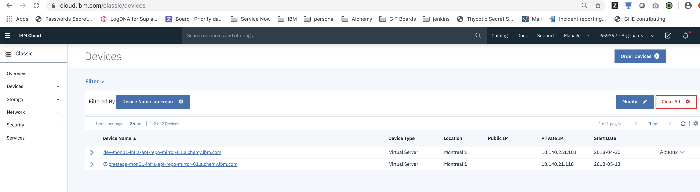
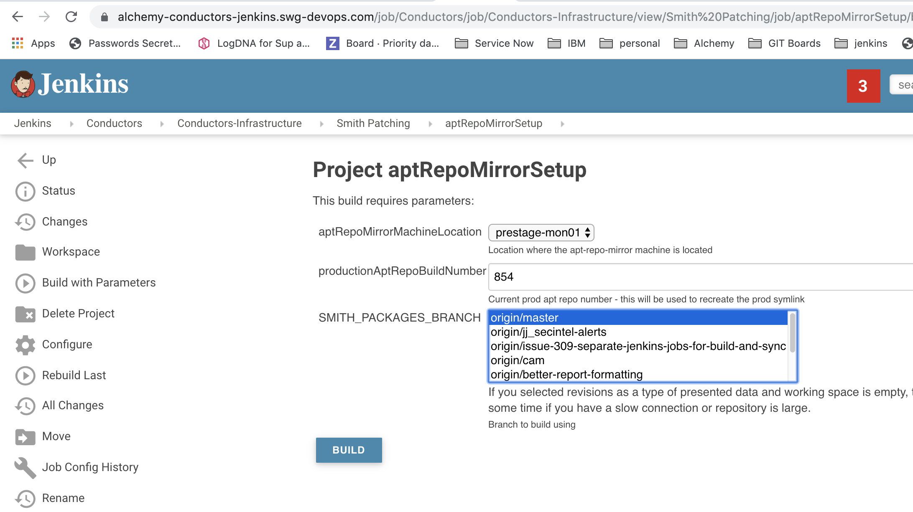

Ops
{: .label .label-green}

## Steps
{:.no_toc}

* Will be replaced with the ToC, excluding the "Contents" header
{:toc}

---

## Overview

This runbook explains how to reload an infra-apt-repo-mirror machine.

## Detailed Information

The instructions here will be based on reloading via the [IBM Cloud Classic Infrastructure interface]

## Detailed procedure

- Log into [IBM Cloud Classic Infrastructure interface]
{:height="75%" width="75%"}
- Switch to the correct account (if you are unsure which account to switch to, use `netmax` to query the machine you are reloading as the AccountID is included in the output)
- In [IBM Cloud Classic Infrastructure interface], navigate to  `Devices -> Device List` and locate the machine you wish to reload.
{:height="75%" width="75%"}
- Access the machine in the [IBM Cloud Classic Infrastructure interface]. Once in the machine menu, under the `Actions` drop-down menu, select `OS Reload` 
{:height="75%" width="75%"}

On the `OS Reload` page, fill in the following information:

- Ensure the Operating System selected is correct (As of writing this runbook, Ubuntu 18 minimal install is required)

- Ensure post provision script is selected, and pointing to the correct script.
  - The [bootstrap-one readme](https://github.ibm.com/alchemy-conductors/bootstrap-one#os-reload) details what post provision script to use in each datacenter / region.

- Select the following SSH Keys to be added to the server:
1. jenkins
1. yourself (if you have one)
1. Paul Cullen
1. Any other Conductors you see fit to add

For example:
{:height="75%" width="75%"}

- Click `Reload Above Configuration` and agree to any pop up screens to progress the reload to commence.

The reload will take anywhere from a few minutes to a few hours to complete as the actions are dependent on IBM Cloud Infrastructure.  

During a reload, the machine will have a timer icon next to it in IBM Cloud Infrastructure UI (example below).  Wait for this to disappear before moving on to any further steps.
{:height="75%" width="75%"}

## Post Reload Setup

After a reload, the repo-mirror machine requires configuring before it successfully serves the apt-repos to the regions it is a mirror for.

A series of ansible roles have been written to perform the setup.
The ansible setup scripts are located in the [smith-packages GHE repo](https://github.ibm.com/alchemy-conductors/smith-packages) under `scripts/jenkins/setupAptRepoMirror.

To configure the repo-mirror, run the [aptRepoMirrorSetup](https://alchemy-conductors-jenkins.swg-devops.com/job/Conductors/job/Conductors-Infrastructure/view/Smith%20Patching/job/aptRepoMirrorSetup/) jenkins job.

Two parameters are needed 
1.  The machine location - eg: prestage-mon01
2.  The current production ready smith apt repo build number - used to recreate the `prod` symlink.

For example
{:height="75%" width="75%"}

Monitor the console output of this job and investigate any issues that may occur.

If the job succeeds, proceed onto the next steps.

## Investigating errors

If any step of the process fails, work with your squad to resolve the issue and re-run the failing steps.

## Validate the service is running

If all steps complete successfully, the easiest way to validate that the repo mirror is back is to perform a patch request against a single machine in that environment.

See the [patch request runbook for details how to patch a single machine](./sre_patching.html)

## Escalation paths

There is no formal escalation for problems with the patching process.

In the first instance, speak with the UK Conductors squad for advice using `@conductors-uk` in slack to get their attention.

[IBM Cloud Classic Infrastructure interface]: https://https://cloud.ibm.com/classic