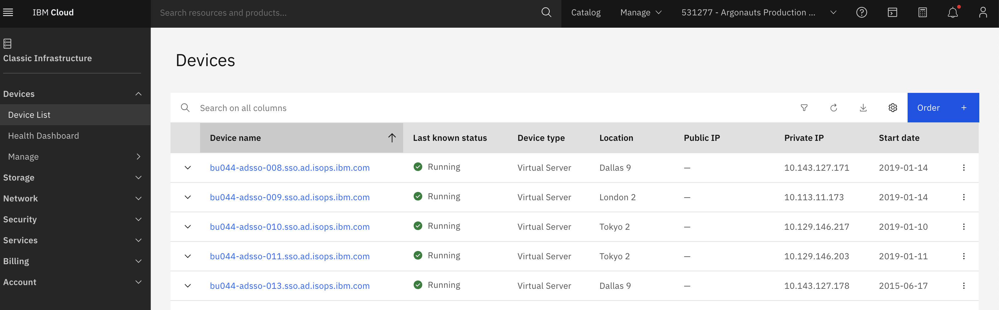

Ops
{: .label .label-green}

## Table of contents
{:.no_toc}

* Will be replaced with the ToC, excluding the "Contents" header
{:toc}

---

## Overview

How to load, reload and re-deploy an `infra-vpn` machine, safely, when **at least one of the pair** of machines is still available.

The **normal** procedure to follow involves :
1. OS reloading the target machine
1. Verifying that the Bootstrap process has completed
1. Re-deploying the machine as a VPN server

However, in some situations you may be required to run the deployment directly.  For such situations see [Running the VPN deployment code from your laptop](#running-the-vpn-deployment-code-from-your-laptop) below.


**NB. After changing the configuration of any VPN server always validate the new server is working correctly.**


## Detailed Information

As noted above, these instructions will only work if at least one of the pair of VPN servers is available for use.

The instructions are based on reloading via the [IBM Cloud Classic Infrastructure interface](https://cloud.ibm.com/gen1/infrastructure/devices)

**_WARNING_** : **DO NOT ALTER BOTH `INFRA VPN` SERVERS IN A REGION TOGETHER!!**  
_Attempting to alter both members of a pair (we always use a pair of machines - for the purposes of HA) will prevent many of the steps in this runbook from running correctly and, consequently, it would then be necessary to run the re-deploy manually from your laptop over a Softlayer VPN connection!_

## Detailed procedure

To setup one (of a pair) of VPN servers use the following steps:

1. **OS reload the target machine**
   1. Log into IBM Cloud using the [Classic Infrastructure interface](https://cloud.ibm.com/gen1/infrastructure/devices)
   {:height="75%" width="75%"}
   
   1. Ensure the appropropriate **account** is selected for the machine you wish to work on  
   _if you are unsure which account to switch to, use `netmax` to query the machine you are reloading as the AccountID is included in its output_
   
   1. Navigate to the [`Devices -> Device List`](https://cloud.ibm.com/classic/devices) and locate the machine you wish to reload  
   _you will probably benefit from using the **filter** facility - as shown below_  
   {:height="75%" width="75%"}
   
   1. Select the appropriate machine in the list to see its full details page  
   _The **OS Reload** action is **not** available from the `Actions v` menu in the list screen!_
   
   1. On the machine's details page, under the `Actions v` drop-down menu, select `OS Reload`
   {:height="75%" width="75%"}
   
   1. You are now on the OS Reload page for you chosen machine  
   _The url will be like `https://cloud.ibm.com/gen1/infrastructure/bare-metal/1437143/os-reload`_
   
      1. Select the category Operating System click edit and select the correct OS required 
         _you will probably benefit from using the **filter** facility - as shown below_  
         {:height="65%" width="65%"}

      1. Ensure the Operating System selected is correct  
      _At the time of writing [Aug 2023] `Ubuntu 20 minimal install` is required_
      {:height="35%" width="35%"}
      1. Ensure post provision script is selected, and pointing to the correct script.  
      _The [bootstrap-one readme](https://github.ibm.com/alchemy-conductors/bootstrap-one#os-reload) details what post provision script to use in each datacenter / region._
      
      1. Select the following SSH Keys to be added to the server:
         - jenkins
         - yourself _(if you have one)_
         - Paul Cullen
         - Any other Conductors you see fit to add
         
         For example:
         {:height="75%" width="75%"}

      1. Click `Reload Above Configuration` and agree to any pop up screens to allow the reload to commence.  
      _NB. The reload will take anywhere from a few minutes to a few hours to complete because the actions are dependent on IBM Cloud Infrastructure._  
      _During a reload, the machine will have a timer icon next to it in IBM Cloud Infrastructure UI._  
      _Wait for this to disappear before moving on to any further steps._


1. **Verify bootstrap (execute as part the OS reload) has completed**

   After a reload, a bootstrap should automatically execute and it should log to [#bootstrap-bot-alerts channel in slack](https://ibm-argonauts.slack.com/archives/C53PSDQUC)

   Example output:
   ~~~
   Bootstraping prod-lon02-infra-vpn-03  ** SUCCESS ** prod-lon02-infra-vpn-03 has completed bootstrap
   YML File             :- bootstrap_weekly.yml
   GHE Branch           :- master
   Run type             :- run_from_container
   Run by user          :- root
   Run on host          :- 498889c693b7/172.17.0.11
   Jenkins URL          :- https://alchemy-conductors-jenkins.swg-devops.com/job/Conductors/job/Conductors-Infrastructure/job/bootstrap-environment/10779/
   Build number         :- 1235
   SL Image Template ID :- unknown
   ~~~
   
   If this message does not appear, you can also track bootstrap status on the machine.
   Log into the machine you've just reloaded, and monitor `/opt/bootstrap-one/ansible.log`.
   
   If any errors occur, investigate and fix.  Use your SRE colleagues if you are unsure how to proceed.
   
   **== DO NOT CONTINUE == until you have verified the machine has been bootstrapped and patched!**  
   _i.e. the `smith` agent has run (with the `prod` build) to successful completion_

1. Add node to bastion

   After a successful patch and reboot, we must add the node to bastion.

   1. Go to this job [bastion-register-nodes-ww](https://alchemy-containers-jenkins.swg-devops.com/job/armada-ops/job/bastion-register-nodes-ww/) and `Build with parameters`

   2. Enter `TARGET_HOSTS_IP` as the node IP(s) which need to be registered to bastion.

   3. Enter `TARGET_HOSTNAME` as one hostname from the same region. Example: if the node region is `prod-wdc06` then pick one of worker of that region ie `prod-wdc04-carrier1-worker-1001`. This is used to figure out which bastion to add the target node to.

   4. Leave `Branch` field unselected, default is `master`

   5. Monitor the output of jenkins job and make sure it succeeds. If it fails for some reason, open a [conductors team issue](https://github.ibm.com/alchemy-conductors/team/issues) with output of jenkins job and label the issue as `bastion`.

1. **Re-deploy the server as a VPN server**

   _**Pre-reqs before re-deployment**:_
      - Machine has been bootstrapped and patched
      - Machine has been added to bastion
      - The other VPN server of the pair is available

   A series of ansible roles have been written to perform the setup and are located in the [openVPN GHE repo](https://github.ibm.com/alchemy-conductors/openVPN) 

   To configure the infra-vpn server, run the [deploy-infra-vpn-server](https://alchemy-conductors-jenkins.swg-devops.com/view/Conductors/job/Conductors/job/Conductors-Infrastructure/job/deploy-infra-vpn-server/) jenkins job.

   Fill in the parameters appropriately :
   1.  **vpnEnvRegion**  
   e.g. `prod-lon02`
   2.  **machineName**  
   e.g. `prod-lon02-infra-vpn-03`
   3.  **reboot is required** _(Default is yes)_  
   _Accept the default unless there is a specific reason not to_
   4.  **Enable 2FA login**  
   This should be set to **true** for all environments except for `dev` and `prestage`

   For example
   {:height="75%" width="75%"}

   Monitor the console output of this job and investigate any issues that occur.

   If the job succeeds, proceed onto the next steps to verify the machine is running as a VPN server. Otherwise, do not proceed with this runbook until the reason for the Job's failure is investigated and addressed.

## Running the VPN deployment code from your laptop

I've seen some intermittent issues with the jenkins job and connection issues causing problems.
To rule these out, it is possible to run the deployment from your laptop following these steps

1.  Establish a VPN connection to the environment where you want to re-deploy the VPN server.
2.  Test that an ssh connection using your ID is possible to this environment.
3.  Clone [openVPN GHE code to your machine](https://github.ibm.com/alchemy-conductors/openVPN)
4.  Execute [deploy-server.sh](https://github.ibm.com/alchemy-conductors/openVPN/blob/master/deploy-server.sh) with these parameters
  - `-f` - to enable 2FA (stage and production only) 
  - `-r` - to reboot the server after vpn config has been completed 
  - `-e <env>` - the environment - e.g. prod-dal09 
  - `-l <machine name>` - provide the machine you wish to deploy the vpn config to - e.g. `prod-dal09-infra-vpn-03` 
  - `-u <ssh user>` - the user to perform the SSH connections to the machine as 
  - An example: `./deploy-server.sh -f -r -e prod-dal09 -l prod-dal09-infra-vpn-03 -u pcullen` 

This script will clone down the required ansible inventory and network source GHE code in order to perform the deployment.

Monitor the output and investigate any errors that may occur.

Here is successful output from a previous local run
{:height="75%" width="75%"}

## Validate services (openVPN and openconnect(ocserv) ) are running after deployment

Point your local tunnelblick config at the reloaded server and attempt to establish a VPN connection to that environment.
If the connect works, try logging into some machines located in that region to verify ssh works across the VPN connection.
Note that `ocserv` is used by `jenkins` user connecting to the nodes. We can verify the services as shown below
   ```
   root@prod-dal09-infra-vpn-11:~# ss -antpl 
State             Recv-Q            Send-Q                        Local Address:Port                       Peer Address:Port           Process                                               
LISTEN            0                 4096                          127.0.0.53%lo:53                              0.0.0.0:*               users:(("systemd-resolve",pid=602,fd=13))            
LISTEN            0                 128                            10.143.143.4:22                              0.0.0.0:*               users:(("sshd",pid=684,fd=3))                        
LISTEN            0                 1024                         169.55.193.100:443                             0.0.0.0:*               users:(("ocserv-main",pid=829,fd=3))                 
LISTEN            0                 500                               127.0.0.1:8096                            0.0.0.0:*               users:(("mono",pid=664,fd=8))                        
LISTEN            0                 1                              10.143.143.4:1994                            0.0.0.0:*               users:(("openvpn",pid=844,fd=3))                     
root@prod-dal09-infra-vpn-11:~#
   ```
   
Even if the services are reported running (as shown from the above output) we need to confirm the file `/etc/ocserv/defaults/groups.conf` exists to verify `ocserv`. This file holds the list of subnets provided by #netint and push though the client after a successful connection. In case this file is missing we need to copy the file from the specified location ( eg : [group.conf](https://github.ibm.com/alchemy-netint/network-configuration/blob/master/openvpn_subnets/prod-dal09.group.conf) for specific region) and restart `ocserv` service by running the commands,
   ```
   systemctl restart ocserv
   ```
   and confirm by running 
   ```
   systemctl status ocserv
   ```
   For verifying logs the following command can use
   ```
   journalctl -t ocserv -f
   ```
   from the root shell. We can verify the connection after running any sample Jenkins Job (eg: [ssh to nodes](https://alchemy-conductors-jenkins.swg-devops.com/job/Sandbox/job/Run-commands-with-ssh/) ) as manual access via `ocserv` is not supported only Jenkins can.
 
## Escalation paths

There is no formal escalation for problems with the VPN servers.

The process is owned by SRE so discuss in the SRE channels for ways to move forward.


[IBM Cloud Classic Infrastructure interface]: https://https://cloud.ibm.com/classic
