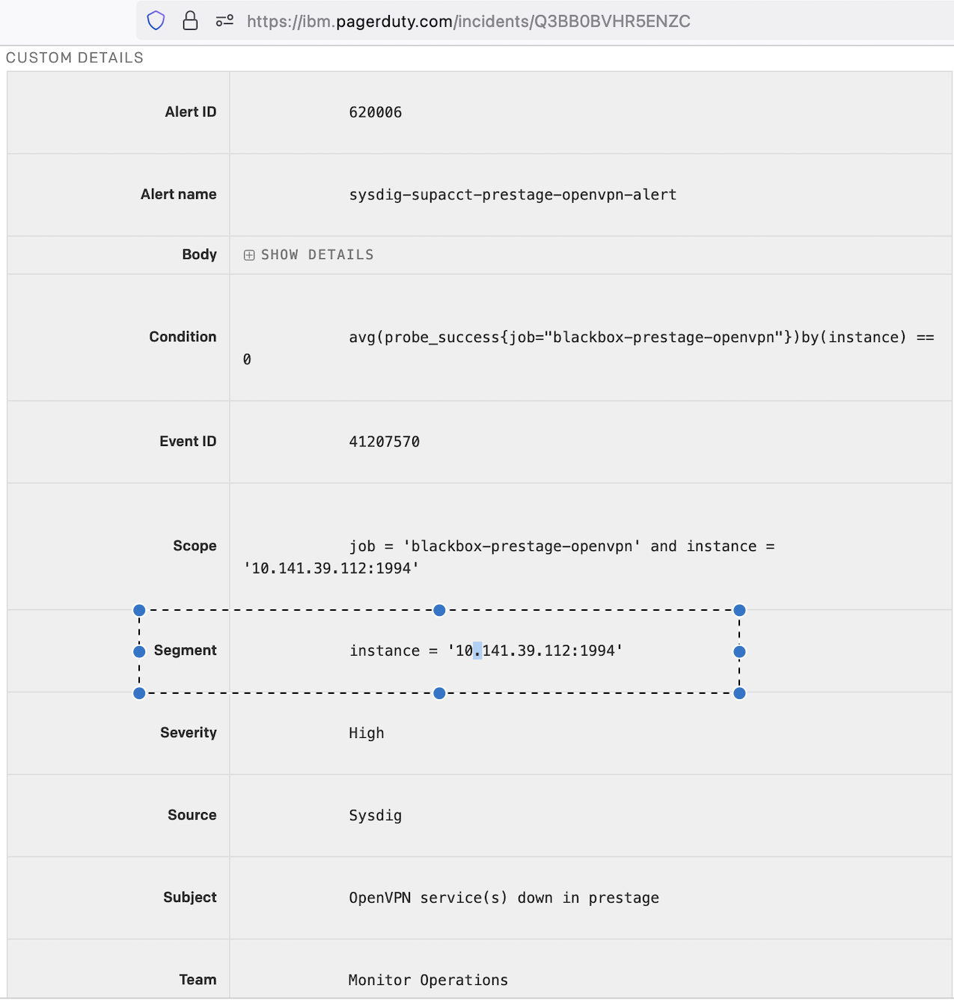

Ops
{: .label .label-green}

## Overview

From time to time the OpenVPN service stops running on the infra-vpn machines. You are here because the vpnRestart script has failed to restart and a PagerDuty alert has been sent.

You will need to use the [Softlayer VPN client](https://cloud.ibm.com/docs/iaas-vpn?topic=iaas-vpn-standalone-vpn-clients) to connect to the machine. You will also need to enable SL VPN for your ID using this runbook: [Request SL VPN access](https://pages.github.ibm.com/alchemy-conductors/documentation-pages/docs/runbooks/kvm_access.html#managing-your-userid-and-enabling-vpn). Once Softlayer VPN is running, follow the commands in this runbook for the infra-vpn machine experiencing the issue.

## Detailed information

The OpenVPN servers are a crucial and integral part of the Alchemy infrastructure and need to be available at all times. Issues with the OpenVPN servers are to be considered as SEV 1

## Example Alert

[OpenVPN service(s) down in prestage](https://ibm.pagerduty.com/incidents/Q3BB0BVHR5ENZC)
  
### How to get the OpenVPN Server name from Pager Duty Alert
- Get `instance` value from `Segment` section in the alert <br> 
  - Example: <br> 
        `instance = https://10.141.39.112:1994`  <br> 
        Use `netmax` bot to get the name of OpenVPN Server for given IP address `10.141.39.112`. In this example it is `prestage-mon01-infra-vpn-12`. <br>
        OR <br>
        Search in [NetInt-source-file](https://github.ibm.com/alchemy-netint/network-source/tree/master/softlayer-data). <br>
    
    
## Detailed Procedure

### Switch to the SoftLayer VPN

disabled all running openvpn client sessions and connect to the SoftLayer VPN.

### Check connectivity

Can you ping the VPN node from your local machine?

If not, connect to the [kvm](kvm_access.html)

Otherwise continue to the next section

### Check openvpn service

```
service openvpn status
```

If the status shows "VPN service is not running", restart the service:

```
sudo service openvpn start
```

### Check with Netint
Check with the NetInt team via slack in channel #netint. @ask-netint

### Check with SoftLayer 
has an incident occurred that affects the VPN node?
  
## False Positive alert
If PagerDuty Alert is still open after verifying that OpenVPN Service is up and running, refer to [Sysdig Monitoring On Support Act runbook](https://pages.github.ibm.com/alchemy-conductors/documentation-pages/docs/runbooks/sysdig-suptacct-debug.html) for further debugging steps.
  
# Further information:
- [OpenVPN Guide](https://pages.github.ibm.com/alchemy-conductors/documentation-pages/docs/runbooks/openvpn_guide.html)
- [VPN Troubleshooting](https://pages.github.ibm.com/alchemy-conductors/documentation-pages/docs/runbooks/vpn_troubleshooting.html)
- [OpenVPN Additional Info](https://pages.github.ibm.com/alchemy-conductors/documentation-pages/docs/runbooks/openvpn_additional_info.html#overview)
