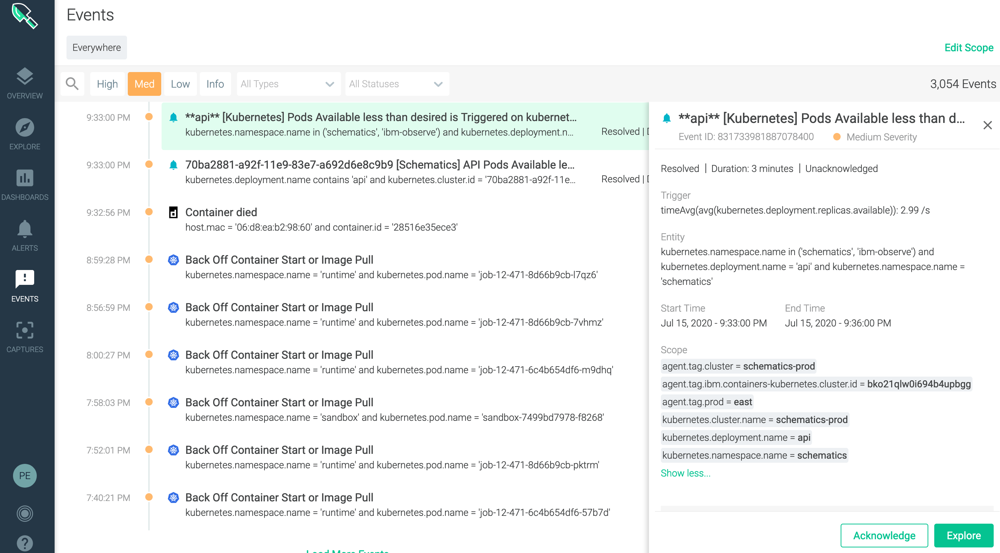

Alert
{: .label .label-purple}

## Overview

When a few pods do a restart or get into a state other than 'Ready', the available pod count falls less than the desired pod count.
The alert is segmented based on the deployment name and is scoped only to the `ibm-observe`, `schematics` and `runtime` namespaces.
The deployments in the `schematics` and `runtime` namespaces are part of various schematics micro-services, while the deployments in the ibm-observe namespace affect the logging and monitoring availability of the service.

**Permission required**: Please follow [schematics access runbook](https://pages.github.ibm.com/alchemy-conductors/documentation-pages/docs/runbooks/schematics/Introduction_to_Schematics_Infrastructure.html) to get the required permission to access Schematics Environment.

---

## Example Alert

- **Source**: Sysdig
- **Alert Name**: `"**<service name>**[Kubernetes] Pods Available less than desired is Triggered"`
or `"*EU*<cluster name--service name>[Kubernetes] Pods Available less than desired is Triggered"`

- **Alert condition**: `avg(timeAvg(kubernetes.deployment.replicas.available)) < avg(timeAvg(kubernetes.deployment.replicas.desired))`

- **Trigger duration**: 5 mins for 100%

Example: [https://ibm.pagerduty.com/incidents/PROB2G1](https://ibm.pagerduty.com/incidents/PROB2G1)

---

## Actions to take 

#### Collect the debug data from Pager Duty Incident

If the alert has the prefix *EU* then the alert is triggered from one of the EU clusters or if the prefix is *BNPP* then the alert is triggered from the BNPP/eu-fr2 cluster. Otherwise, it is from one of the US-South/US-East clusters.

Take a look at the description of the alert in the Pager Duty Incident.

For example:
`Description: Not enough pods running for deployment Entity:kubernetes.namespace.name in ('schematics', 'ibm-observe', 'schematics-api', 'orchestrate', 'monitor') and kubernetes.cluster.name = 'schematics-prod-eu-de-01/bmp46d5f0pu4npo0u9s0' and kubernetes.deployment.name = 'api' and kubernetes.namespace.name = 'schematics-api' Condition: avg(timeAvg(kubernetes.deployment.replicas.available)) < avg(timeAvg(kubernetes.deployment.replicas.desired)) Value: [{aggregation:timeAvg,groupAggregation:avg,metric:kubernetes.deployment.replicas.available,value:2.6},{aggregation:timeAvg,groupAggregation:avg,metric:kubernetes.deployment.replicas.desired,value:2.875}]`

Gather the debug data from PD Incident description:
`cluster id`, `deployment`, `namespace` and the `desired available replicas value`

In the above alert:
- `cluster id` value is mentioned with `kubernetes.cluster.id` or `kubernetes.cluster.name`. Its value is `bmp46d5f0pu4npo0u9s0`
- `deployment` value is mentioned with `kubernetes.deployment.name` and its value is `api`
- `namespace` value is mentioned with `kubernetes.namespace.name` and its value is `schematics-api`
- `desired available replicas` value is mentioned with `kubernetes.deployment.replicas.desired,value:` and its value is `2.875`.

##### If the required debug data is not available in the PD Incident, login to Sysdig portal and gather the same
         - Login to cloud.ibm.com
         - Select `1998758` account for *EU*  or 
                  `1944771` for Non-*EU* or 
		  `2123790` for BNPP/EU-FR2
         - Select `Resource List` (on left hand side)
         - Select `Services`
         - Select `Schematics-Prod-SysDig-<Account Region>`
         - Select `View Sysdig`
         - Select `Event` (on left hand side)
         - Select `Med` at the top of the window
         - View all the recent `Med` severity Events 
         - Locate the latest alert `Pods Available less than desired is Triggered
         - Click on the alert and a new sub-window (with details) will 
		open up on the right hand side
         - Gather the required debug data

Proceed to `Investigation Steps`.

#### Investigation Steps

1. Use IBM Cloud CLI to login to the Production Account

         > ibmcloud login --sso (or use other options to login)

         > ibmcloud target -c c19ef85117044059a3be5e45d6dc1cf6  
               (1944771 - for US-South/US-East production account)
	       
         > ibmcloud target -c c1c277d0979b4c1eaef50ab125279c2e 
                (1998758 - for EU production account)

         > ibmcloud target -c 91a8891cb8a0444590d12a16ebc20329
	         (2123790 - for BNPP/EU-FR2 production account)
	 
2. List the clusters and set the region to point to the required cluster

         > ibmcloud ks clusters

3. Set cluster config to access the cluster

         > ibmcloud ks cluster config --cluster <cluster-id>

4. List the pods in the namespace that triggered the alert

         > kubectl get pods -n <Namespace identified in the alert>

5. Check if the number of `deployment` pods match the `desired available replicas` value. If it matches, then the issue is resolved. No further action is required.
If it doesn't match, identify the pod names in error or unknown state, which are prefixed with the `deployment` name specified in the alert.
For example: if deployment name is `monitoring` the pod name would be `monitoring-<some value>`.
Delete the identified pods that are in error or unknown state.
   
         > kubectl delete pod <pod-name> -n <Namespace identified in the alert>

6. Monitor if new pods are created with running or ready state. 

7. If the new pods continue to go to error/unknown/any state other than 'Ready' or the number of deployment pods doesn't match `desired available replicas` value, collect the logs and follow the escalation step.

---

## Automation 

None

---

## Escalation Policy

* Slack channel : [#schematics-dev](https://ibm-argonauts.slack.com/archives/GHFT8J7CJ)
* Pager Duty escalation policy : Escalate to
[schematics-prod-sev2-4](https://ibm.pagerduty.com/escalation_policies#PNFUE36). 

---
