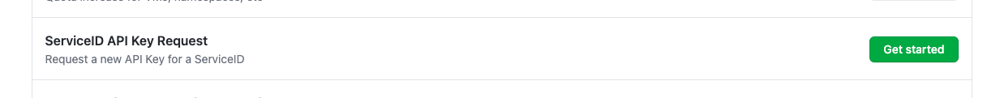
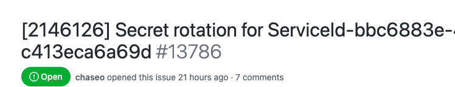

Informational
{: .label }

## Overview

This runbook explains how to leverage Secret-rotate-automation to renew an APIKEY for IBM Cloud ServiceID and update the value into destinations automatically. This is part of FS cloud control: AC-2-1 - Automated System Account Management that an apikey for service ID needs to be created without a human being able to see it.

## Detailed Information

### Secret-rotation GHE issue

Secret-rotate-automation is designed to automatically open a GHE issue after detecting aged (> 355 days) apikeys in IBM Cloud accounts. However, same process can be used to support on-demand APIKEY creation with a little bit of manual intervention. Given the consideration that no API KEY should be exposed to a human being, new APIKEY or rotation should be executed via the automation.

- An GHE issue needs to be opened under [https://github.ibm.com/alchemy-containers/secret-rotate-metadata/issues](https://github.ibm.com/alchemy-containers/secret-rotate-metadata/issues)

- An GHE issue type `secret-rotation` can be opened with the pre-defined template


  - **Service ID**: ID of a IAM serviceID (not the Name of it)
  - **APIKey ID**: ID of API Key that you want to rotate.
  - **APIKey Name**: Name of API Key that you want to rotate. (New Service ID name and API Key name is duplicated with the previous API Key name with a timestamp)
  - **Squad name**: microservice team or squad own or use API Key. (Required for the metadata of the API Key so SRE knows which team to go for verify new API Key or destinations setting)
  - **Contact person**: team leader or contact point of the team

- `secret-rotate-automation` is a template-driven that it retrieves values from the following fields to generate a metadata file for the Service ID and APIKEY so it is important to keep the field consistently.
```
Service ID: ServiceId-bbc6883e-4c8f-4e09-83ae-c413eca6a69d
APIKey ID: ApiKey-12ad7f35-3b3c-4f1b-b34a-dde5aef0e5db
APIKey Name: auto-generated-apikey-f27800b9-c27d-4356-855e-ffa365ef2815
Service Type: cloud-object-storage
Squad name: satellite-mesh
```
- Another convention is the automation detects which IBM account it belongs to by the IBM Cloud Account ID specified in the title between the square bracket. So please make sure correct account ID(number not UID) is assgined


- `secret-rotate-automation` captures a GHE issue for `secret-rotation` ready to be run by the label `ready-to-rotate`. Once the label is set, a scheduler will pick it up and change the label to `in-progress` which indicates the rotation is started.

- Once a metadata creation is successfully completed, it triggers the jenkins job [https://alchemy-conductors-jenkins.swg-devops.com/job/Conductors/job/Security-Compliance/job/ibmcloud-secret-rotator/](https://alchemy-conductors-jenkins.swg-devops.com/job/Conductors/job/Security-Compliance/job/ibmcloud-secret-rotator/). The jenkins job is responsible for creating a new API KEY and update the destinations automatically. Currently the `armada-secure | travis | Jenkins` are supported destinations.

### Secret-rotation destinations

Here are some examples how to populate the metadata for destinations new API Key value to be updated. Since the automation is using `secret-rotator`, you can find more details from [https://github.ibm.com/alchemy-registry/secret-rotator](https://github.ibm.com/alchemy-registry/secret-rotator)

`NOTE:` please ensure that all markdown format is removed the input and the destination comment matches the sample provided in the body of the issue or the issue templates in the repo.

#### Jenkins

- instance: it indicates different instance of Jenkins under alchemy. It should be either `containers | conductors` at the moment. 
- folder: This is where the Jenkins credentials located
- domain: domain of credentials
  - for `global` domain, the value in the comment needs to be:
  ```
  domain: "_"
  ```

#### Travis

- instance: this is only available for GHE which should be `whitewater`
- repo: GHE repoistory for travis CI
- key: travis CI environment variable

#### LogDNA and Activity_tracker archiving
- instance: (required) logDNA or Activity_tracker instance name (required)
- location: (optional) region of logDNA or Activity_tracker instance.  if not provided, will try extract from instance name provided in instance attribute above.  As in example below, it been set as `us-south`.

#### armada-secure
Example below should be self-explanatory, with following extra details:
- path: (required) folder of gpg and metadata.yaml file
- secretName: (required) controls the gpg file name prefix, the gpg name is secretName_\<day\>
- securePath: (optional) the file with content need to be updated to point to new gpg file under secure folder


#### COS Credentials

Most API Key from a Service ID is IAM API Key that you can create new API Key using the same Service ID. However, COS credentials are different that with HMAC each credentials binding with a Service ID. Normally, HMAC credentials are used to connect COS buckets and in this case, 2 keys created that one is `access_key_id` and the other `secret_access_key`. In destinations metadata, you can specify these keys using `sourcekey` field with allocation which HMAC key you want to assign to.

```
destinations:
- jenkins:
      instance: containers
      folder: "Containers-Registry"
      domain: "Registry Admin Passwords"
      id: "secret-management-admin-dev"
      type: secret-text
      name: "rotation apikey from ServiceId-f1c147d4-fc98-4b77-ac10-c9e61d42c864"
- travis:
      instance: whitewater
      repo: alchemy-registry/go-base
      key: GHE_TOKEN
- logdnaarchiving:
      instance: satellite-microservices-stage-us-south-STS
# COS HMAC credentials
- travis:
      instance: whitewater
      repo: alchemy-containers/addon-openshift-container-storage
      key: ADDON_SERVICE_BUCKET_KEYID
      sourcekey: access_key_id
- travis:
      instance: whitewater
      repo: alchemy-containers/addon-openshift-container-storage
      key: ADDON_SERVICE_BUCKET_KEY
      sourcekey: secret_access_key
- vault:
      instance: dev
      path: registry/cos
      key: S3_ACCESS_KEY
      sourcekey: access_key_id
- vault:
      instance: dev
      path: registry/cos
      key: S3_SECRET_KEY
      sourcekey: secret_access_key
- armada-secure:
      path: build-env-vars/test9
      teamName: test
      teamLeadEmail: test@email.com
      secretName: testSecret
      purposeOfSecret: test auto rotation
      ibmCloudAccount: 659397
      securePath: secure/armada/dev-south/satellite-health.yaml, secure/armada/dev-south/service-endpoint-config.yaml
```

### Secret-rotate-automation tooling

- Secret-rotate-automation has 2 parts as the following:
  - `ghe-watcher`: Monitor GHE issues under (https://github.ibm.com/alchemy-conductors/team/issues) and populate a metadata file for API KEY rotation. Metadata file is stored in https://github.ibm.com/alchemy-containers/secret-rotate-metadata. It is deployed in `bots` cluster under Alchemy-support account
    - repo: [https://github.ibm.com/alchemy-conductors/secret-rotate-automation](https://github.ibm.com/alchemy-conductors/secret-rotate-automation)
  - `Jenkins Job`
    - https://alchemy-conductors-jenkins.swg-devops.com/job/Conductors/job/Security-Compliance/job/ibmcloud-secret-rotator/ - responisble for renewing API KEY and update destinations
    - https://alchemy-conductors-jenkins.swg-devops.com/job/Conductors/job/Security-Compliance/job/compliance-find-old-api-keys/ - Scan each IBM Cloud accounts and filter out API KEYs to detect aged (335>days) keys to be rotated

## On-going Secret Rotation Process

Based on build artifacts from `compliance-find-old-api-keys` jenkins job, `ghe-watcher` picks up a new apikey that is expiring in 30 days advance. `ghe-watcher` opens a GHE issue for an expiring apikey in https://github.ibm.com/alchemy-containers/secret-rotate-metadata/issues along with a squad label. Each IBM Cloud account owned by IKS SRE has been distributed to each squad (ref: https://github.ibm.com/alchemy-conductors/team/issues/22369#issue-39024933) so each squad can pick up an issue to proceed to rotation.

There is no unified process but a recommended process to ensure expiring apikeys rotated and removed within 365 days 

- Have an internal schedule who would work on secret rotation for a given week
- Filter GHE issue for a squad to assign new issue to one on schedule
- Issue owner takes responsiblity to close an issue with deleting expiring apikey.
- If the key is not deleted and the issue is closed, ghe-watcher will flag this key and trigger another issue to be created.
- Expired keys will violate compliance so please ensure timely rotation of keys.

## Escalation policy

If you are unsure then raise the problem further with the SRE team.

Discuss the issues seen with the SRE team in `#conductors` (For users outside the SRE squad) or in `#conductors-for-life` or `#sre-cfs` if you have access to these private channels.

There is no formal call out process for this issue.
