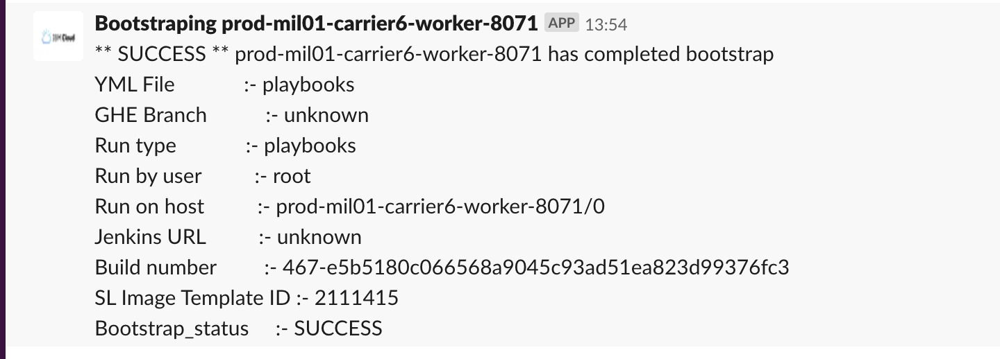

Informational
{: .label }

## Overview

This runbook is intended for the use of SRE team members tasked with provisioning new machines for IBM Containers.

Provisioning machines should be performed with the Provisioning API. This GHE link will take you to the technical documentation pages: [readme.md](https://github.ibm.com/alchemy-conductors/provisioning-app/blob/master/readme.md).

This link takes you to the [design and build documentation](./sl_provisioning_design.html)

## Detailed Information

## Provisioning with Provisioning UI.

Link to the [Provisioning UI](https://alchemy-dashboard.containers.cloud.ibm.com/prov/api/web/)

## Managing Templates

The following video showcases the template management workflow.

<iframe src="https://ent.box.com/embed/preview/oz8g2bx7c0vovucenknnwr759b3h810a?theme=dark" width="640" height="360" frameborder="0" allowfullscreen webkitallowfullscreen msallowfullscreen></iframe>

## Orders

It is easy to verify and place orders. The following video shows how.

<iframe src="https://ent.box.com/embed/preview/kvn4bkcbi226vo5gm64go5s0zwiie8zk?theme=dark" width="640" height="360" frameborder="0" allowfullscreen webkitallowfullscreen msallowfullscreen></iframe>

## Machine Management

From the UI we can access machine details as well as performing some maintenance actions, such as: reboot, power off/on, boot to rescue, and perform an os reload. It is also possible to verify the post-provisioning status and even download post-provision logs.

<iframe src="https://ent.box.com/embed/preview/5bjrbeizj9nep4v12esfchb3x3evrqze?theme=dark" width="640" height="360" frameborder="0" allowfullscreen webkitallowfullscreen msallowfullscreen></iframe>

## User Management

Softlayer User Management is defined in these documents

- [Adding/removing IBM Cloud and Infrastructure users](./ibmcloud_account_management.html)
- [User Management tools runbook](./sl_usrmgmt.html)

## The app is down - how to build and redeploy

This link takes you to the [design and build documentation](./sl_provisioning_design.html) which covers where the provisioning-app code is, how it is built and how it is deployed.

# Provisioning using the CLI Client

## Download and Install
Detailed download instructions and usage examples here: [Provisioning CLI](https://github.ibm.com/alchemy-conductors/provisioning-app/blob/master/docs/curl_client.md)

## Check the list of existing templates.
There are a number of templates already defined for machines. So it might be that the new machine you
are ordering is based on one of the existing templates. You can review them here: [Templates UI](https://alchemy-dashboard.containers.cloud.ibm.com/prov/api/web/templates).

**NOTE**: For VSI orders at least we should try to use any of the existing templates.

## Create a new Template From An Existing Machine

To create a machine template you can use the CLI client, like this:

```
./curl_client.py -r generate_template_from_existing --host dev-mon01-infra-sensu-01
```

The output looks like this:

```
{
  "messages": ["Success"],
  "template": {
    "pkgId": 46,
    "ram_item": "RAM_16_GB",
    "disks": {"guest_disk0": "GUEST_DISK_100_GB_LOCAL"},
    "core_item": "GUEST_CORES_8",
    "pkgDescription": "Virtual Server Instance",
    "os_item": "OS_UBUNTU_14_04_LTS_TRUSTY_TAHR_MINIMAL_64_BIT",
    "port_speed_item": "1_GBPS_PUBLIC_PRIVATE_NETWORK_UPLINKS",
    "bandwidth_item": "BANDWIDTH_5000_GB",
    "machine_type": "vs"
  }
}
```

**REMEMBER**: Add `-e prod` if you want to target a machine in the SL Production account (stage and prod machines).

## Create a new Template From Scratch

If you need to create a new machine template, you can do so by using the API (And soon the web UI :) ). It requires a fair bit of domain knowledge of the SL internals, and it's generally not an easy thing to do. For instance, a specific product package might be available in one data center but not in others.

You can add a template to the provisioning API using the `add_template` endpoint. This is an example:

```
/curl_client.py  --test -r add_template -f my_template_file.json --name my_test
```

You can check that the template has been added and is available by browsing to the [Templates URL](https://alchemy-dashboard.containers.cloud.ibm.com/prov/api/web/templates).

Here's an example of what a template file looks like for a VSI:

```
{
    "machine_type": "vs",
    "pkgId": 46,
    "pkgDescription": "Virtual Server Instance",
    "ram_item": "RAM_16_GB",
    "os_item": "OS_UBUNTU_14_04_LTS_TRUSTY_TAHR_MINIMAL_64_BIT",
    "core_item": "GUEST_CORES_4",
    "port_speed_item": "1_GBPS_PUBLIC_PRIVATE_NETWORK_UPLINKS",
    "disks": {
        "guest_disk0": "GUEST_DISK_100_GB_SAN",
        "guest_disk1": "GUEST_DISK_2000_GB_SAN",
        "guest_disk2": "GUEST_DISK_2000_GB_SAN"
    }

}
```

You can find more examples of templates here: [readme.md](https://github.ibm.com/alchemy-conductors/provisioning-app/blob/master/readme.md).

Building a template requires knowledge of SoftLayer Product Packages. Product Packages are SoftLayer's broad classification of machine specs. Different data centers can allow or disallow different product packages, so it is important to keep that in mind.

To ease template development, we have put together the following page: [Product Packages](https://alchemy-dashboard.containers.cloud.ibm.com/prov/api/web/packages).

What you see is a list of all the machine-related packages in each of our data centers in SoftLayer. Each product package can be expanded, showing the full list of configuration options for that package.

The items in each configuration category are the exact strings that need to be copied in the relevant template section.

In general, these are the steps that you should follow when creating a template:

- Look at the machine configuration that you want to duplicate
- Identify a Product Package that matches the CPU configuration. This is especially relevant for bare metal configurations. All Bare Metal product packages refer to processor families.
- Add the package ID number to the "pkgId" section in the template.
- Find the required RAM, OS, CPU, and disk configuration,
- The `port_speed_item` is usually 1Gbps or 10Gbps, public+private or just private. You can find the valid options by looking at the **Port Speed** category of your package.
- **bandwith** option is usually valid by default. If the default values don't work with your particular machine configuration, you should add a **bandwith** key to your template with the specific Bandwith option. Default values are:
  - For public interfaces: 20Tb
  - For Private interfaces only: Unlimited

- For RAID specific configuration, you can use the `storage_groups` key in the template. It allows you to mount a RAID drive using some or all of the physical drives, as a particular RAID version, with a given size. This is an example:

```
"storage_groups": [
  {
    "drives": [0, 1, 2, 3, 4],
    "key": "RAID_6",
    "size": 99
  },
  {
    "drives": [0, 1, 2, 3, 4],
    "key": "RAID_6",
    "size": 11901
  }]
```

After you create your template, you should validate it by placing a test order.

## Create a Machine Order
A machine order captures the requirements for a particular machine order. You can order one or many machines with the same template in the same order. It is meant to be as simple as:

- **template**: Name of the machine template to use.
- **hostname**: the machine host name. It needs to follow the alchemy [naming convention](https://pages.github.ibm.com/alchemy-conductors/documentation-pages/docs/runbooks/conductors_requesting_softlayer_machine.html#hostname). It can be an array of hostnames for multiple machine orders.
- **location**: This is the datacenter identifier, currently one of *Mon01, Dal09, Lon02*
- **BackEndVlan**: The VLAN for the private interface, specified as a pair name, router.
- **FrontEndVlan**: The VLAN spec for the public interface. Only needed if the machine has a public network interface. Otherwise this section is ignored.
- **ssh-keys**: Optional list of extra SSH keys to add.

Here is an example:
```
{
    "template": "bm.medium.big-storage.private",
    "location": "dal09",
    "hostname": "stage-dal09-vuln-ES-07",
    "domain": "alchemy.ibm.com",
    "BackEndVlan": {"name": "Stage/Dal09/CSMG/B", "router": "bcr06a.dal09"},
    "ssh_keys": ["colin_thorne", "ralph"]
}
```

You can find other example orders in the `examples/api` folder of the CLI client.

For reference, you can retrieve the details of the Vlans by going to the [Vlans Page](https://alchemy-dashboard.containers.cloud.ibm.com/prov/api/web/vlans) in the Provisioning Web.

## Verify an Order

It is recommended to run an order verification before placing the order. This can be done by using the CLI client.

This is done by invoking the `verify_order` endpoint, with the file that contains the JSON representation of the order.

```
./curl_client.py -r verify_order -f examples/api/vs_small_order.json
```

## Placing an order

The CLI for Placing and Order is similar to the `verify_order` command above, using the `place_order` endpoint instead. The output is the same.

While it takes minutes to provision a VSI, it can take several hours to provision a bare metal server.

# Provisioning machines needed for a carrier

## Order VSIs

Go to Provisioning App->Orders->Order Server [https://alchemy-dashboard.containers.cloud.ibm.com/prov/api/web/](https://alchemy-dashboard.containers.cloud.ibm.com/prov/api/web/)

### Order worker-100X

* Machine Template: carrier-workers-1000-series
* Hostame: <carrier_name>-worker-10[00-XX]
* Domain: alchemy.ibm.com
* Back/Front End Vlan: Use same as existing workers. Should be of the form: Prod/Carrier1

### Order worker-800X

* Machine Template: carrier-workers-8000-series
* Hostame: <carrier_name>-worker-80[00-XX]
* Domain: alchemy.ibm.com
* Back/Front End Vlan: Use same as existing workers. Should be of the form: Prod/Carrier1

### Order master

* Machine Template: carrier-masters-ha-ubuntu-18
* Hostame: <carrier_name>-master-XX
* Domain: alchemy.ibm.com
* Back/Front End Vlan: Use same as existing workers. Should be of the form: Prod/Carrier1

## Order BMs

### Order haproxys

* Machine Template: carrier-haproxy
* Hostame: <carrier_name>-haproxy-XX
* Domain: alchemy.ibm.com
* Back/Front End Vlan: Use same as existing workers. Should be of the form: Prod/Carrier1

`Notes: Hardware price ids vary widely from dc to dc. May need to order this one via SL UI.`


## Post actions

Once the order is complete, follow these steps to complete the machine setup and get it deployed into a carrier.

### Verify bootstrap has completed

Once a machine has been provisioned by IBM Cloud Infrastructure, a post provision bootstrap should execute
Upon successful completion, a message will be posted to the [`#bootstrap-bot-alerts` slack channel](https://ibm-argonauts.slack.com/archives/C53PSDQUC)

Monitor this channel for a message.

<a href="images/conductors/worker-order-bootstrap-alert.png">
</a>

If this message does not appear, consult the [debugging bootstrap failures documentation]

### Patch the machine

Issue a [patch request](./sre_patching.html) for the newly ordered machine using the details in the linked runbook.

### Reboot the machine

Once the patch request completes successfully, log into the node and issue a reboot  
Use `sudo shutdown -r now` to complete a reboot.

This will reboot the machine and complete any patching requirements which require a system restart. (such as booting into a newly installed kernel)

## Escalation Policy

If you are unable to order machines due to capacity in the specific datacenter or other reasons, raise a ticket with SL to investigate


[debuging bootstrap failures documentation]: https://github.ibm.com/alchemy-conductors/bootstrap-one/blob/master/README.md
