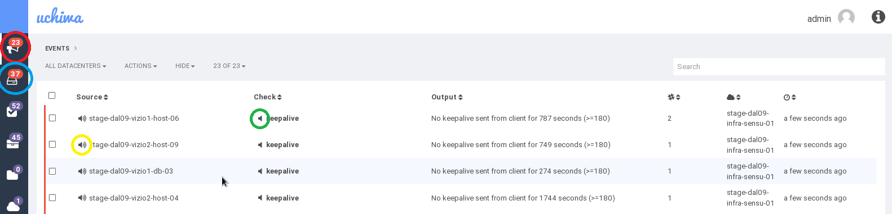
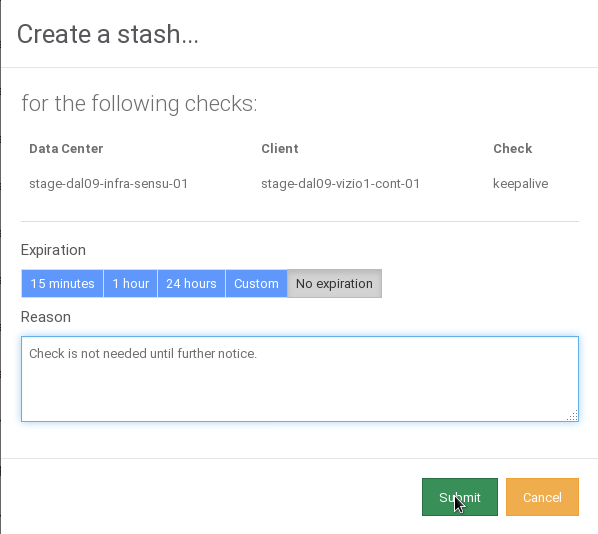

Informational
{: .label }

## Content
{:.no_toc}

* Will be replaced with the ToC, excluding the "Contents" header
{:toc}

---

## Purpose

This runbook describes how to silence alerts on Uchiwa, both temporarily and perminantly.

---

## Steps

1.	Log into your privileged machine.

1.	VPN into the softlayer environment.

1.	Use web browser to access the desired environments Uchiwa. For example https://10.143.144.25:3000 for prod-dal09, or https://10.142.198.98:3000 for stage-dal09.

1.	Login using the default details:

		Username: admin
		Password: Sensui$dabomb1

	  

1.	Click on the Events page (Red circle).

1.	Locate the Check that you wish to silence, then click on the speaker symbol to the left (Green circle).

 		 If the alert that you want to sleep isn't currently active, you can find the client list to the left (Blue circle).
		 If you want to stop alerts for a whole client, this can be done by clicking the speaker to the left of the client name (Yellow circle).

1.	Select a timeframe, and give a valid reason.

	  

1.	Enjoy the silence.

## Steps to silence check using Sensu API

1. See the following [runbook](https://github.ibm.com/alchemy-conductors/sensu-uptime/blob/master/runbook/sensu-uptime-ops.md#section-1-how-to-silence-one-check-using-sensu-api)
