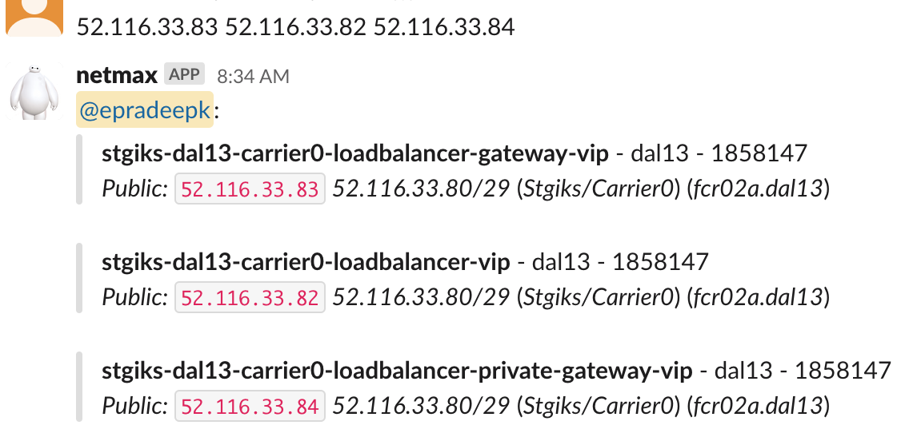
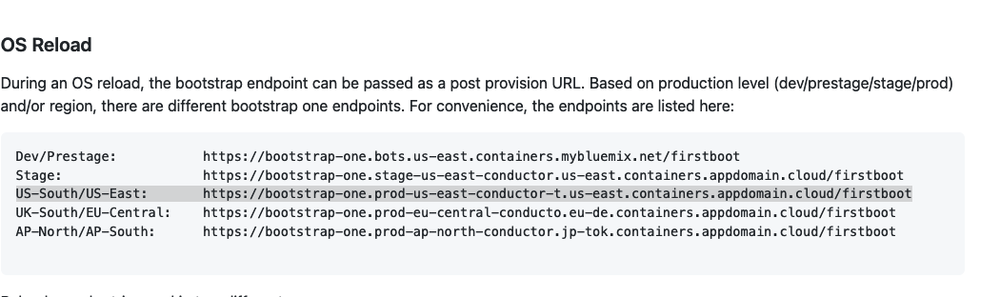

Ops
{: .label .label-green}

## Overview
This runbook provides the steps to reconfigure a haproxy system after OS reload to a new Ubuntu image.
  
  
## Detailed Information
As part of Infrastructure systems migration from Ubuntu18 to Ubuntu20, this runbook is created to provide steps for haproxy systems reconfiguration.
  
There are two Haproxy systems exist per CARRIER (Eg: prod-tor01-carrier1-haproxy-01 and prod-tor01-carrier1-haproxy-02). One haproxy will be running as MASTER and other as BACKUP. Note that these roles will not be permenantly configured to either haproxy-01 or haproxy-02. They can be switched between the two haproxies.
  
The reconfiguration process should be started on BACKUP (Eg: haproxy-02) after verifying that the MASTER (Eg: haproxy-01) is up and running fine. Once the upgrade process is completed on haproxy-02, it should be set as MASTER and the haproxy-01 becomes BACKUP. Now the same process need to be executed on haproxy-01 (BACKUP). So its required to keep the MASTER up and running all the time. 

Finally, the roles can be switched back as before where haproxy-01 can be MASTER and haproxy-02 becomes BACKUP. 
  
## Detailed Procedure
### Steps to reconfigure haproxy systems on a CARRIER <br>
#### Confirm who is the MASTER
On both haproxy-01 & 02, run the command `sudo ip addr show | grep bond1`. If the output shows two/three VIPs under `bond1` (refer to below example) then its MASTER. Otherwise its BACKUP.

Example: <br>
`sudo ip addr show | grep bond1` <br>

for MASTER:
```
 root@stgiks-dal10-carrier4-haproxy-02:~# ip addr show | grep bond1
3: eth1: <BROADCAST,MULTICAST,SLAVE,UP,LOWER_UP> mtu 1500 qdisc mq master bond1 state UP group default qlen 1000
5: eth3: <BROADCAST,MULTICAST,SLAVE,UP,LOWER_UP> mtu 1500 qdisc mq master bond1 state UP group default qlen 1000
6: bond1: <BROADCAST,MULTICAST,MASTER,UP,LOWER_UP> mtu 1500 qdisc noqueue state UP group default qlen 1000
  inet 150.239.42.59/28 brd 150.239.42.63 scope global bond1
  inet 52.117.144.12/32 scope global bond1
  inet 52.117.144.10/32 scope global bond1
  inet 52.117.144.11/32 scope global bond1
```
for BACKUP:
```
 root@stgiks-dal10-carrier4-haproxy-01:~# ip addr show | grep bond1
3: eth1: <BROADCAST,MULTICAST,SLAVE,UP,LOWER_UP> mtu 1500 qdisc mq master bond1 state UP group default qlen 1000
5: eth3: <BROADCAST,MULTICAST,SLAVE,UP,LOWER_UP> mtu 1500 qdisc mq master bond1 state UP group default qlen 1000
7: bond1: <BROADCAST,MULTICAST,MASTER,UP,LOWER_UP> mtu 1500 qdisc noqueue state UP group default qlen 1000
  inet 150.239.42.53/28 brd 150.239.42.63 scope global bond1
```
  
#### Pre-requisites before starting reconfiguration process
Verify the MASTER is up and running fine: <br> 
1. Check if keepalived is running ok on MASTER: <br>
`sudo systemctl status keepalived` or `sudo /etc/init.d/keepalived status` (use it if systemctl doesn't work) <br>
2. Verify that network traffic is running fine through loadbalancer VIP: <br>
  (a) Identify the loadbalancer VIP: <br>
  Run `sudo ip addr show | grep bond1` [Refer to `Confirm who is the MASTER` for sample output] <br> 
  Take the three VIPs from the output 52.116.33.83 52.116.33.82 52.116.33.84 and run it with @netmax:
  
  <a href="images/conductors/loadbalancer_vip.png">
  </a>

  
  From @netmax the loadbalancer VIP is `52.116.33.82` <br>
  (b) Run `sudo ipvsadm -Ln --stats | grep 52.116.33.82` to verify that the network traffic is fine on loadbalancer VIP. <br>
Example: <br>
```
root@stgiks-dal13-carrier0-haproxy-01:~# ipvsadm -Ln --stats | grep 52.116.33.82
TCP 52.116.33.82:0         756691 3028495 2273866 321726K 234681K
TCP 52.116.33.82:443        268528 12046651 15145469  1033M  83440M
UDP 52.116.33.82:0           27    30    30   1603   2443
```
  The output should show values (as shown above) for all the columns in the output. If not (if it shows zeros), abort the upgrade and report in #conductors-for-life channel.
  
(c) Verify that overall the network traffic is fine as well:
```
  #  ipvsadm -Ln --stats
IP Virtual Server version 1.2.1 (size=4096)
Prot LocalAddress:Port               Conns   InPkts  OutPkts  InBytes OutBytes
  -> RemoteAddress:Port
TCP  169.54.76.125:0               3365877 61301762 63121238    8129M   39601M
  -> 169.54.77.197:0                114586  2900084  2943688  402408K    1824M
  -> 169.54.77.198:0                 97179  1509774  1379980  199678K  539781K
  -> 169.54.77.199:0                100784  2496618  2495652  349434K    1487M
  -> 169.54.77.201:0                 77978   312093   234348 32791908 24166695
  -> 169.54.77.206:0                 80485   321822   241592 33634319 24944434
  -> 169.54.77.208:0                 92720  1697735  1791522  200706K    1391M
  -> 169.54.77.209:0                127173  3058715  3089199  441109K    1604M
  -> 169.54.77.212:0                 88915  1127954  1081233  169484K  399534K
  -> 169.54.77.214:0                101537  2176558  2038372  293335K  833818K
  -> 169.54.77.215:0                104905  1031380  1020945  141310K  408970K
  -> 169.54.77.216:0                 87845  1273076  1408658  161605K    1192M 
  ....
  ....
  ```
 (d) As a side note, the `sudo ipvsadm -Ln --stats` output will show all zeros for InPkts/OutPkts columns when executed on BACKUP. <br>
3. If any of the above two pre-requisites are NOT met then abort the reconfiguration process on the CARRIER. Similarly if any of the Reconfiguration steps didn't return the expected output then abort the process and post in #conductors-for-life channel.

`NOTE: The reconfiguration process should be first completed on BACKUP and then to be proceeded on to MASTER.`

#### Raise one stage/prod train request per region in day. Can use the same train for all the haproxies in that region that can be covered in a day.
```
Squad: SRE
Title: Upgrade Haproxy to Ubuntu20 and perform reconfiguration
Environment: <REGION>
Details: <NAMES OF THE HAPROXY Systems>
Risk: low
PlannedStartTime: now
PlannedEndTime: now + 8h
Ops: true
BackoutPlan: SRE will work on blackout plan
CustomerImpact: LOW
ValidationRecord: N/A 
PipelineName: N/A
PipelineVersion: N/A
ServiceEnvironment: Production
ServiceEnvironmentDetail: N/A
Audience: Private
```
#### Reconfigure the BACKUP haproxy <br>
Assuming haproxy-01 is MASTER and haproxy-02 as BACKUP. <br>
  
SSH to haproxy-02/BACKUP: <br>
1. Verify keepalived is running: <br>
    `sudo systemctl status keepalived` <br>
2. Confirm that haproxy-02 a BACKUP by following the steps in `Confirm who is the MASTER`
4. Silence the netint alerts for haproxy-02/BACKUP by running below command in #sre-cfs slack channel: <br>
  `@netmax silence HAPROXY-02 for 6h` <br>
  Eg: `@netmax silence prestage-mon01-carrier1-haproxy-02 for 6h` <br> 
  NOTE: In case of OS Reload or [netint Jenkins Job](https://alchemy-containers-jenkins.swg-devops.com/view/Network-Intelligence/job/Network-Intelligence/job/reconfigure-haproxy/) (mentioned later in the steps) or any OS reload issues etc that takes more time than 6hrs then extend the silencing hrs accrodingly (preferably 24 hrs if SL ticket is open for OS reload failures) by re-running the above command <br>
5. Inform netint squad in #netint channel about the haproxy upgrade
6. Stop the keepalived on haproxy-02: <br>
 `sudo systemctl stop keepalived` <br> or `sudo /etc/init.d/keepalived stop` (use it if systemctl doesn't work)
7. Perform the OS reload on haproxy-02 by selecting the Ubuntu20 image: <br>
  (a) Login to `cloud.ibm.com`. Select appropriate Softlayer Account based on Haproxy [for Dev=659397,Stage=1858147,Prod=531277].  <br>
  (b) Click on `Navigation Menu`, select `Classic Infrasctructure` --> `Device List` and enter the haproxy-02 name/IP  <br>
  (c) Click on the haproxy-02 device listed in the `Device List` <br>
  (d) In the haproxy02 device page, goto `Actions` --> select `OS Reload` option <br>
  (e) In the OS Reload page edit `Operating System` option and select `Ubuntu Linux 20.04 LTS Focal Fossa(64 bit)` <br>
  (f) In `Extra features`: <br> 
      (f.1) for `Provision script`, select the region specific entry (Example: "B1 Stage" for Stage) <br>
      Refer to [this page](https://github.ibm.com/alchemy-conductors/bootstrap-one/blob/master/README.md) for more info about the selecting an appropriate option/script. <br>
      <a href="images/OS-Reload.png">
      </a>
       <br>
      (f.2) for `SSH Keys`, select `jenkins` <br>
  (g) If the reloads takes more than 3:30 hrs, raise a Sev1 SoftLayer ticket for the haproxy system. Inform in #netint channel about this failure. <br>
8. After successful OS reload to Ubuntu20, run the [netint Jenkins Job](https://alchemy-containers-jenkins.swg-devops.com/view/Network-Intelligence/job/Network-Intelligence/job/reconfigure-haproxy/) to configure haproxy-02 as haproxy. Set parameter `A single haproxy` as haproxy-02. <br> 
Example: `prestage-mon01-carrier1-haproxy-02`. <br>
Maximum run time of the netint Jenkins Job is approx. 1 hr 30 mins. If it exceeds, report to netint squad in #netint channel.
9. After successful run of [netint Jenkins Job](https://alchemy-containers-jenkins.swg-devops.com/view/Network-Intelligence/job/Network-Intelligence/job/reconfigure-haproxy/) (if any issues, report in #netint slack channel), SSH to haproxy-02 and verify keepalived is running fine: <br>
`sudo systemctl status keepalived` <br>
10. Login to Support openvpn (`sup-wdc04` client). Goto netint monitoring page (listed below) and verify that the haproxy is reporting GREEN.  If not, report to netint squad in #netint slack channel. <br>
The list of netint monitoring pages for all Environments/Regions: see URLs below

  
#### Reconfigure the MASTER haproxy <br>
Currently haproxy-01 is MASTER and haproxy-02 is still BACKUP. <br>
1. Configure haproxy-02 as MASTER: <br>
SSH to haproxy-01 and run `sudo systemctl restart keepalived` to move MASTER to haproxy-02 and also move VIPs to it.<br>
2. Repeat the steps `Confirm who is the MASTER` and `Pre-requisites before starting reconfiguration process` on haproxy-02 to verify its a MASTER now and running fine. <br>
3. WAIT and monitor for around 1 hr to see if the new MASTER/haproxy-02 is running fine or if any issues are showing up [check Pager Duty alerts,slack messages from teams reporting any issues for this CARRIER etc]
4. If all looks fine after 1 hr then proceed to below step#5. <br>
   Else move the MASTER back to haproxy-01: <br>
   Restart keepalived on haproxy-02: `sudo systemctl restart keepalived`. <br>
   Verify haproxy-01 is now MASTER.
   Debug & fix the issue before proceeding. After fixing the issue, repeat the steps from Step#1.
5. SSH to haproxy-01 and repeat the steps `Reconfigure the BACKUP haproxy` on haproxy-01 which is a BACKUP now (and haproxy-02 is MASTER) <br>
6. Goto [netint monitoring page](https://monitoring-stage-us-south-private.netint.containers.cloud.ibm.com/prometheus/targets) and verify that both the haproxies are reporting GREEN. If not, report to netint squad in #netint slack channel. <br>
The list of netint monitoring pages for all Environments/Regions: see URLs below

  
## References
[How to debug Armada HA Proxy (LVS) front end api load balancer](https://pages.github.ibm.com/alchemy-conductors/documentation-pages/docs/runbooks/armada_haproxy_troubleshooting.html) <br>
[armada-infra - Failing a VIP over to another HAProxy](https://pages.github.ibm.com/alchemy-conductors/documentation-pages/docs/runbooks/armada/armada-carrier-vip-failover.html)

### Netint Prometheus URLs

Login to Support openvpn (`sup-wdc04` client)

- <https://monitoring-dev-us-south-private.netint.containers.cloud.ibm.com/prometheus/targets>
- <https://monitoring-prestage-us-south-private.netint.containers.cloud.ibm.com/prometheus/targets>
- <https://monitoring-us-south-private.netint.containers.cloud.ibm.com/prometheus/targets>
- <https://monitoring-uk-south-private.netint.containers.cloud.ibm.com/prometheus/targets>
- <https://monitoring-ap-north-private.netint.containers.cloud.ibm.com/prometheus/targets>
- <https://monitoring-eu-fr2-private.netint.containers.cloud.ibm.com/prometheus/targets>
- <https://monitoring-stage-us-south-private.netint.containers.cloud.ibm.com/prometheus/targets>
- <https://monitoring-sup-wdc04-private.netint.containers.cloud.ibm.com/prometheus/targets>

### Netint Grafana URLs

Login to Support openvpn (`sup-wdc04` client)

- <https://monitoring-dev-us-south-private.netint.containers.cloud.ibm.com/grafana> (doesn't seem to have haproxy dashboards)
- <https://monitoring-prestage-us-south-private.netint.containers.cloud.ibm.com/grafana/d/Sc4cOs4Iz/carrier-load-balancer?orgId=1&refresh=1m>
- <https://monitoring-us-south-private.netint.containers.cloud.ibm.com/grafana/d/a6U_csVIk/carrier-load-balancer?orgId=1&refresh=1m&var-target=All>
- <https://monitoring-uk-south-private.netint.containers.cloud.ibm.com/grafana/d/t_RJcyVIz/carrier-load-balancer?orgId=1&refresh=1m>
- <https://monitoring-ap-north-private.netint.containers.cloud.ibm.com/grafana/d/2mPYKs4Iz/carrier-load-balancer?orgId=1&refresh=1m>
- <https://monitoring-eu-fr2-private.netint.containers.cloud.ibm.com/grafana/d/2Lznty4Iz/carrier-load-balancer?orgId=1&refresh=1m>
- <https://monitoring-stage-us-south-private.netint.containers.cloud.ibm.com/grafana/d/JHj6ds4Iz/carrier-load-balancer?orgId=1&refresh=1m>
- <https://monitoring-sup-wdc04-private.netint.containers.cloud.ibm.com/grafana/d/xG2fdsVSk/carrier-load-balancer?orgId=1&refresh=1m> (no carriers in sup)


## Escalation paths
Slack channels: <br>
@ask-netint in #netint  <br>
#conductors-for-life 
