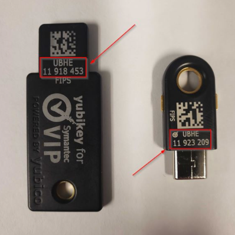

Informational
{: .label }

# Access requests for IKS SRE Squad

## Overview

This document details how new SRE members should onboard to the Worldwide SRE squad.

Work with your local squad lead to get your access granted and your workstation setup ready.

You should begin by completing the [production onboarding checklist](https://pages.github.ibm.com/alchemy-conductors/documentation-pages/docs/process/production_onboarding.html).


### Prerequisites

<span stype="color:red">*IMPORTANT*:</span> Mandatory trainings and WST security compliance *MUST* be completed before any access request to be submitted. Non-conformance will result in violating `Control HR.02 - Late Completion of Mandatory courses`.

- **AccessHub access**
Login to [AccessHub](https://ibm-support.saviyntcloud.com/ECMv6/request/requestHome)

- **IBM GitHub userid**  
Before you start onboarding, please ensure that you already have logged on to IBM GitHub and that a GitHub userid has been created for you - to achieve this go to [https://github.ibm.com](https://github.ibm.com).  
_Log on, if necessary, using the w3id federation. If you click on the top most right icon, github should show you as signed in._  
_**If you create a new user, please allow AccessHub half a day to discover and synchronize your new userid!**_

  Without a valid user in IBM GitHub, the AccessHub onboarding will fail.

### Before you begin notes
- If you are not familiar with AccessHub, usage steps are outlined here. [Using AccessHub](../process/access_control_using_accesshub.html#how-to-use-accesshub)
- Focus on Yubikey, IKS Access & Service Now as these are primary blockers.
[Yubikey Starting point](https://pages.github.ibm.com/alchemy-conductors/documentation-pages/docs/runbooks/sre_access_requests.html#setting-up-global-protect-vpn)
- Do **not** accept __"You are invited to join an account"__ email until **after** your yubikey is setup as joining a yubikey MFA account without a yubikey will disable all IBMCloud and Service Now access. The join invitation is vaild for 30 days.  
- The steps below will differ slightly if you are new to IBM (**Select Request Access for Self**) or an Existing IBMer with some access already (**Select Manage My Access**).


## Detailed Information

### AccessHub request for an SOS IDMgt

SOS IDMgt is required to connect to vpn and IBM Cloud machines. Hence, user have to remember the username he/she provides during the process.

**NOTE** An `SOS IDMgt ID` is required to connect to vpn and IBM Cloud machines. Make sure the ID is unique and easy to remember as it will be used to login to IBM Cloud machines. Existing usernames are not checked by SOS IDMgt so, if the ID is not unique, it causes complications for the SRE squad. If in doubt, check with the SRE squad.

1. Go to [AccessHub](https://ibm-support.saviyntcloud.com/ECMv6/request/requestHome).
1. Click on **Request New Access for Self** or **Manage My Access** 
1. Search for **SOS IDMgt** in the **Applications** search box.
1. Enter a **Account Name** for yourself
_for example, use your intranet short name_
_NB: This must NOT clash with any local user account on any machine - see NOTE above_
1. In the **Brand Type** field type **BU044-ALC**
1. Click **Add**.
1. Find the group `BU044-ALC-Conductor`
   _You can use the search box to find it quickly._
   - if you are an EU member, also `BU044-ALC-Conductor_EU`
1. Click **Select** on each of the above.
1. When you have added all the **Groups** you are requesting, click on **Done** at the bottom of the page.
1. Click **Review & Submit**
1. Enter a **business justification**.
   _This should detail the `squad` you are in, the `region` you are in (important for EU confirmation), and the reason you need access to each `group and role`._
1. Confirm your details and **Tick** the box.
1. Click **Submit**


#### Removal of AccessHub entitlements after period of SOS inactivity

Note that if the SOS ID has been inactive for a period of time, production entitlements in AccessHub will be revoked. Please see the [How to restore SOS IDMgt entitlements](https://pages.github.ibm.com/alchemy-conductors/documentation-pages/docs/runbooks/sre_restoring_sos_idmgt_entitlements.html) runbook.

### Setting up Global Protect VPN

This section is for creating an account in the Softlayer (Commercial) environment and setting up temporary access using Symantec VIP App and permanent access using Yubikey.

1. #### Request an account into the Softlayer (Commercial) environment (SL IMS/AD credentials and a YubiKey) via AccessHub (IaaS Access Management Application)

   1. Go to [AccessHub](https://ibm-support.saviyntcloud.com/ECMv6/request/requestHome)
   1. Click on **Request Access for Self** or **Manage My Access** 
   1. Search for **IaaS Access Management** in the **Applications** search box
   1. Select **Employee Type** and then click on **Add**
   1. From dropdown, select **IBM Employee**
   1. Enter a **business justification**
   _This should detail the `squad` you are in, the `region` you are in (important for EU confirmation), and the reason you need access to each `group and role`._
   1. Click **Submit**

   Once your AccessHub request is approved, you will receive an email with subject line **[EXTERNAL] Softlayer Commercial Account**, containing a temporary password and instructions for next steps.

   **Post requisite:** After your Softlayer account has been created, please ask your first line managers to submit: [FSBOA - IMS Security-Level requests] (https://confluence.softlayer.local/pages/viewpage.action?pageId=59604584 ). And once FSBOA has been approved, proceed to order Yubikey  [ YubiKey ] (https://confluence.softlayer.local/display/HELPDESKPUB/Requesting+A+YubiKey). Yubikey process can be slow - its important to get it done early.

2. #### Reset SL AD Password and Enroll Account

   The steps for this task are included in the email you receive at the end of first step.

   _**Note** After registration, if the user doesn’t login for longer than 28 days, the account gets disabled and need to reach SL help to re-activate it. You will receive a temporary password again and will need to change password and enroll account_

3. #### Pre-prod MFA option

   1. ##### Download and install the Symantec VIP App on your mobile phone

      1. Download this app by visiting this link: [Symantec VIP](https://vip.symantec.com/). For Mac use the mobile app.
      1. Once you download the Symantec VIP App and open it, you will be presented with a **Symantec Credential ID**. This credential ID has been observed to start with SYMC followed by 8 digits (SYMCxxxxxxx or SYMZxxxxxx).

   1. ##### Register the Symantec VIP Credential ID

      1. You will need to contact SL Helpdesk team to link your Symantec VIP Credential ID (App instance on mobile device) and your SL IMS/AD account.
      1. Join the slack channel `#sl-helpdesk` (or call `+12817144500`).
      1. Post a message indicating, You need your SL IMS/AD Account and Symantec credential ID linked.
      _**WARNING** DO NOT POST YOUR CREDENTIAL ID IN THIS PUBLIC CHANNEL_
      1. One of the helpdesk representative will respond with either a Direct Message or ask you to send your SL IMS/AD user id or IBM ID email address and SYMC credential ID.
      1. Send the details in a Direct Message.
      1. You will receive a confirmation message in that DM that your SL IMS/AD ID and Symantec credential ID are linked.

4. #### Prod MFA option

   1. ##### Register your Yubikey

      On receiving your Yubikey, you need to contact the SL Helpdesk team to register the serial number and associate it with your AD account. At that time, the Symantec VIP auth will be disabled.
      1. Join the slack channel `#sl-helpdesk` (or call `+12817144500`).
      _**Note**: Please do not use @here or @channel as it will alert 2800+ people._
      _**WARNING** DO NOT POST YOUR CREDENTIAL ID IN THIS PUBLIC CHANNEL_
      1. Provide the helpdesk personnel with your current 2-factor Credential ID from your mobile phone application (VIP Access or VIP Access for iPhone) or provide your IBM Serial Number.
      1. Provide the Yubikey serial number. It can be found as shown in the image:
      
      1. Once Softlayer helpdesk has added your key, test it by logging into the Softlayer VPN.
      _**Note:** You explicitly need the Yubikey from SoftLayer for this purpose. This Yubikey is FIPS compliant which is a requirement_

5. #### Download and install VPN Client for Mac

   This step will guide you to download, install, and run the Palo Alto Networks Global Protect VPN client for Mac
   1. Visit the URL: [Global Protect Portal](https://eu1.gp.softlayer.com/)
   1. Login with your SL IMS/AD credentials
   1. Provide 2FA code from Symantec VIP Access app or provide code from your Yubikey
   1. You will be presented with a download options. Pick appropriate one to download
   1. After downloading, use appropriate instructions for Windows or Mac to install the client on your laptop/desktop
   1. You can find instructions to download and configure the Global Protect VPN client on Mac here: [instruction for global protect](https://github.ibm.com/cloud-docs-internal/bastionx/blob/draft/pdfFiles/SUPPORT-GlobalProtectVPNClient-MacUsers-011020-0309-126.pdf)

6. #### Download and install VPN Client for Linux

   This step will guide you to download, install, and run the Palo Alto Networks Global Protect VPN client for Linux
   1. Visit the following box [folder](https://ibm.ent.box.com/s/u6t2k6idhi53bzxrlyhdyohuhxxh2gc9/folder/113719793038)
   1. Download the package (it is in tgz format)
   1. Extract files from the package. You will see multiple installation packages for supported operating systems. DEB for debian and Ubuntu and RPM for CentOS and Red Hat. The package for the GUI version is denoted by GlobalProtect_UI prefix.
   1. Install the package for your system:
      For Debian and Ubuntu, use `sudo apt-get install <gp-app-pkg>` command.
      For CentOS and Red Hat, use `sudo yum install <gp-app-pkg>` command
   1. Configure GlobalProtect app to add portals
      Portals for Pre-Prod and Prod is listed in [Box Note](https://ibm.ent.box.com/file/760458054708).

      Portals for EU-FR2 is listed in [SoftLayer Confluence](https://confluence.softlayer.local/x/y0PFAg).
      NOTE: For Non BNPP squad, follow `BNPP Portals and Gateway URLs - Unrestricted Workstations`.

7. #### Test connectivity through the VPN to verify access

   Run the client and continue to follow the instructions, provided in the previous step, to connect to VPN, using SL IMS/AD credentials (us, pwd) + 2FA (Symantec VIP Auth 6 digit token), using the portal `am2.gp.softlayer.com`

### Ticket for self-onboarding to Global Protect VPN profile

This section details steps for self on-boarding to GP VPN profile

1. Go to [AccessHub](https://ibm-support.saviyntcloud.com/ECMv6/request/requestHome)
1. Click on **Request Access for Self** or **Manage My Access** 
1. Search for **IaaS Access Management** in the **Applications** search box
1. Add groups as follows:

    Pre-Prod: `ICCR-VPN-AD-preprod`, `IKS-VPN-AD-preprod`

    Prod: `ICCR-VPN-AD-prod`, `IKS-VPN-AD-prod`

    ProdFr2: `bnpp-paas-iks`
  
    Dreadnought: `dn-crew-bastion`
  
1. Enter a **business justification**
_This should detail the `squad` you are in, the `region` you are in (important for EU confirmation), and the reason you need access to each `group and role`._
1. Click **Submit**

### Enable U2F MFA on IBM Cloud Account

`Global Protect VPN FIPS-enabled Yubikey` must be used for U2F MFA authorization for IBM Cloud account. Therefore, a Yubi key issued by SoftLayer (IAAS) is required:
- SoftLayer key (aka Global Protect VPN key) FIPS-enabled Yubikey  
_as per [Setting up Global Protect VPN](#setting-up-global-protect-vpn) above_

The following steps explain required configuration process

#### 1. Register the SoftLayer (SL) FIPS-enable Yubikey as IAM MFA

Follow one of these two options:

- **If Yubi key was shipped BEFORE 2021-June-23**:

   1. Install Yubi Key manager, Download the package from [yubico](https://www.yubico.com/support/download/yubikey-manager/)
   2. Raise a [SL ticket](https://internal.softlayer.com/Ticket/addInternal) to arrange a web session with SL team (sample task [138115810](https://internal.softlayer.com/Ticket/ticketEdit/138115810)).  
   NB. Availability time slots **need** to be specified
   1. During websession,SL unlocks the key
   1. During websession, [Add SL Yubi key to IBM Cloud Account Security authentication](#2-adding-fips-enabled-yubikey-to-ibm-cloud-account)
   1. During web session, SL support locks the key again  
   SL Ticket:
   ```
   Group: Help Desk
   Subject: Yubikey/2FA
   request that FIDO module be unlocked
   ```
   
- **If Yubi key was shipped AFTER 2021-June-23**:
   1. SL team ship a SL key unlocked and without FIPS mode
   1. The key comes with an instructions on how to register the key with Softlayer (IaaS) 
   1. Install Yubi Key manager, Download the package from [yubico](https://www.yubico.com/support/download/yubikey-manager/)
   1. Raise a [SL ticket](https://internal.softlayer.com/Ticket/addInternal) to arrange a web session with SL team (sample task 138115810). Available time slots need to be specified
   1. During websession, [Add SL Yubi key to IBM Cloud Account Security authentication](#2-adding-fips-enabled-yubikey-to-ibm-cloud-account)
   1. During web session, SL support sets FIPS mode and locks the key 
     ```
   Group: Help Desk
   Subject: Yubikey/2FA
   request that FIDO module be locked
   ```

#### 2. Adding FIPS-enabled Yubikey to IBM Cloud Account

1. Go to the [IBM Cloud Two Factor Authentication](https://iam.cloud.ibm.com/mysecurity/index.jsp) page
   - You need to identify yourself with two different methods - usually Email and Text (SMS)
1. Authenticate using both methods
1. Go to the `Manage additional authentication factors` section and expand
1. Click `Add` and for `Add Authentication Factor` select `U2F` in the drop-down list
1. Give the U2F key a name (e.g. `SL Security Key`) and click `Register Key`
1. Insert the key and touch it when it flashes (Note: there may be no on-screen instruction for this)
1. If successful, it will be listed in the authentication factors alongside any existing factors (such as TOTP Verification Codes)

To test the key, log out of any [cloud.ibm.com](https://cloud.ibm.com) windows or open a private browser window, and attempt to log in using the key.


#### 3. Break-the-glass if SL Yubikey is unavailable

1. If the yubikey is broken, reach out to the [#sl-helpdesk](https://ibm-cloudplatform.slack.com/archives/C6MNCAJ4W) channel for help.
1. As part of [MFA enablement](https://w3.ibm.com/w3publisher/w3idsso/authentication-methods/add-new-authentication-methods), it is recommended to set up at least two authentication methods


### AccessHub request for IKS Access

Before you start onboarding, please ensure that you already have logged on to IBM GitHub and that a GitHub userid has been created for you. To do this, go to https://github.ibm.com. Log on if necessary using the w3id federation. If you click on the top most right icon, github should show you as signed in. If you create a new user, please allow AccessHub half a day to discover and synchronize your new userid.

Without a valid user in IBM GitHub, the AccessHub onboarding will fail.

1. Go to [AccessHub](https://ibm-support.saviyntcloud.com/ECMv6/request/requestHome).
1. Click on **Request Access for Self** or **Manage My Access** 
1. Search for **IBM Kubernetes Service (IKS) Access** in the **Applications** search box.
1. Verify that under the value of the Dynamic Attribute as GitHub Username your GitHub user shows up.
1. `I acknowledge` by clicking the 2 checkboxes.
1. Click on `Add` for `Organization`
1. Click `Add` next to `argonauts-access` and **Done**
1. Click `Add` next to `Team`
1. Find and select the following groups (_you can use the search box to find them quickly_):
   - `ROLE_IKS_SRE`
   - `ROLE_IKS_SRE-<your_country>`
   - `ROLE_ICCR_SRE`
   - `ROLE_ICCR_SRE-<your_country>`
   - `ROLE_RAZEE_SRE`
   - `ROLE_RAZEE_SRE-<your_country>`
   - `ROLE_SAT_Link-SRE-<your_country>`
   - **if you are an EU member**, also select `ROLE_IKS_SRE-EU`, `ROLE_ICCR_SRE-EU` and `ROLE_RAZEE_SRE-EU`  
     _**NOTE** EU members are required to request `ROLE_IKS_SRE-EU` as well as `ROLE_IKS_SRE-<your_country>` because `ROLE_IKS_SRE-EU` role is being used for migration at the moment._
1. Click **Add**.
1. When you have added all the **Groups** you are requesting, click on **Next** at the bottom of the page.
1. Enter a **business justification**.  This should detail the `squad` you are in, the `region` you are in (important for EU confirmation), and the reason you need access to each `group and role`.
1. Confirm your details and **Tick** the box.
1. Click **Submit**

### AccessHub request for Dreadnought Access

Before you start onboarding, please ensure that you already have logged on to IBM GitHub and that a GitHub userid has been created for you. To do this, go to [https://github.ibm.com](https://github.ibm.com){:target="_blank"}. Log on if necessary, using the w3id federation. If you click on the topmost right icon, github should show you as signed in. If you create a new user, please allow AccessHub half a day to discover and synchronize your new userid.

Without a valid user in IBM GitHub, the AccessHub onboarding will fail.

1. Go to [AccessHub](https://ibm-support.saviyntcloud.com/ECMv6/request/requestHome){:target="_blank"}.
1. Click on **Request Access for Self** or **Manage My Access** 
1. Search for **Dreadnought - Access Control** in the **Applications** search box.
1. Verify that under the value of the Dynamic Attribute as GitHub Username your GitHub user shows up.
1. Add the Organization `dreadnought-access`
1. Find and select your home country group (_you can use the search box to find them quickly_):
   - `Platform_SRE_<your_country>` 
       - Your Country Options:
           - AU - Australia
           - CA - Canada
           - GB - Great Britain
           - IE - Ireland (will include EU and BNPP cloud access)
           - IN - India
           - US - United State
1. Click **Add**.
1. When you have added all the **Groups** you are requesting, click on **Done** at the bottom of the page.
1. Click **Review & Submit**
Enter a **Business Justification**.  This should detail the `squad` you are in, the `region` you are in (important for EU confirmation), and the reason you need access to each `group and role`.
1. Confirm your details and **Tick** the box.
1. Click **Submit**

**NOTE** Dreadnought has many accounts in multiple enterprises.  As Conductors are added to new accounts an announcement will be made in the [#conductors-for-life](https://ibm.enterprise.slack.com/archives/G53NY6QH0){:target="_blank"} private channel to expect a new account invitation.

You can also look at the [Conductors supported Dreadnought accounts](https://pages.github.ibm.com/alchemy-conductors/documentation-pages/docs/runbooks/dreadnought/dn-general-info.html#conductors-supported-dreadnought-accounts){:target="_blank"} for the complete list of currently supported Dreadnought accounts.

### AccessHub request for Launch Darkly

Launchdarkly access is outlined here [LD](https://pages.github.ibm.com/alchemy-conductors/documentation-pages/docs/runbooks/launchdarkly-access.html)

### AccessHub request for Uptycs Dashboard

1. Go to [AccessHub](https://ibm-support.saviyntcloud.com/ECMv6/request/applicationRequest?search=SUJNIEFybWFkYSBVcHR5Y3MgSW5zdGFuY2Vz)
1. Request access to `IBM Armada Uptycs Intances`
1. Request `Uptycs Security Analyst (Read Only)` role and enter a business justification, "Member of the SRE team."
1. Click the blue tick to right of business justification.
1. Click on **Review and Submit**
1. Confirm your details, re-enter the business justification and **Tick** the box.
1. Click **Submit**

### Argonauts slack access

If you are in the Argonauts tribe then access to the Argonauts slack workspace can be requested.

1. Navigate to https://ibm.enterprise.slack.com/signin/find-workspaces
1. Search for `Argonauts`
1. Click `request to join` button.

A request will go to the `Slack workspace administrators`. More information on [Argonauts slack access](../process/access_control_argonauts_slack_access.html)

### SOS security center

The user should open [AccessHub](https://ibm-support.saviyntcloud.com/ECM/workflowmanagement/requesthome?menu=1) and select **Request or Manage Access**
This is access for pimconsole.sos.ibm.com also known as thycotic.  

1. Select System:
   1. Search for the `SOS-IDMgt` system
   1. Select **MODIFY EXISTING ACCOUNT**
   1. Click **Checkout**
1. Select Access:
   1. Specify the desired **USER ID**
   1. Set **Brand Type** to `BU044-ALC` and `BU203-ARMADA`
   1. In the **Available memberOf** search field, specify `SecurityCenter`
   1. Click the **ADD** button next to the following entries:
      - `BU044-ALC-SOS-SecurityCenter`
      - `BU203-ARMADA-SOS-SecurityCenter`
   1. Click the **Next** button
1. Provide a justification
`I'm joining the \<squad\> in \<location\> as a \<role\>`
1. Click **Submit**

When the AccessHub request has been approved:

1. raise a new GHE issue on [conductors team](https://github.ibm.com/alchemy-conductors/team/issues/new):
_see example [conductors team issue - #8530](https://github.ibm.com/alchemy-conductors/team/issues/8530)_
In the GHE issue, provide following details:
   - Title: `ACCESS REQUEST: SOS Security Center access request for <Intranet ID>`
   - Details of the user to be added
   - The user's SSO ID and email address
   - The role to be granted

1. assign the GHE issue to one of the roles authorised to review access requests

### SOS Inventory

1. Go to [AccessHub](https://ibm-support.saviyntcloud.com/ECMv6/request/requestHome).
1. Click on **Manage My Existing Access** 
1. Search for the `SOS-IDMgt` system
1. Select **MODIFY**
1. Add **Brand Type** `BU044-ALC` and `BU410-ALC_FR2`
1. Click the **ADD** button
1. In the **Available memberOf** search field, specify `Inventory`
1. Click the **Select** button next to the following:
   - `BU044-ALC-SOS-Inventory-Editor`
   - `BU044-ALC-SOS-Inventory-Reader`
   - `BU410-ALC_FR2-SOS-Inventory-Editor`
   - `BU410-ALC_FR2-SOS-Inventory-Reader`
1. Click the **Done** button
1. Click **Review & Submit**
1. Enter a **business justification**.
   _This should detail the `squad` you are in, the `region` you are in (important for EU confirmation), and the reason you need access to each `group and role`._
1. Confirm your details and **Tick** the box.
1. Click **Submit**


### Armada Inventory

Original Issue https://github.ibm.com/alchemy-conductors/team/issues/12193

1. Go to [AccessHub](https://ibm-support.saviyntcloud.com/ECMv6/request/requestHome).
1. Click on **Manage My Existing Access** 
1. Search for the `SOS-IDMgt` system
1. Select **MODIFY**
1. Add **Brand Type** `BU203-ARMADA`
1. Click the **ADD** button
1. In the **Available memberOf** search field, specify `Inventory`
1. Click the **Select** button next to the following
   - `BU203-ARMADA-containers-kubernetes-SOS-Inventory-Reader`
   - `BU203-ARMADA-containers-kubernetes-dev-SOS-Inventory-Reader`
   - `BU203-ARMADA-containers-kubernetes-tugboat-SOS-Inventory-Reader`
   - `BU203-ARMADA-satellite-link-SOS-Inventory-Author`
   - `BU203-ARMADA-SOS-Inventory-Author`
1. Click the **Done** button
1. Click **Review & Submit**
1. Enter a **business justification**.
   _This should detail the `squad` you are in, the `region` you are in (important for EU confirmation), and the reason you need access to each `group and role`._
1. Confirm your details and **Tick** the box.
1. Click **Submit**


### ServiceNOW

1. Open [ServiceNow Access Request](https://watson.service-now.com/ess_portal?id=sc_cat_item&sys_id=9a1240ebdbcdef0472583c00ad9619ad&sysparm_category=9b26f7d8dbe48f008799327e9d96199e)
1. For Person Needing Access select `For myself`
1. For Access Type select `Join a Licensed Assignment Group (requests will be routed to the group manager)`
1. For Cloud Role select `Person supporting/operating Cloud services`
1. For Assignment group to join type `Containers SRE`
1. Add your Business Justification
1. Click `Submit` button

Follow same process for [ServiceNow Test Access Request](https://watsontest.service-now.com/ess_portal?id=sc_cat_item&sys_id=9a1240ebdbcdef0472583c00ad9619ad)

This process is slow - Ralph is the first approver, it then starts a workflow to another set of approvers.  
In `Service Now > My Requests` some parts can say "Approved". This is misleading, CLick on your Request Number - `REQ00XXXXX`. At the bottom, click on the Requested Item Number `RITM00XXXXX`.  
In the window that opens up, at the bottom, Click the `Approvers Tab`.  This will show the actual progress. 


### VPN Access

#### Two-factor authentication set-up

To connect to stage, production, and support account OpenVPNs, you **must** use two-factor authentication. This means that when you want to log in to a 2FA-enabled OpenVPN you will need both your `SOS-IDMgt` ID and password (from AccessHub) and a registered device where a push notification will be sent. You will no-longer need the 6 digit code.

Follow these simple steps to get setup.

1. Enroll your mobile device on [Identity@IBM](https://ibm-device-enroll.prod.identity-services.intranet.ibm.com/)
1. Install the DUO application from the Apple or Android store.

Further documentation is on [2FAaaS User Enrollment Guide](https://apps.na.collabserv.com/wikis/home?lang=en-us#!/wiki/W9b145d60814d_40a2_b53b_657ff324b22a/page/2FAaaS%20User%20Enrollment%20Guide%20and%20Device%20Changes)

#### Tunnelblick setup for MacOS

If your on a mac and make use of the Tunnelblick client.

1. Download VPN client config files from [GHE repo](https://github.ibm.com/alchemy-conductors/openvpn-clients/tree/static/final-dst-automation)
1. Double click the config files you downloaded in the previous instructions and they will be added to your connections list.
1. Edit each config file to enable 2FA by changing from `auth-user-pass /openvpn/ldap-login.txt` to `auth-user-pass`

Tunnelblick will prompt you for access detail when connecting and you should enter your SOS-IDMgt username and credentials (from USAM)

_Tip: If Tunnelblick prompt you to use `down-root` plugin click on `Do not use the plugin` button._

More information on VPN access is available on [VPN Access](./vpn.html) runbook.

#### EU Vyatta Access
_Note: Netint cannot access EU vyattas, SRE needs access on their behalf._

First of all, it is necessary to get a request approved in AccessHub for ROLE_IKS_SRE-DE and ROLE_IKS_SRE-IE for the user to be added to EU vyattas.

EU SREs need to add their public key to https://github.ibm.com/alchemy-netint/firewall-source/blob/master/vyatta/users.json

1. Create a new [Firewall Request issue](https://github.ibm.com/alchemy-netint/firewall-requests/issues/new?template=firewall-request.md) filling up the required fields in the issue template.

1. Edit the file `users.json` in the [firewall-source repository](https://github.ibm.com/alchemy-netint/firewall-source/blob/master/vyatta/users.json), filling out the below template and adding an entry to the file 

   ```
   "<Unique-ID-For-Json-File>": {
      "level": "admin",
      "email": "<User-Email>",
      "keys": [
         {
               "public-key": "<PUBLIC-KEY>",
               "type": "<Encryption-Type>",
               "id": "<ID-Used-Create-Key>"
         }
      ]
   }
   ```

1. Create a PR with the changes. The creator of the PR needs to add a comment on the PR with the following "diff looks fine", this is for compliance for the request.
Example PR: https://github.ibm.com/alchemy-netint/firewall-source/pull/1618

1. Add a link to the firewall request issue in the PR.
Example issue: https://github.ibm.com/alchemy-netint/firewall-requests/issues/3682

More information about Vyatta Firewall Access can be found [here](https://pages.github.ibm.com/alchemy-conductors/documentation-pages/docs/process/access_control_vyatta_access.html).

The process may take up to 24 hours to roll out once the PR is merged and the access is granted.

### CIEBot request

With access to Service Now incidents, all CIEBot users must also apply to join API platform. 

Request access from [Test Environment Request Form](https://watsontest.service-now.com/ess_portal?id=sc_home) and [Production Environment Request Form](https://watson.service-now.com/ess_portal?id=sc_home)

On the request page,

1. Select the `Access` category on the left
1. From the list of requests, select the `API Authorization Access Request` form
1. In `Business Justification`, you must include `[Your Service/team]`, `[Your role]` and `process CIEs using CIE bot`
1. From the Groups drop-down in the request form, select `CieBot Users`

If a user attempts to work with an incident before getting approval for the above request, a slack message will appear linking to the above page.

More information is at [CIEBot User Authentication](https://pages.github.ibm.com/cloud-sre/runbooks/docs/runbooks/ciebot/Runbook_CIEBot_User_Authentication.html) runbook.

### Pagerduty

Pagerduty access is outlined here [PD Access](https://pages.github.ibm.com/alchemy-conductors/documentation-pages/docs/process/access_control_pagerduty_access.html#process)


### SRE & Container Meetings

**Contact the following people**

- Andrea.Weinecker@ibm.com - Ralph's Weekly scrum

**Enroll in the following** 
- for NA/EU timezone enroll series [NA/ER SRE Playback](https://ec.yourlearning.ibm.com/w3/meeting/10423295)
- for IN/AU timezone contact Pradeep Kumar (`@epradeepk`)

### Conductors Box Access
Request access to the Conductors box folder - [Alchemy Conductors](https://ibm.ent.box.com/folder/5134260558)
Any regional team lead can do this.

### Checklist

- Go to https://github.ibm.com/alchemy-conductors/documentation-pages/blob/master/docs/runbooks/sre_access_requests.md#checklist
- Click edit and copy the below in to **YOUR** onboarding git issue created by your Team Lead
- Do **NOT** fill in the below.


- [ ] Access to Argonauts Slack - ibm-argonauts.slack.com
- [ ] Service Now > Incidents > Create New Incident
- [ ] TIP Access - In slack > ciebot > run `incb create -s containers-kubernetes -e london -j new user test`
- [ ] SOS Sec Center - Login to pimconsole.sos.ibm.com
- [ ] Successful login to IKS via Bastion
- [ ] Access to Conductors Box folder
- [ ] SOS Inventory Access
- [ ] Armada Inventory Access
- [ ] LaunchDarkly
- [ ] Successful connection of GLobal VPN 
- [ ] Successful connection to Tunnelblick
- [ ] Have physical possession of a yubikey
- [ ] Webex session with Softlayer to setup yubikey
- [ ] Access https://ibm.pagerduty.com part of Alchemy Team
