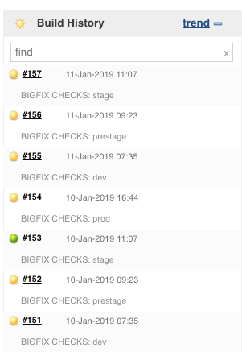
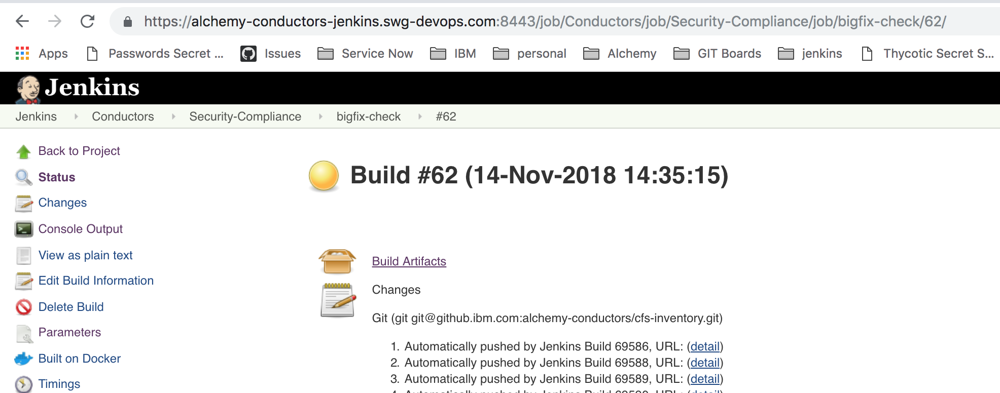
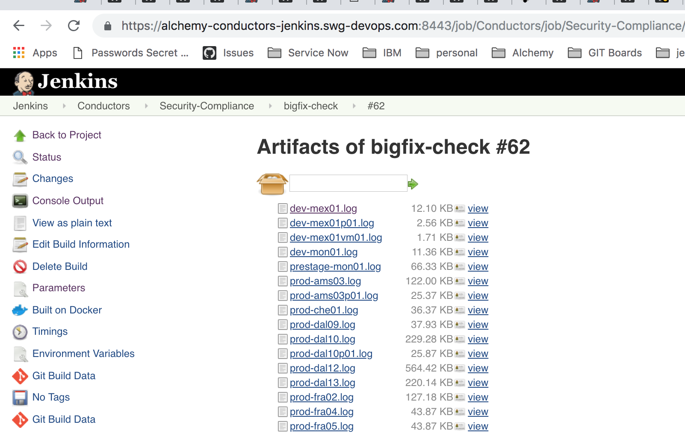
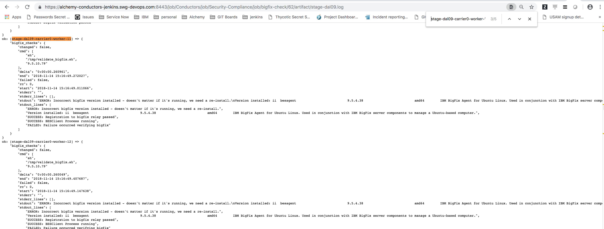
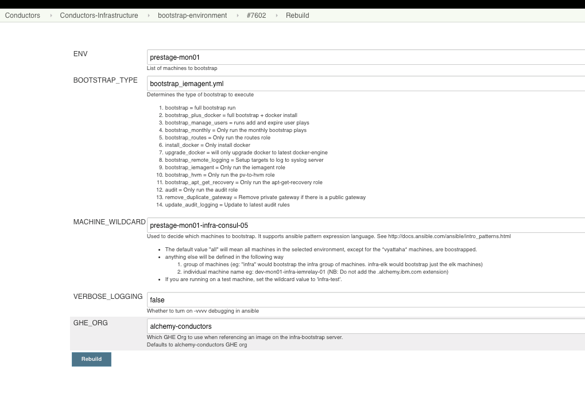

Troubleshooting
{: .label .label-red}

## Overview

This runbook helps SRE team members address issues reported by the Bigfix checker Jenkins Job

The main aim of the job is to check that Bigfix is running on all of our machines as this is the main tool used when checking for patches and whether we are overdue applying them.

- The [Bigfix checker Jenkins job] will report FAILURE only when errors occur in a production environment.
- The [Bigfix checker Jenkins job] will report UNSTABLE when failures occur in non-prod environments but all production checks have passed.
- The [Bigfix checker Jenkins job] will report UNSTABLE if unreachable machines are reported but NO FAILURES are found checking Bigfix.

There will be one job per environment checked - i.e `dev` , `prestage`, `stage` and `prod` are checked in individual executions.  In Jenkins, they will therefore appear like this.

{:height="75%" width="75%"}

## Useful links

- [Bigfix checker Jenkins job]
- [Bigfix validation script]
- [Bigfix information from the SOS team](https://w3-connections.ibm.com/wikis/home?lang=en-us#!/wiki/W50576e433cea_4fbb_84ed_ec8a855405e4/page/BigFix%20Health%20%26%20Patch)
-[SOS Bigfix slack channel](https://ibm-argonauts.slack.com/messages/C39742VMF) - useful to discuss errors seen when debugging Bigfix issues.

## Detailed information

We need to ensure that Bigfix is correctly running on all of our systems.
Bigfix is a key part of the [patching process which is described here](./patch_process_runbook.html)

[Bigfix checker Jenkins job] checks the following:

1. On Ubuntu 18.04 machines version 9.5.10.79 is installed.
2. The bigfix agent is running
3. There is a log file with the current days date present.
4. The log file is examined and checked to ensure the server is correctly registered with Bigfix server
5. The log file is examined for strings to indicate the agent is correctly communicating to the Bigfix server.

If any of these conditions fail, the script does try and restart the bigfix agent on the server to correct them, but if a restart doesn't fix it, then manual steps detailed below will be needed.

## Example alerts

No alerts will currently be triggered to pagerduty.

The error will be reported in to the `#sre-cfs-patching` channel to start with, with it being the responsibility of the developer tasked with patching to investigate failures.

## Investigation and Action

You'll be reading this runbook as a result of either a failed or unstable execution of [Bigfix checker Jenkins job]

### Review the console output

Open and review the console output for the job.

Navigate to the bottom of the console output where an attempt is made to check all logs produced by the bigfix checks and summarise the problems.

This will be under a section like this:
~~~
*****************************
*****************************
***** SUMMARY OF CHECKS *****
*****************************
*****************************
~~~

First, any failures will be reported.  Only failures spotted against **PRODUCTION** servers will result in the job failing (turning red).

Here are some examples of reported faiures
~~~
Checking /home/jenkins/workspace/Conductors/Security-Compliance/bigfix-check/prod-par01.log - Errors has been found
*************
prod-par01-build-svc-01    : ok=3    changed=0    unreachable=0    failed=1
*************
Checking /home/jenkins/workspace/Conductors/Security-Compliance/bigfix-check/stage-dal09.log - Errors has been found
*************
stage-dal09-carrier0-worker-11 : ok=3    changed=0    unreachable=0    failed=1   
stage-dal09-carrier0-worker-12 : ok=3    changed=0    unreachable=0    failed=1   
stage-dal09-carrier0-worker-13 : ok=3    changed=0    unreachable=0    failed=1   
stage-dal09-carrier0-worker-14 : ok=3    changed=0    unreachable=0    failed=1
~~~

After any failures, success is reported. For example:

~~~
SUCCESS: No errors found checking /home/jenkins/workspace/Conductors/Security-Compliance/bigfix-check/dev-mex01.log
SUCCESS: No errors found checking /home/jenkins/workspace/Conductors/Security-Compliance/bigfix-check/dev-mex01p01.log
SUCCESS: No errors found checking /home/jenkins/workspace/Conductors/Security-Compliance/bigfix-check/dev-mex01vm01.log
SUCCESS: No errors found checking /home/jenkins/workspace/Conductors/Security-Compliance/bigfix-check/dev-mon01.log
~~~

All unreachable machines are summarised at the bottom

~~~
UNSTABLE: unreachable machines found
stage-dal13-carrier5-worker-1002 : ok=0    changed=0    unreachable=1    failed=0   
UNSTABLE: unreachable machines found
sup-wdc04-infra-bots-01    : ok=0    changed=0    unreachable=1    failed=0  
~~~

### Investigating the problems

The most important issues to investigate are the failures.

The majority of issues are successfully being fixed by the checking script restarting the besclient service on the machine, however, some problems should not be fixed by this process and need manual investigation.

The error section in the jenkins job will have a header / summary like this:

~~~
Checking /home/jenkins/workspace/Conductors/Security-Compliance/bigfix-check/stage-dal09.log - Errors has been found
stage-dal09-carrier0-worker-11 : ok=3    changed=0    unreachable=0    failed=1
~~~

To investigate each failure further, follow these steps.

- Navigate to the main Jenkins page for the build that has failed. (example screen shot)
{:height="75%" width="75%"}
- For each environment checked, a log file is produced and saved under the `Build Artifacts` link.
{:height="75%" width="75%"}
- Find the corresponding log file.  For the example above, open `stage-dal09.log`
- Search for the failed machine and review the output.
{:height="75%" width="75%"}

The following sections help deal with common errors.

### Error case 1

~~~
ok: [stage-dal09-carrier0-worker-11] => {
    "bigfix_checks": {
        "changed": false,
        "cmd": [
            "sh",
            "/tmp/validate_bigfix.sh",
            "9.5.10.79"
        ],
        "delta": "0:00:00.260961",
        "end": "2018-11-14 15:16:49.272027",
        "failed": false,
        "rc": 0,
        "start": "2018-11-14 15:16:49.011066",
        "stderr": "",
        "stderr_lines": [],
        "stdout": "ERROR: Incorrect bigfix version installed - doesn't matter if it's running, we need a re-install.\nVersion installed: ii  besagent                          9.5.4.38                          amd64        IBM BigFix Agent for Ubuntu Linux. Used in conjunction with IBM BigFix server components to manage a Ubuntu-based computer.\nSUCCESS: Registration to bigfix relay passed\nSUCCESS: BESClient Process running\nFAILED: Failure occurred verifying bigfix",
        "stdout_lines": [
            "ERROR: Incorrect bigfix version installed - doesn't matter if it's running, we need a re-install.",
            "Version installed: ii  besagent                          9.5.4.38                          amd64        IBM BigFix Agent for Ubuntu Linux. Used in conjunction with IBM BigFix server components to manage a Ubuntu-based computer.",
            "SUCCESS: Registration to bigfix relay passed",
            "SUCCESS: BESClient Process running",
            "FAILED: Failure occurred verifying bigfix"
        ]
    }
}
~~~

- In this case, the wrong version of Bigfix is installed because (as of start November 2018) the bootstrap process did not have the new version of Bigfix needed by Ubuntu 18.  This is usually because the machine has been osreloaded, but has **NOT** had patching re-run against it after the reload.
- To correct, we can issue a patch request via igor.  In slack, post this message to igor, replacing `<machine name(s)>` with 1 or more space separated machines
~~~
smith deploy <machine name(s)> build prod outage none
~~~

- Smith patching can be monitored via igor using `smith status <ticketnumber>`

### Error case 2

~~~
ok: [prod-che01-carrier5-haproxy-01] => {
    "bigfix_checks": {
        "changed": false,
        "cmd": [
            "sh",
            "/tmp/validate_bigfix.sh",
            "9.5.10.79"
        ],
        "delta": "0:00:00.091163",
        "end": "2018-11-13 14:40:57.909523",
        "failed": false,
        "rc": 0,
        "start": "2018-11-13 14:40:57.818360",
        "stderr": "",
        "stderr_lines": [],
        "stdout": "SUCCESS: Registration to bigfix relay passed\nERROR: BESClient is not running\n* besclient.service - LSB: Starts BigFix Agent\n   Loaded: loaded (/etc/init.d/besclient; bad; vendor preset: enabled)\n  Drop-In: /lib/systemd/system/besclient.service.d\n           `-restart.conf\n   Active: inactive (dead)\n     Docs: man:systemd-sysv-generator(8)\n\nNov 13 11:41:00 prod-che01-carrier5-haproxy-01 systemd[1]: Stopping LSB: Starts IBM BigFix Agent...\nNov 13 11:41:05 prod-che01-carrier5-haproxy-01 systemd[1]: Stopped LSB: Starts IBM BigFix Agent.\nFAILED: Failure occurred verifying bigfix",
        "stdout_lines": [
            "SUCCESS: Registration to bigfix relay passed",
            "ERROR: BESClient is not running",
            "* besclient.service - LSB: Starts BigFix Agent",
            "   Loaded: loaded (/etc/init.d/besclient; bad; vendor preset: enabled)",
            "  Drop-In: /lib/systemd/system/besclient.service.d",
            "           `-restart.conf",
            "   Active: inactive (dead)",
            "     Docs: man:systemd-sysv-generator(8)",
            "",
            "Nov 13 11:41:00 prod-che01-carrier5-haproxy-01 systemd[1]: Stopping LSB: Starts IBM BigFix Agent...",
            "Nov 13 11:41:05 prod-che01-carrier5-haproxy-01 systemd[1]: Stopped LSB: Starts IBM BigFix Agent.",
            "FAILED: Failure occurred verifying bigfix"
        ]
    }
}
~~~

In this case, the bigfix agent is not running.

The [Bigfix validation script] has been updated to try and fix issues where the `besclient` service has failed/stopped on the machine, so this error is less common.

If this does occur, then manually investiging the problem on the machine is requireed.

Initial first checks should be:

1.  ssh to the failed machine
2.  Run `service besclient status` to obtain current status
3.  If stopped, restart using `service besclient restart`
4.  If the service does not remain up, investigate machine issues further. (There could be many reasons why this has occurred - read only filesystems, disk full etc. )   

If needed, see escalation section.

### Error case 3

~~~
ok: [stage-dal09-infra-deploy-01] => {
     "bigfix_checks": {
         "changed": false,
         "cmd": [
             "sh",
             "/tmp/validate_bigfix.sh",
             "9.5.10.79"
         ],
         "delta": "0:00:00.286603",
         "end": "2018-11-12 11:11:33.133397",
         "failed": false,
         "rc": 0,
         "start": "2018-11-12 11:11:32.846794",
         "stderr": "grep: /var/opt/BESClient/__BESData/__Global/Logs/20181112.log: No such file or directory\ngrep: /var/opt/BESClient/__BESData/__Global/Logs/20181112.log: No such file or directory\nUsage: /etc/init.d/besclient {start|stop|restart|force-reload}",
         "stderr_lines": [
             "grep: /var/opt/BESClient/__BESData/__Global/Logs/20181112.log: No such file or directory",
             "grep: /var/opt/BESClient/__BESData/__Global/Logs/20181112.log: No such file or directory",
             "Usage: /etc/init.d/besclient {start|stop|restart|force-reload}"
         ],
         "stdout": "SUCCESS: Registration to bigfix relay passed\nERROR: BESClient is not running\nFAILED: Failure occurred verifying bigfix",
         "stdout_lines": [
             "SUCCESS: Registration to bigfix relay passed",
             "ERROR: BESClient is not running",
             "FAILED: Failure occurred verifying bigfix"
         ]
     }
 }
~~~

This error should now be addressed by the valdation script.  The script detected that the besclient was not running, but it now attempts a restart.  

### Error case 4

~~~
ERROR: Registration failed\nFailure message:    RegisterOnce: GetURL failed - General transport failure. - BAD SERVERNAME (winsock error 4294967290 - registration url - http://ustw3-in00-is02.gk.sso.ad.isops.ibm.com:52311/cgi-bin/bfenterprise/clientregister.exe?RequestType=RegisterMe60&ClientVersion=9.5.10.79&Body=13906655&SequenceNumber=483&MinRelayVersion=7.1.1.0&CanHandleMVPings=1&Root=http://ustw3-in00-is02.gk.sso.ad.isops.ibm.com%3a52311&AdapterInfo=06-5c-98-5e-e5-c8_10.127.72.0%2f27_10.127.72.18_0&AdapterInfo=06-9b-ec-6b-4b-d2_159.8.74.64%2f27_159.8.74.73_0&AdapterInfo=02-42-50-dd-0a-60_172.17.0.0%2f16_172.17.0.1_0\n  
~~~

Registration errors usually require a re-install of the Bigfix agent.

#### re-install Bigfix on a single server.

##### Automated

https://alchemy-conductors-jenkins.swg-devops.com/job/Conductors/job/Security-Compliance/job/bigfix_cattle_fixer/

##### Manually
1. Log onto the server
2. Switch to root
3. Uninstall Bigfix using `dpkg -r besagent`
4. Remove the bigfix install directory using `rm -rf /var/opt/BESClient`

To re-install, execute a bootstrap against the machine using the [bootstrap environment](https://alchemy-conductors-jenkins.swg-devops.com/job/Conductors/job/Conductors-Infrastructure/job/alchemy-bootstrap/) jenkins job.

Example screenshot

{:height="75%" width="75%"}

### Investigating unreachable machines.

Unreachable machines are machines that could not be reached via ssh (using ansible)

This needs to be investigated on a machine by machine basis to determine why.

Common reasons could be.

1.  The machine is down and unreachable.
2.  The machine is new and needs to be bootstrapped.
3.  A VPN issue is occurring - especially if all machines in a particular environment are unreachable.

## Investigating, other, undocumented errors

Reach out to the SRE team in `#conductors` or in `#sre-cfs` for assistance.

## Manually re-running the job

Once you've corrected the problems, you can re-execute the jenkins job if you wish.

The job requires an environment as input.  The environments are based on ansible inventory files in the [cfs-inventory GHE Repo](https://github.ibm.com/alchemy-conductors/cfs-inventory/tree/master/inventory).  If the environment doesn't exist in the cfs-inventory files, nothing will be executed.

Some examples:

- to run against all prod envs, `prod` can be passed to the job - this will find all inventory files starting `prod` and run the checks against all machines listed inside them.
- to run against just prod-dal09, `prod-dal09` can be passed to the job

The Jenkins job will try and match these against the cfs-inventory files, so if the environment doesn't exist in the [cfs-inventory files](https://github.ibm.com/alchemy-conductors/cfs-inventory/tree/master/inventory), nothing will be executed.

## Escalation policy

If you are unsure then raise the problem further with the SRE team.

Discuss the issues seen with the SRE team in `#conductors` or in `#sre-cfs`

There is no formal call out process for this issue but all SRE members should have access to the servers being flagged with issues to help investigate problems.

[Bigfix checker Jenkins job]: https://alchemy-conductors-jenkins.swg-devops.com/job/Conductors/job/Security-Compliance/job/bigfix-check/
[Bigfix validation script]: https://github.ibm.com/alchemy-conductors/conductors-tools/blob/master/ansible-playbooks/validate_bigfix.sh
