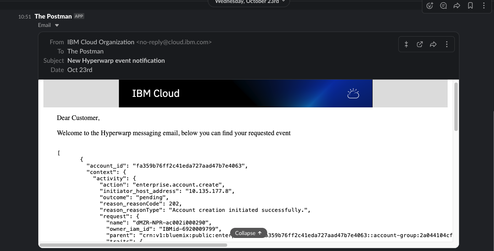
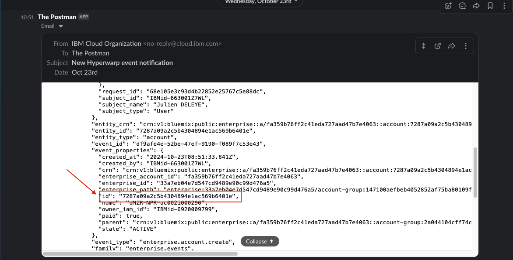
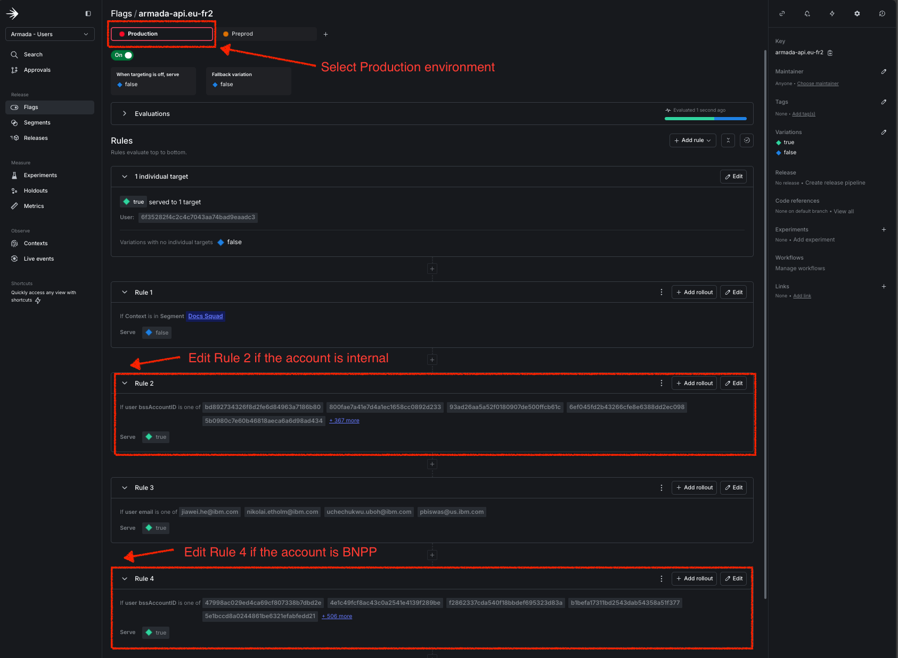
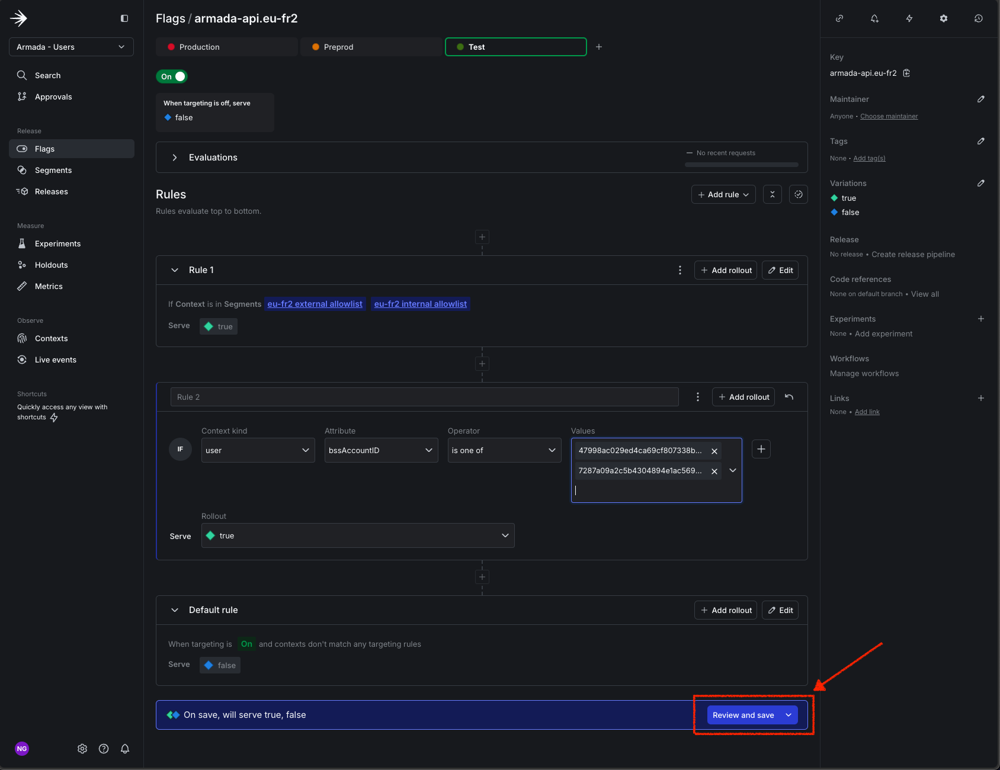
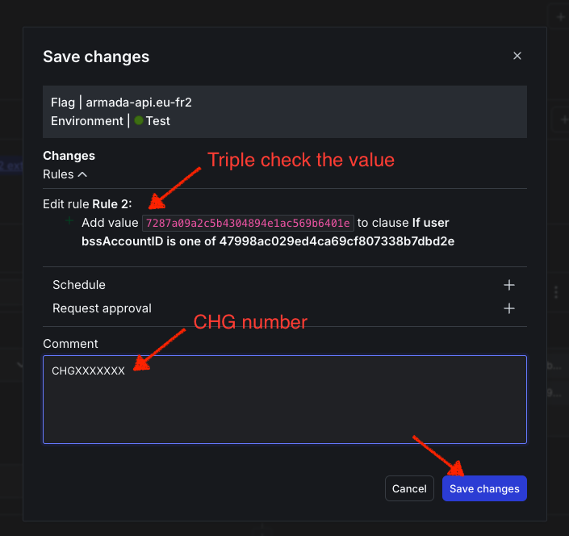

Informational
{: .label }

## Overview 
This document describe the process of adding an account to the IKS API `eu-fr2` allow-list.

## Detailed Information 
**IMPORTANT**: IKS service will soon move out of using LaunchDarkly(LD) feature flags and target rules for allow-listing and will adopt GlobalCatalog.
`armada-api` uses a feature flag in LD in order to check access to the `eu-fr2` region. In order to be able to interact with the IKS API via UI/CLI or API the account needs to be added to a specific rule in the mentioned feature flag.

### Internal Accounts
For an internal account the request needs to be commented on this [issue](https://github.ibm.com/alchemy-containers/armada-ironsides/issues/2590) by the service team following the below template.
```
Service Name: <Service Name>
AccountID: <Account Name>
Owner: <Owner email>
Purpose: <Details about the request>
```
The request needs to be approved by Ralph Bateman(`@ralph`).

### BNPP Accounts
Each newly created account under BNPP's enterprise accounts need to be allow-listed. 
When a new account is created we receive a notification from hyperwarp in [#iks-eu-fr2-allowlisting](https://ibm.enterprise.slack.com/archives/C07B8L2CEDP) channel. \
**NOTE**: This is a private channel in the `Argonauts` workspace dedicated to the `eu-fr2` dedicated SREs.

For each new account created, there will be a new event notification in slack. (see example below) \
<a href="./images/conductors/eu-fr2-allowlist-slack-1.png"></a>

You'll need to extract the account ID from the payload of the notification from the `id` key under `event_properties` (see example below) \
<a href="./images/conductors/eu-fr2-allowlist-slack-2.png"></a>

### Allow-listing process
**IMPORTANT**: You need to have `Writer` access in **LaunchDarkly** to be able to complete this process (see this [runbook](https://pages.github.ibm.com/alchemy-conductors/documentation-pages/docs/runbooks/launchdarkly-access.html))
1. Create a team ticket ([BNPP example](https://github.ibm.com/alchemy-conductors/team/issues/24198), [Internal example](https://github.ibm.com/alchemy-conductors/team/issues/24199)) assign it to yourself and add `eu-fr2` and `SRE_BNPP` labels
2. Raise a train ([example](https://ibm-cloudplatform.slack.com/archives/C529CCTTQ/p1730100719703469)), use the below template
```
Squad: Conductors fr2
Title: Add BSS account to eu-fr2 region
Environment: eu-fr2
Details: |
 https://github.ibm.com/alchemy-conductors/team/issues/24198
Risk: low
PlannedStartTime: now
PlannedEndTime: now + 30m
Ops: true
BackoutPlan: remove the accounts
```
3. After approval, start the train, go to [LaunchDarkly](https://app.launchdarkly.com/projects/armada-users/flags/armada-api.eu-fr2/targeting?env=production&env=preprod&selected-env=production), make sure you are have selected the `Production` environment. 
  - if the account is internal the account ID needs to be added in `Rule 2`
  - if the account is BNPP the account ID needs to be added in `Rule 4` \
  <a href="./images/conductors/eu-fr2-allowlist-LD-1.png"></a>
4. Click on `Review and Save`, *TRIPLE* check the value of account(s), add the `CHG` to the comment and click on `Save Changes` \
  <a href="./images/conductors/eu-fr2-allowlist-LD-2.png"></a>
5. Update the team ticket with the `CHG` number and close it. \
  <a href="./images/conductors/eu-fr2-allowlist-LD-3.png"></a>
6. Update status
  - **INTERNAL ACCOUNT**: Update the `armada-ironsides` ticket - [example](https://github.ibm.com/alchemy-containers/armada-ironsides/issues/2590#issuecomment-95423848)
  - **BNPP ACCOUNT**: Put the green check mark on the slack notification to indicate that the request has been processed.


## Further Information 
This process is considered a temporary workaround. An [automation](https://github.ibm.com/alchemy-conductors/eu-fr2-allowlister) is under development to automate this process.
