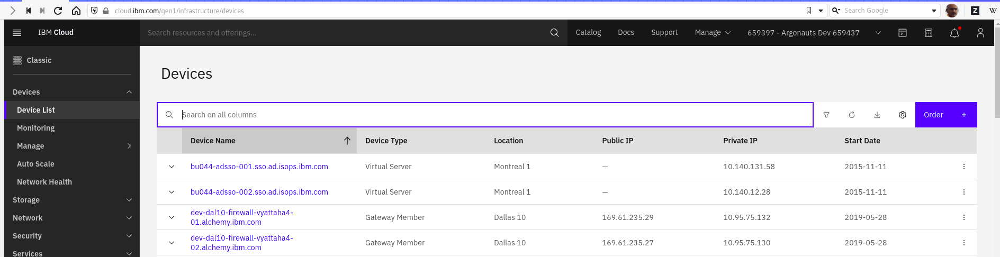

Informational
{: .label }

## Overview

This document details information about all of the specification of infra-vpn machines and the steps needed to replace a machine or order a new one for a new environment

## Detailed information

## Pre-reqs

Ensure the public and private VPN VLANs exist before attempting to order a new VPN machine (especially if this is a new environment with no existing VPN servers)

## Machine specification required 

An order can be placed via the [provisioning application](https://alchemy-dashboard.containers.cloud.ibm.com/prov/api/web/verify_page) using the `NEW-infra-VPN-all` template OR via https://cloud.ibm.com (see the image attached below and select `Order` at the top right )

<a href="images/conductors/machine-order.png">
</a>

Current machines specification is:

```
        "disk_controller_item": "DISK_CONTROLLER_RAID",
        "description": "Single Intel Xeon E3-1270 v3 (4 Cores, 3.50 GHz)",
        "ram_item": "RAM_16_GB_DDR3_1333_ECC_NON_REG",
        "disks": {
            "disk0": "HARD_DRIVE_1_00TB_SATA_II",
            "disk1": "HARD_DRIVE_1_00TB_SATA_II"
        },
        "pkgDescription": "",
        "os_item": "OS_UBUNTU_18_04_LTS_BIONIC_BEAVER_MINIMAL",
        "storage_groups": [
            {
                "drives": [
                    0,
                    1
                ],
                "key": "RAID_1",
                "size": 500
            }
        ],
        "port_speed_item": "1_GBPS_REDUNDANT_PUBLIC_PRIVATE_NETWORK_UPLINKS",
        "bandwidth_item": "BANDWIDTH_20000_GB",
        "machine_type": "baremetal server",
        "server_item": "INTEL_SINGLE_XEON_1270_3_50"

```


The machine should be ordered onto the `VPN VLAN` for the environment.  This may not exist.  If it doesn't, raise an issue with [netint](https://github.ibm.com/alchemy-netint/firewall-requests/issues/new/choose) to get it created.


## Deployment / post ordering setup

### Register with bastion

Run the [bastion register nodes jenkins job](https://alchemy-containers-jenkins.swg-devops.com/job/armada-ops/job/bastion-register-nodes-ww/) to install bastion code and register with bastion server.

### Register the machine with DUO

This needs to be completed with an IKS SRE login - see [duo README](https://github.ibm.com/alchemy-1337/duo-credentials)

### Networking dependencies

Several netint tickets need creating to do the following

1.  VPN subnet pool needed - example [netint ticket](https://github.ibm.com/alchemy-netint/firewall-requests/issues/4224)
2.  openconnect subnet pool needed - example [netint ticket](https://github.ibm.com/alchemy-netint/firewall-requests/issues/4270)
3.  Request that they `Update the static routes on the firewalls with these new servers` once both are created and have IP addresses

Until these issues are complete, no further actions can be taken

### Code PRs

-  PR needed to update [openVPN code](https://github.ibm.com/alchemy-conductors/openVPN/blob/master/roles/ansible-openvpn-server/vars/main.yml) to reference the new subnets created by netint (only openvpn ones) - [example PR for a previous VPN update](https://github.ibm.com/alchemy-conductors/openVPN/pull/60/files)

-  PR needed to update [openconnect - example](https://github.ibm.com/alchemy-conductors/openconnect-client/pull/17)

-  PR needed for bootstrap-one to allow inter vpn machine routing - [example PR for a previous update](https://github.ibm.com/alchemy-conductors/bootstrap-one/pull/732)

### Deployment steps

Once the machine is built, and all the prereqs and code changes are merged, follow the details in [openVPN GHE repo to get it enabled as a VPN server](https://github.ibm.com/alchemy-conductors/openVPN/blob/master/README.md#deploying-a-new-environment)


### Testing the newly deployed server

Create a new tunnelblick (if using Mac client or OpenVPN client in case of RedHat client) config file and point it at the new server and not at the FQDN provided by netint after the DNS registration (eg: vpn.dev-mon01.containers.cloud.ibm.com). Validate routing works by ssh'ing to machines across the whole environment that the VPN server is used for - i.e. if US South, connect to some Dallas machines, some in US-East, Mexico etc.  Any problems need to be discussed with the netint and SREs in case if the connections (`ssh`) are unsuccessful as this cannot go live as a VPN server at this stage.

### Updating DNS

Once you are happy this server is fully working as a VPN server, you need to submit a ticket to netint to either update an exist cloudflare entry, or create a new one.  This depends on whether the VPN server is going into an existing setup/environment, or a brand new one.

In our [VPN client code](https://github.ibm.com/alchemy-conductors/openvpn-clients/tree/static) instead of hard coding machine IP addresses, we use Akamai DNS which map to our pool of machines in an environment.  For example, for US-South, we use `remote vpn.prod-dal09.containers.cloud.ibm.com` which is mapping as the following CNAME (See the dig output given below)
```
$ dig +trace vpn.prod-dal09.containers.cloud.ibm.com | tail -n 2

vpn.prod-dal09.containers.cloud.ibm.com. 300 IN	CNAME vpn.prod-dal09.containers.cloudibmcom.zone.akadns.net.
;; Received 135 bytes from 96.7.50.64#53(usc3.akam.net) in 403 ms
```

Raise a [netint firewall request](https://github.ibm.com/alchemy-netint/firewall-requests/issues/new/choose) to get the new machine added to the pool. Example [ticket](https://github.ibm.com/alchemy-netint/firewall-requests/issues/4550)

### Updating Sensu

Need to add (or change) the new server IP in sensu-uptime repo- [example PR](https://github.ibm.com/alchemy-conductors/sensu-uptime/pull/1199)

## Escalation Policy

There is no formal escalation policy.

Reach out to SRE squad members in these channels to ask further questions about any of the machine types

- `#conductors` if you are not a member of the SRE Squad.
- `#sre-cfs` or `#conductors-for-life`  if you are a member of the SRE squad (these are internal private channels)


