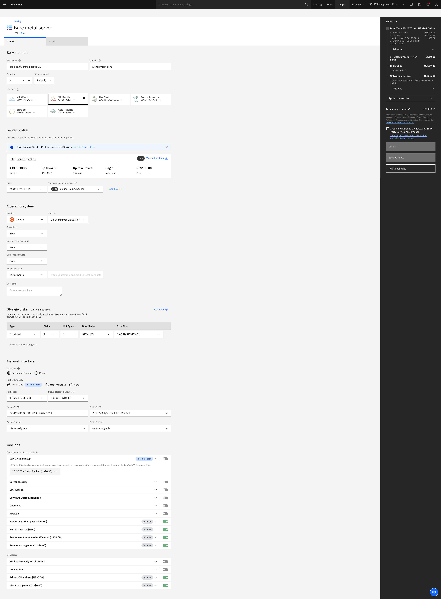
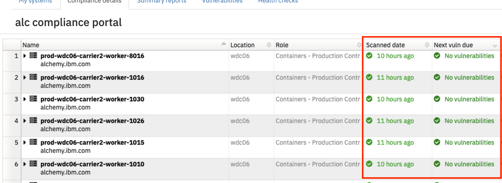

Informational
{: .label }

## Overview

This document details how to order and manage infra-nessus servers

## Detailed information

There are two main reasons for reading this runbook.

1.  Ordering and setting up a brand new nessus scanner; or
2.  OSReloading a nessus scanner

## Ordering a new nessus scanner

In 2020, a new nessus scan zone was setup for servers in `US East`.  This was carried out to reduce the load on the US-South nessus scanner which was scanning all of US-South and US-East

This runbook covers all the follow points when setting up a whole new scan zone.

1.  Ordering a scanner
2.  Setting up and enabling the scanner
3.  Updating security center 
4.  Updating our automation which populates scan asset lists in security center
5.  Updating VLANs and associating with a nessus scanner


### Ordering a scanner

Orders are usually placed via the [provisioning application](https://alchemy-dashboard.containers.cloud.ibm.com/prov/api/web/)

 - [Local Nessus Scanner Requirements](https://pages.github.ibm.com/SOSTeam/SOS-Docs/sca/Local-Nessus-Scanner-Requirements.html) - Official machine specification from the SOS team

- The provisioning application [template](https://alchemy-dashboard.containers.cloud.ibm.com/prov/api/web/verify_page) doesn't work well for baremetal orders.

Current machines specification is as follows, ordered directly from the [IBM Cloud Classic Infrastructure website](https://cloud.ibm.com/classic) 

A screen shot is attached with example settings.  We recently moved to using 32GB RAM for all our syslog servers as 16GB was not enough and we saw frequent OOM errors during nessus scan runs.

Overview of key configuration:

- ram:	32GB RAM
- type: Single E3-1270 (4 Drives) or similar (depends what is available in that DC)
- os_item:	OS_UBUNTU_18_04_LTS_BIONIC_BEAVER_MINIMAL
- disk type:	Individual
- disks:	1 disk - 1TB SATA HDD
- Network:  Public and private with default redundancy
- port_speed_item:	"1_GBPS_PUBLIC_PRIVATE_NETWORK_UPLINKS"
- Public bandwidth:	"BANDWIDTH_500_GB"
- VLAN: Select `Sec` VLAN 
- Subnet: Leave as auto-assign
- Postprovision url: Set the correct bootstrap one url depending on machine location

The machine should be ordered onto the `Sec` vlan for the environment.  This may not exist.  If it doesn't, raise an issue with [netint](https://github.ibm.com/alchemy-netint/firewall-requests/issues/new/choose) to get it created.

Example order form:

<a href="images/nessus_order_form.png">
</a>


### Installing the nessus server

[SOS documentation](https://pages.github.ibm.com/SOSTeam/SOS-Docs/sca/Upgrading-Installing-Nessus-Server-to-Latest-Version.html) details how to install the nessus components onto the ordered server.

We've converted that into [ansible code which runs as part of our postprovisioning bootstrap](https://github.ibm.com/alchemy-conductors/bootstrap-one/tree/master/playbooks/roles/nessus), therefore, no manual steps are required here.

Once ordered, you need to ensure that the machine provisions correctly and a full bootstrap completes.
The bootstrap installs the nessus daemon onto the server which needs to be active for the remaining steps in this runbook to work.

### Post order network validation

Raise an issue in the [firewall requests GHE repo](https://github.ibm.com/alchemy-netint/firewall-requests/issues/new) and ask netint to verify that the new scanner and vyattas where the scanner is located has the correct rules enabled - see [SOS documentation](https://pages.github.ibm.com/SOSTeam/SOS-Docs/sca/Placement-of-Local-Nessus-Scanners.html)


### Enabling the scanner

Once the machine is built (or if a nessus scanner is ever osreloaded), raise an [SOS ticket](https://ibm.service-now.com/nav_to.do?uri=%2Fcom.glideapp.servicecatalog_cat_item_view.do%3Fv%3D1%26sysparm_id%3D45ef56a7db7c4c10c717e9ec0b96193a%26sysparm_link_parent%3D109f0438c6112276003ae8ac13e7009d%26sysparm_catalog%3De0d08b13c3330100c8b837659bba8fb4%26sysparm_catalog_view%3Dcatalog_default%26sysparm_view%3Dcatalog_default)

Use the following values

- `Assignment Group = SOS Vulnerability Scanning`
- `Severity = 3`
- `C_CODE` - depends who you are setting this up for, it's usually ALC or ALC_FR2
- `Short Description = Please enable a nessus scanner`
- `Description`

- New deployment body

```
A new nessus scanner has been created
<Paste in machine details / IP addresses / VLAN info>

This needs enabling as a new nessus scanner and associating with a new scan zone.
Please name the scanzone ALC_<environment>_<DC of the scanner>_SZ  e.g.  For prod-wc06-infra-nessus-01, we called the scanzone ALC_Prod_WDC06_SZ.
```


- OSReload body

```
The following scanner has been osreloaded and needs to be re-deployed by the SOS team
<Paste in machine details / IP addresses / VLAN info>

The scanzone related to this scanner is ALC_<environment>_<DC of the scanner>_SZ  e.g.  For prod-wc06-infra-nessus-01, ALC_Prod_WDC06_SZ.
```

After submitting the SNow ticket, expect some questions or feedback from the SOS Team.  In the past, this is where we've seen most of the problems and ultimately, it'll likely need involvement from netint especially if connection issues are being seen.


### Creating the necessary artifacts in Security Center

[SOS Documenation on this can be found here](https://pages.github.ibm.com/SOSTeam/SOS-Docs/sca/Security-Center-How-To%27s.html)

The following is the IKS setup that normally occurs

#### Create a private IP asset list

This is a listing which will eventually get populate by automation each day.  The naming convention for a private IP asset list is `<env>_<location>_Private_Automated_Servers`

- Log into [Security Center](https://w3sccv.sos.ibm.com/#assets) with you SSO ID.
- Click on `Assets` then the `+Add` button in the top right corner
- Select `Static IP List`
- Give the asset list a name - e.g `Prod_Us_East_Private_Automated_Servers` 
- Provide at least one private IP address of a server which this scan zone will scan (the remainder will get filled in by automation at a later date)
- Click `submit` to create the asset list

#### Create a public IP asset list

This is a listing which will eventually get populate by automation each day.  The naming convention for a private IP asset list is `<env>_<location>_Public_Automated_Servers`

- Log into [Security Center](https://w3sccv.sos.ibm.com/#assets) with you SSO ID.
- Click on `Assets` then the `+Add` button in the top right corner
- Select `Static IP List`
- Give the asset list a name - e.g `Prod_Us_East_Public_Automated_Servers` 
- Provide at least one public IP address of a server which this scan zone will scan (the remainder will get filled in by automation at a later date)
- Click `submit` to create the asset list

#### Create a public scan schedule

NOTE: The name of the scan is important.  If `import` is not present at the end of the scan name, the results do not get imported into SOS and will not show on our compliance dashboards

- Click on `Scans -> Active Scans`
- Click the `+Add` button in the top right corner
On the general tab:
- Give the scan a name - e.g. `ALC_Prod_WDC06_public_import`
- Set the policy to `SOS Basic Plus Security Focal Faster`
- Schedule - set to run each day at around 01:00 UTC
On the Settings tab:
- Set the scan zone - the one created in an earlier step should be listed
- Import repository = ALC or ALC_FR2
- Everything else, leave as default
On the targets tab:
- Target Type - Assets
- Select the public asset list you created in an earlier step

Click `submit` to create the scan definition


### Updating the asset generator

There is a jenkins job that runs once a day called [nessus_scan_ip_list_generator](https://alchemy-conductors-jenkins.swg-devops.com/job/Conductors/job/Security-Compliance/job/nessus_scan_ip_list_generator/)

The [code to populate the list is here](https://github.ibm.com/alchemy-conductors/compliance-nessus-scan-asset-list-generator/blob/master/main.go)

The code uses the asset list names generated in a previous step so it's important these exist before updating this code.

Some example PRs to help define new entries can be seen here:

- [US-East](https://github.ibm.com/alchemy-conductors/compliance-nessus-scan-asset-list-generator/pull/16)
- [US-East for registry](https://github.ibm.com/alchemy-conductors/compliance-nessus-scan-asset-list-generator/pull/17)
- [EU-FR2](https://github.ibm.com/alchemy-conductors/compliance-nessus-scan-asset-list-generator/pull/14)


### Assigning VLANs to the scanner

**WARNING** If the scanner is not associated with any of our VLANs, scans will not occur!

There is automation that should associate a VLAN with the correct scanner in SOS, however, when new scanners are setup, the scripts need reviewing to make sure the new scanner is defined and the locations associated with the scanner are correct.

- The [scan-zone classifier code is here](https://github.ibm.com/alchemy-conductors/security/tree/master/scan-zone)
- The [scan-zone classifier jenkins job](https://alchemy-conductors-jenkins.swg-devops.com/job/Conductors/job/Security-Compliance/job/sos-vlan-scan-zone-classifier/) is used to run this code on a daily basis.

Follow these steps to review the current setting and make any required adjustments to the scan zone classification code;

1. Review the [scan-zone classifier](https://github.ibm.com/alchemy-conductors/security/tree/master/scan-zone) code.  The code should associate regions to a particular scan zone.  For example, `wdc` and `tor` should be associated with the `ALC_Prod_WDC06_SZ` scanner.  If a new scanner is being setup, SREs will have to create a pull request against the classifier code to change the regions and scanner association.  If you are unsure of region and scanner associatation, please discuss with your SRE team mates.

2. If a PR was created in step one, get the PR reviewed and merged. Once merged, execute the [scan-zone classifier jenkins job](https://alchemy-conductors-jenkins.swg-devops.com/job/Conductors/job/Security-Compliance/job/) which will adjust the VLAN association in SOS.

3. Once step 2 has completed without errors, a manual review of VLANs in SOS is required before the VLAN definitions are manually published to Security Center.  Log into the [SOS Inventory](https://w3.sos.ibm.com/inventory.nsf/index.xsp?c_code=alc) and click on the `Network` tab
4. On the `Network` page, click on `VLANs by Scan zone` to show the `VLANs` sorted by what scanzone they are associated with
5. Follow the guidance as documented by SOS in the [How to Edit networks for scanning](https://pages.github.ibm.com/SOSTeam/SOS-Docs/sca/HowTo-Add_Edit-networks-for-Scanning.html) documentation - this will detail how to review VLAN association and also publish to Security Center.


### Validating the setup

This can only occur after all of the above steps have been completed

- Check that the asset lists have been populated in Security center
- Check that the scans have started - they will appear on the `Scans -> Scan results` page
- Check the [SOS portal](https://w3.sos.ibm.com/inventory.nsf/compliance_portal.xsp?c_code=alc) and confirm that scans are running and reporting green/success



## Escalation Policy

There is no formal escalation policy.

Reach out to SRE squad members in these channels to ask further questions about any of the machine types

- `#conductors` if you are not a member of the SRE Squad.
- `#sre-cfs` or `#conductors-for-life`  if you are a member of the SRE squad (these are internal private channels)


