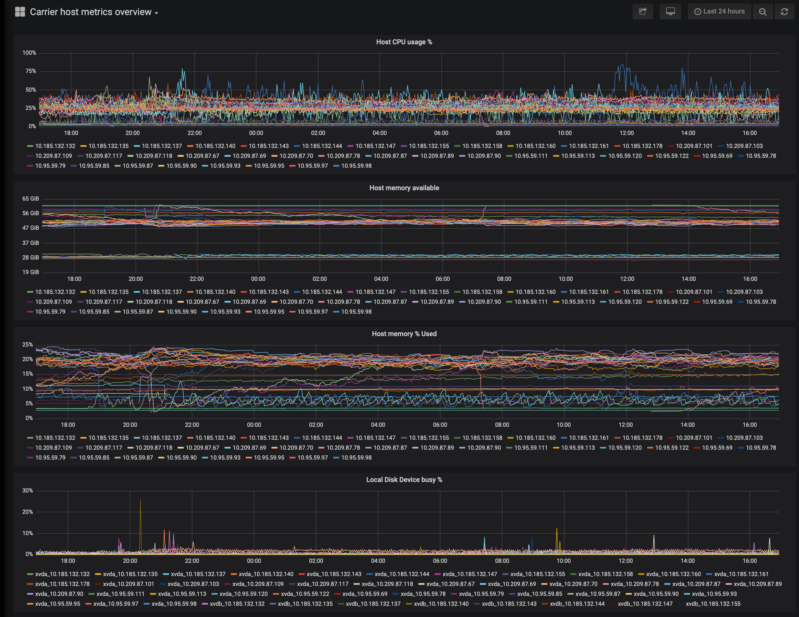
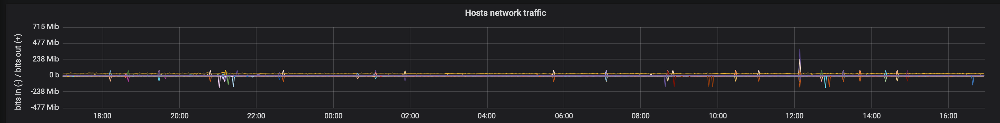
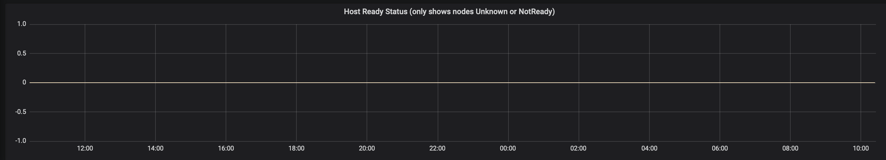
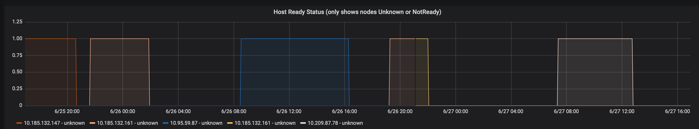
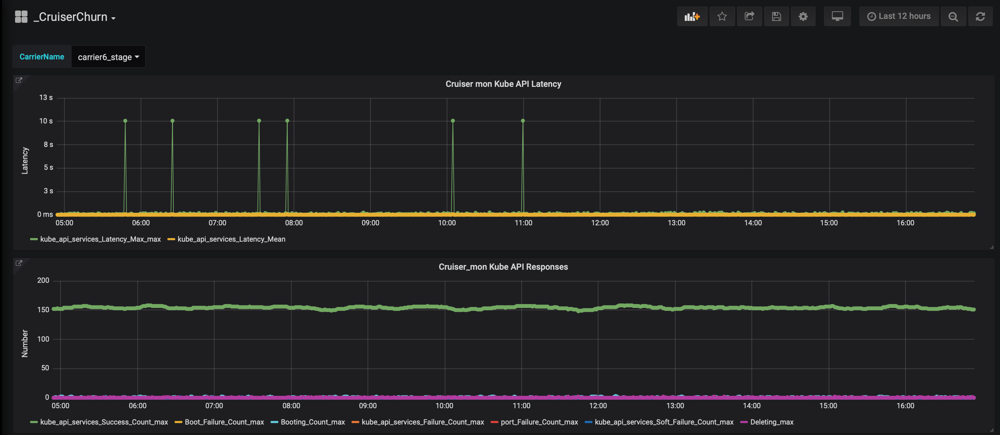
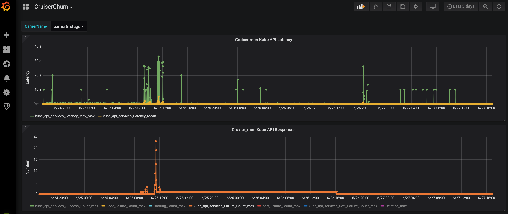
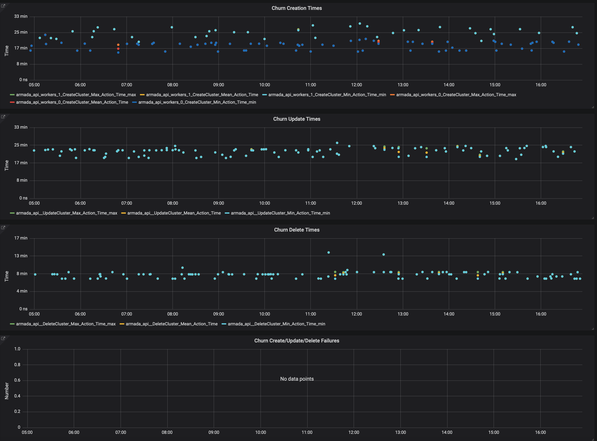
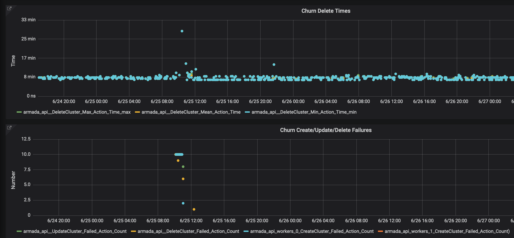

Informational
{: .label }

## Overview

The [patch process runbook] should be consulted for end to end process of patching.

This document details how to manually verify that a carrier is stable after it has been patched.

Initial patch stability verification is run on `stage-dal10-carrier6`.

### `cruiser churn`
> _The documentation and source is located at [`cruiser_churn`](https://github.ibm.com/alchemy-containers/armada-performance/tree/master/api/cruiser_churn)_

Owned by the armada-performance squad, carrier `stage-dal10-carrier6` is continuously running **cruiser churn** to create, update and delete cruisers.

- The workload is aimed at being representative of what will happen on production carriers so will help identify any instabilities in any patches that are applied.

## Detailed Information
See below for full details

### Carrier Node Stability

The first thing to verify is the stability of memory/CPU and if the nodes themselves have had any unexpected reboots.

As **kernel updates** have seen nodes unexpectedly rebooting this is a key thing to check.

You should wait at least 24 hours after the patches have been applied to allow any problems to manifest, although in previous cases it can take up to a week before any problems would show.  
_Clearly waiting 1 week for each patch is not feasible, hence the specified rules._

Use the Grafana dashboard [Carrier host metrics overview](https://alchemy-dashboard.containers.cloud.ibm.com/stage-dal10/carrier6/grafana/d/JgjEg0QMk/carrier-host-metrics-overview?orgId=1) for the carrier.


In addition to that please check if there are any alerts causing the the performance carrier instability here [Prometheus link for performance carrier](https://alchemy-dashboard.containers.cloud.ibm.com/stage-dal10/carrier6/prometheus/alerts) and make sure those issues are resolved before running the churn tests

**Good result indication**:
- CPU, memory, disk IO & network should all be similar before and after the patches were applied.

The images below show how these metrics should look when things are stable:
<a href="images/patch_verification_normal_host_metrics.png">
</a>

<a href="images/patch_verification_normal_host_metrics_network.png">
</a>

<a href="images/patch_verification_normal_node_ready_status.png">
</a>

As can be seen in the images there are some spikes, but as long as there are no prolonged differences the patch can be considered good.

The image below shows what will be seen in the `Host Ready status` dashboard when things are not stable. It shows several nodes going `NotReady` or to `unknown` status. This suggests there may be an issue with the patch, and needs investigation to understand why the nodes are going `NotReady`.
<a href="images/patch_verification_bad_node_ready_status.png">
</a>

### Cruiser Churn Stability

There are 2 applications running that are used to validate if the carrier is working and able to create/run cruisers; Cruiser mon & Cruiser churn:

#### `Cruiser mon`
> _The documentation and source is located at [`cruiser_mon`](https://github.ibm.com/alchemy-containers/armada-performance/tree/master/api/cruiser_mon)._

Cruiser mon (Cruiser Monitoring) will find all masters on the carrier and attempt to do the equivalent of a `kubectl get services` call against each master - to verifiy that the masters that have been created are functional.

The results for Cruiser mon can be found in the **top 2** panels in the Grafana dashboard [\_CruiserChurn](https://alchemy-dashboard.containers.cloud.ibm.com/stage/performance/grafana/d/N6sEBkMWk/_cruiserchurn?orgId=1&var-CarrierName=carrier6_stage).  
_NB On the **\_CruiserChurn** dashboard **ensure** you have **carrier6_stage** selected in the **CarrierName** dropdown._

The first chart shows the mean and max latency when making the API calls. These should remain similar before and after the patching process. Note we normally see some occasional spikes, so these can be considered normal, but the latencies should remain similar before and after the patching process.

The second chart shows the number of successful/failing masters. The number successful should fluctuate around the 150 mark - as we are continuously creating/updating/deleting cruisers, so the number does vary. Any increase in the number of failures after the patching process may indicate a failure (Click on the failure labels in the legend to only show failures - this should make it easier to see). Note, we do occasionally see spikes in failures, and there are many other external issues that can cause failures, so just because failures are occurring does not mean a patch is bad - but the reason for failures should be investigated.

The following chart shows a normal output from Cruiser mon, with occasional spikes in latency, and no failures:
<a href="images/patch_verification_normal_cruiser_mon_data.png">
</a>

The following chart shows output from Cruiser mon that suggests an issue - with large spike in latency, and failures, meaning the cause should be investigated:
<a href="images/patch_verification_bad_cruiser_mon_data.png">
</a>

If no data is displayed for a time period, it probably means Cruiser mon is not running. This could because the client machine where it is running (`stage-dal09-perf6-client-01`) has been rebooted, or it has failed due to an unexpected condition.

#### `Cruiser churn`
> _The documentation and source is located at [`cruiser_churn`](https://github.ibm.com/alchemy-containers/armada-performance/tree/master/api/cruiser_churn)_

Cruiser churn runs in a continuous loop attempting to create, update & delete cruisers.

The results for Cruiser churn can be found in the bottom 4 panels in the [_CruiserChurn dashboard](https://alchemy-dashboard.containers.cloud.ibm.com/stage/performance/grafana/d/N6sEBkMWk/_cruiserchurn?orgId=1&var-CarrierName=carrier6_stage). (Ensure you are on the `_CruiserChurn` dashboard and have `carrier6_stage` selected in the `CarrierName` dropdown.)

The first 3 Churn charts show the times taken to Create, Update & Delete cruisers. During normal operation these times should remain fairly consistent. Verify these times are not significantly changed after the patching occurred. The bottom chart shows the number of Failures of each operation. We do see a small number of occasional failures, during normal operation, so a small number (less than 5 in a 24 hour period) can be ignored. But a significant increase in the number of failures after the patching occurred could be cause for concern.


The following chart shows normal results for Cruiser churn:
<a href="images/patch_verification_normal_churn_data.png">
</a>

The following chart shows results for Cruiser churn when problems are occurring, and should be investigated:
<a href="images/patch_verification_bad_churn_data.png">
</a>

If no data is displayed for a time period, it probably means Cruiser churn is not running. This could because the client machine where it is running (`stage-dal09-perf6-client-01`) has failed to reboot cleanly, or it has failed due to an unexpected condition.

### Investigating Cruiser mon or Cruiser churn failures

1. **If `Cruiser churn` or `Cruiser mon` is showing no data**  
Both `Cruiser churn` and `Cruiser mon` run as `systemd` services (which should restart after reboot) and they may be done. The services run client machine `stage-dal09-perf6-client-01`. To restart the services:
   ``` sh
   sudo systemctl status cruisermon
   sudo systemctl status fakecruiserchurn
   sudo systemctl status realcruiserchurn
   ```
   
   `fakecruiserchurn` churns cruisers that have 0 workers, and `realcruiserchurn` churns cruisers that have 1 worker. We run both against the carrier.
   
   If any of the services are stopped ping `@armada-perf` in the `#armada-performance` slack channel to see if they have been stopped deliberately.
   
   You can also check the log file in `/performance/stats/cruiser_mon/cruiser_mon.log` (For Cruiser mon) or `/performance/stats/churn/cruiser_churn.log` (For Cruiser churn) to check for errors.
   
   - To restart `Cruiser mon`  
   `sudo systemctl start cruisermon`  
   _then check the output in `cruiser_mon.log` to check it has successfully restarted.)
   
   - To restart `Cruiser churn`  
   `sudo systemctl start fakecruiserchurn`  
   `sudo systemctl start realcruiserchurn`  
   _then check the output in `cruiser_churn.log` to check it has successfully restarted._

2. **If `Cruiser mon` or `Cruiser churn` is showing failures or consistently high latencies**  
then you can check the data for another carrier, to see if it is showing the same thing. Select `carrier5_stage` in the `CarrierName` dropdown. If that is showing similar issues, then it is likely the cause is something more widespread than the carrier patching (as carrier5 will not have had the patches applied yet). To see the cause of any failures check the log file in `/performance/stats/cruiser_mon/cruiser_mon.log` (For Cruiser mon) or `/performance/stats/churn/cruiser_churn.log` (For Cruiser churn). You can also ping `@armada-perf` in the `#armada-performance` slack channel to help investigate the issues.

#### Fallback for accessing the dashboard

If the cruiser churn dashboard is down, a fallback is to open an ssh tunnel to `stage-dal09-perf1-client-03` and connect over local browser. From the [performance wiki](https://github.ibm.com/alchemy-containers/armada-performance/wiki/Performance-test-results-monitoring):

> Note, if the dashboard is not working a fallback option is to connect Via the VPN (The old stage VPN), then run:
>
> ```ssh -f -N stage-dal09-perf1-client-03 -L 8081:10.143.115.223:3000```
>
> The dashboard can then be accessed by going to http://localhost:8081

## Escalation Policy

There is no formal escalation policy.

Cruiser churn is owned by the armada-performance squad so issues should be raised and discussed in:

- `#armada-performance` (Use `@armada-perf` to notify performance squad members).

[patch process runbook]: https://pages.github.ibm.com/alchemy-conductors/documentation-pages/docs/runbooks/patch_process_runbook.html
