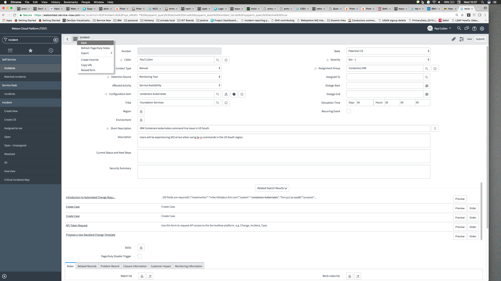

Informational
{: .label }

## Overview

Incidents are urgent notifications of unexpected service outages and stability issues affecting the platform. These notifications can be posted 24 x 7 x 365.

Incident notifications require a Incident record in ServiceNow for auditing purposes. No exceptions!

Raise a CIE when one of our services is impacted, and get a notification published only when the CIE is confirmed. 
If there is a notification already posted that will cover us, make sure it includes our services in the notification.
We still have our own CIE in this case, even though we have a shared notification.

There are two ways to create the incident which are explained below:

- Via CIEbot
- Manually in Service Now web interface (NB: Should only be raised this way when CIEBot is unavailable)

## Detailed information


The following sections cover how to raise incidents

## Raising a CIE using CIEbot

**Pre-req** Ensure that you have onboarded and requested access to ciebot as per the [CIEBot User Authentication runbook](https://pages.github.ibm.com/cloud-sre/runbooks/docs/runbooks/ciebot/Runbook_CIEBot_User_Authentication.html)

In the relevant CIE channel, use `@ciebot` to raise the CIE.

Channels of interest are:

- [#containers-cie](https://ibm-argonauts.slack.com/messages/C4SN1JNG5) - For all Container service based CIEs (Containers, Registry and Vulnerability Advisor)
- [#whisk-cie](https://ibm-argonauts.slack.com/messages/C8W073D3K) - For Cloud Functions CIEs

CIEBot has a help command and example templates which will assist with raising and managing a CIE.

### Key CIEbot functionality

The CIE bot should be used to create, confirm, update and resolve a CIE.

To intiate interactions with the ciebot use the command below. Afterwards an interactive menu would be displated as shown in Figure 1.  

```
@ciebot cie
```

<a href="images/sre/menu.png">
</a>
<figcaption>Figure 1. - ciebot Interactive menu</figcaption>

#### Creating a cie

In the interactive menu shown (as shown in Figure 1), select "create a New Incident". On the resulting screen enter a concise summary for this new incident, select a crn service to assign the incident, add a detailed description of the incident. 

Here is a list of service name for the components we look after

- containers-kubernetes
- container-registry (NB: Registry and Vulnerability Advisor use this service name)
- functions

On completing this process, an incident number will be returned, for example, INC0062425.  Make a note of this.

#### Confirming a cie

Using the bot to confirm a cie.
This will change the state in Service Now to be `confirmed-cie` and will page out the TOC AVMs

In the interactive menu shown (as shown in Figure 1), select "change incident state". On the resulting screen, select the incident number, and change the state to "Confirmed CIE".

Also update the following section of the incident Record via the bot (You can continually update these as more knowledge becomes available):
- Affected activity 
- Customer Impact description
- Customer Impacted 

Make sure a notification is posted by contacting the availability manager (AVM).

#### Unconfirming a CIE

Using the bot to unconfirm a cie. This will change the state in Service Now to be `potential-cie`.

In the interactive menu shown (as shown in Figure 1), select "change incident state". On the resulting screen, select the incident number, and change the state to "Potential CIE".


#### Adding a worknote to the CIE timeline

Using the bot to add worknotes. This will add your comments as worknotes in Service now. Please note that these worknotes will only be visible to the internal team and not customers.

In the interactive menu shown (as shown in Figure 1), select "Add a comment to an incident". On the resulting screen, select the incident number, and input your comments.

#### Resolving a cie

Using the bot to resolve a CIE. This will change the state in Service Now to `resolved` and within 48 hours the CIE state will then automatically be set to `closed`.

In the interactive menu shown (as shown in Figure 1), select "resolve an incident". On the resulting screen, select the incident number, Select the close code and enter the resolution for this incident. 

The available close codes are:

- "solved-permanently"
- "solved-work-around"
- "solved-remotely-work-around"
- "solved-remotely-permanently"
- "not-solved-not-reproducible"
- "not-solved-too-costly"
- "closed-resolved-by-caller"
- "closed-duplicate"

## Raising a CIE manually in Service Now

The [Service Now cheatsheet](https://ibm.ent.box.com/s/ydul42dsy9tmvf1rwfqp216xbx2y0s3j) provides videos from the Service Now tribe, detailing how to do various activities including raising incidents.  **Please find time to watch these videos**.

The section named training resources and three recordings on Incident Management is relevant for how to create and manage incidents in ServiceNow.


### High level overview of raising an incident manually

The following two sections detail how to create, confirm and resolve a CIE in ServiceNow.

This process should only be followed when CIEBot is unavailable or the functionality is not working in the bot.

#### Creating a potential CIE

- Log into [service now](https://watson.service-now.com/nav_to.do?uri=%2Fhome.do%3F)
- In the top left search box, type `Incident` which will filter out the left menu bar
- Under `Incident`, click `Create New`
- Fill out the following fields on the Incident screen


Field | Possible value | Information
:---: | :---: | ---
Detection Source | Drop down list of how the incident was detected | Select the most appropriate value
Configuration item | <br>containers-kubernetes, <br>container-registry, <br>container-vulnerability-advisor, <br>functions, <br>MHub | Select which component is affected - this should automatically fill in `Tribe` and `Assignment group`
Tribe | Foundation Services | This should automatically get populated - if not, please enter the value specified.
State | Potential CIE | Select potential CIE until we have confirmed.
Severity | Drop down list | Always select severity 1
Assignment Group | Containers SRE |  This should automatically get populated - if not, please enter the value specified.
Outage Start | Date time field | Select the appropriate value for when this incident started (UTC).
Short Description | Free form text | Fill in a short Description / title describing the incident
Description | Free form text | Fill in more detailed Description of the incident, including how end users are affected.
{:.table .table-bordered .table-striped}

Example screenshot

<a href="images/sre/potential_cie.png">
</a>


- NB:  When a potential-cie is created, both the on call TOC AVMs and DSET teams will be paged out.

#### Confirming a CIE

- Change the state field from `Potential CIE` to `Confirmed CIE`.
- Update the `Customer Impact` tab with details of `Customers impacted` , `Description of Customer impact` and tick the box `Was customer impacted?`.
- Left click on the top left menu item next to the incident ID to save the incident after changing the state.

Example screenshot

<a href="images/sre/confirm_cie.png">
</a>

Make sure a notification is posted by contacting the availability manager (AVM).

#### Updating a CIE

There are many fields within the incident that can be added to or updated during the CIE.

The main field which will be updated during the course of a CIE will be the `Work notes` field.
This should be updated regularly with all the actions being taken whilst the CIE is in progress.

Use information from the CIE Channel to populate the `work notes` field.

**When adding work notes, ensure the customer visible box is not ticked!**

Here is an example:

<a href="images/sre/update_notes.png">
</a>

#### Resolving a CIE

Once it's confirmed that the CIE is over, we need to resolve it in ServiceNow.

- Fill in the outage end time
- Click on the `Closure Information` tab, and fill out
  - `Close code` - choose a suitable code depending on how the incident was closed
  - `Close notes` - Add any supporting information
- Click the `Resolve` button at the top right of the screen to resolve the incident.

A message will appear stating the incident was resolved.

#### Closing a CIE incident record

For now, please do not click the `Close` button.

## Useful links

The following links are to associated docs or useful reference materials:

- [SRE CIE Responsibilities documentation](./sre_cie_responsibilities.html) - runbook detailing SRE squad members roles and Responsibilities during a CIE.
- [Service Now Cheat Sheet](https://ibm.ent.box.com/s/ydul42dsy9tmvf1rwfqp216xbx2y0s3j) - ServiceNow documentation and help
- [Service Now production instance](https://watson.service-now.com/nav_to.do?uri=%2Fhome.do%3F) - The Production instance of ServiceNow
- [How to handle a CIE - AVM](https://pages.github.ibm.com/global-toc/avm/star/2019/03/11/How-to-Handle-CIE/#raise-a-cie-via-ciebot)
