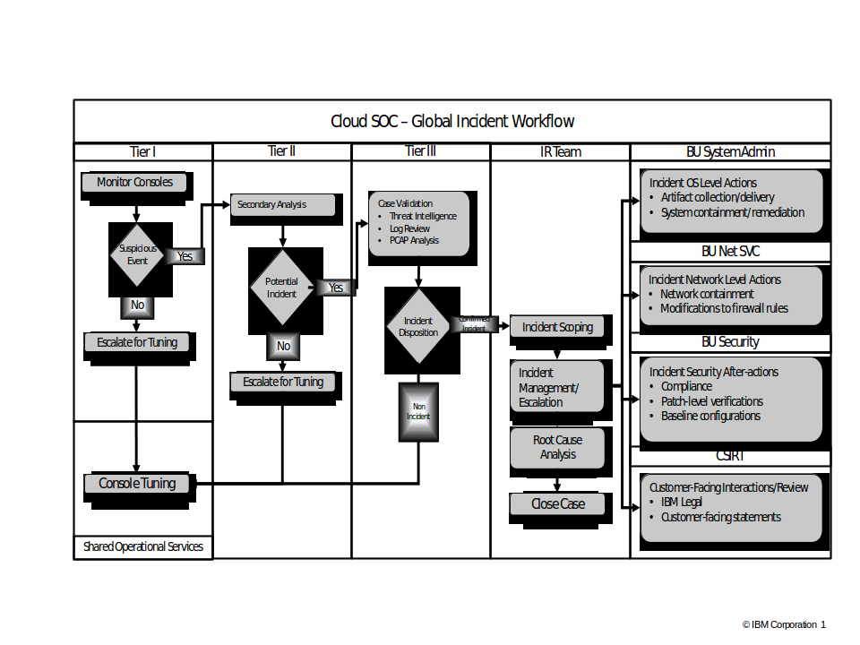
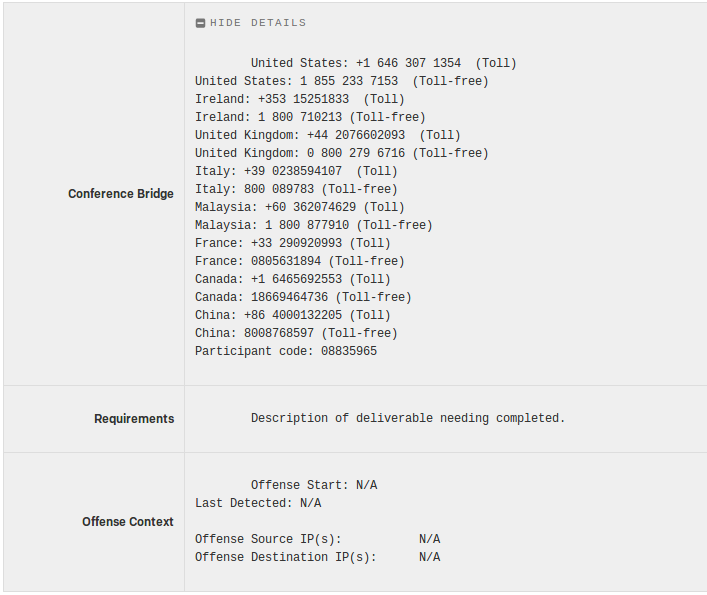

Informational
{: .label }

## Overview 
This runbook is a general aid to understanding of the SOC alerting process. It is **not** a step by step guide for how investigate/resolve Security Operations Center (SOC) Pager Duty (PD) alerts.

SOC PagerDuty (PD) alerts are generated by the Incident Response (IR) team, and fall into two categories:

- Request to investigate a **potential** security incident<br>
  This PD is triggered by creation of a ServiceNow incident against the `Containers SRE` group. Its purpose is to request help and/or information from Containers SRE. 

- Notification of a **confirmed** security incident<br>
  This PD is generated to indicate that a security incident has been identified and that action is required to resolve it. 

### Contacts

Important SOC contact information is maintained on the [Cloud SOC wiki](https://w3-connections.ibm.com/wikis/home?lang=en-us#!/wiki/W899774eeffa6_4383_a35a_e690d20e661e/page/Welcome%20to%20Cloud%20SOC%20-%20Read%20here%20for%20important%20contact%20information).


## Detailed Information 

### SOC Incident Flow 

The following depicts the SOC incident workflow. 



Containers SRE may be included in the `Tier III` investigation <sup>1</sup>. To request aid in the investigation, the SOC IR team opens a ServiceNow incident against the `Containers SRE`. The severity of the ServiceNow incident is mapped to the PD urgency. 

- `Sev1` ServiceNow incidents generate a *high* urgency PD 
- `Sev2` ServiceNow incidents generate a *low* urgency PD 
- `Sev3` and `Sev4` ServiceNow incidents do not generate a PD and are **not** used 

If a security incident is confirmed, the ServiceNow incident is closed and a Security Incident PD is generated. 

<u>Note</u>: Typically a Security Incident PD is only generated after joint investigation with Containers SRE. However, if the situation warrants it, the SOC IR team may bypass the joint investigation. In this case Containers SRE first knowledge of the security incident may be the Security Incident PD.

 <sup>1</sup> Typically `Tier I` and `Tier II` investigation is just the SOC IR team.


### PD to Elicit Containers SRE Help

The PD title will be in the format:

INC*\<incident\>*:*\<worknote\>*:*\<message\>*

e.g. `INC0104266:ESC0717395:SSH into host from privileged container`

The PD will identify a ServiceNow incident which should contain all the relevant data and identify required information or artifacts. It also serves as the primary means of communication between Containers SRE and SOC IR team. The focus is to determine if this incident should be confirmed as a security incident.

Containers SRE should Acknowledge the PD and update the ServiceNow ticket in a reasonable<sup>2</sup> amount of time. 

- If a response is not received a Security Incident PD is generated. 
- Resolving the PD will resolve the ServiceNow incident; pass it along in the handover if necessary. 
- Resolve the PD when the requested information has been provided or some agreement has been reached with the SOC IR team. 

Typically the ServiceNow incident will identify some operation and ask for confirmation of whether or not this was legitimate. If it is legitimate the SOC team will need information to *tune* out these false-positives. This could be in form of (a) schedule for repetitive operations or (b) fields/values within the operation. If Containers SRE cannot provide the requested information, relevant teams should be engaged and, if necessary, the PD may be re-assigned. 

Below is an example ServiceNow request showing ssh as root from a container to its host. Use [armada-xo](https://ibm-argonauts.slack.com/messages/G53AJ95TP) to identify the cluster and the owning service. 

```
SSH into host from privileged container:
<86>May  4 21:38:46 crn.v1.bluemix.public.container-registry.us-south.00f409e2cf3b4aaae8d8ec764d8bb627.f49c47a3959e4501ae0cc4ae49b85f82.worker.kube-dal12-crf49c47a3959e4501ae0cc4ae49b85f82-w30 sshd[30931]: pam_unix(sshd:session): session opened for user root by (uid=0)

SOC needs verification that this SSH traffic was legitimate. If this is a false positive, is it tunable? If not what time Frame is this traffic expected for before we alert again on the same traffic? 
```

 <sup>2</sup> There is no defined SLA associated with these ServiceNow tickets, but the severity reflects the urgency. For example a `Sev2` ServiceNow ticket requires a response in 24 hours or less. If no response is received it may be escalated to a `Sev1`. 


### Security Incident PD
 
These PDs are always *high* urgency and will be titled:

*\<c_code> Security Incident \<case number>*<sup>3</sup>

e.g. `ALC Security Incident 4209`
 
The PD will contain a conference bridge where additional instructions and information exchange will take place. Containers SRE Interrupt pair should join that call as soon as possible. 

If it is determined that an indepth investigation is required, due to the nature or severity of the ongoing incident, then a private slack channel may be established specifically for that incident. This private slack channel is set up in `IBM Cloud Platform` slack, typically named *res-\<case number>*. Details will be communicated over the conference bridge. If there is an SRE shift change during an ongoing incident the new Containers SRE interrupt pair should be added to the private slack channel. 

Containers SRE should request the slack channel as soon as appropriate; this will provide history for handover or to anyone joining the investigation at a later time. They should also `page out` other teams if necessary for the investigation. 

 <sup>3</sup>The *\<case number\>* is a SOC case number; Containers SRE does not have access to the case, nor are they expected to update it.


### Security Incident PD Dichotomized 

Unlike a *typical* PD the contents of a Security Incident PD are tailored towards the offense; there is no list of all possible alerts. However, the PD does try to provide as much information as possible.



- Conference Bridge<br>

  This is the list of toll free phone numbers and pass code used to join the IR team discussing the offense. 
  The Containers SRE Interrupt pair on duty must call in to this conference; their function is to provide information and assistance as requested by the IR team. This may involve interrogation of servers/clusters, or involving other squads.

- Requirements<br>

  This is a description of the incident/attack. If is very specific to the incident/attack. 
  e.g.

  Today, April 23rd, the SOC received an escalation for excessive firewall denies from an *IP* based in (*Country*), *XX*.*XXX*.*XX*.*XX*, with a reputation for malicious activity.  The device logging the denies is (*Device Type*) @ (*Hostname*) and, at present, we have not observed a successful authentication event.  Please confirm whether this device has a business need for being Internet-facing and, if so, what controls are in place to mitigate bruteforce attacks and other external threats.  We will pass additional details on the conference bridge listed above \- thank you.

- Offense Context<br>

  This will provide date and time for when the offense was first and last detected, plus any associated IP addresses. e.g.
  
  ```
  Offense Start: 2018-02-23 12:28:03
  Last Detected: 2018-02-23 12:28:06
  
  Offense Source IP(s): <list of IPs>
  Offense Destination IPS(s): NA
  ``` 

<u>Note</u>: The PD does not reference a runbook. This is because the SOC team controls the contents, and, as policy, do not customize the alert for any consumer.  


## Control Plane Incidents

The following incidents were identified for the Armada control plane.

<b><u>Notice</u><br>
Until the NNT change tracker solution is in place QRadar will be generating offenses based on audit logs. These logs have a limitation in that they identify the user by UID not username. Because the UID is dependent on the system where the audit log was generated, QRadar cannot eliminate legitimate users, resulting in false positives. <br>
To deal with these false positives, the on call SRE will have to log into the system identified in the ServiceNow ticket and verify that the `auid` (again identified in the ServiceNow ticket) identifies a legitimate user. <br>
Typically legitimate users will *local* and can be found via `grep <auid> /etc/shadow`. If the user is not local it can be looked up in USAM via `id <auid>`. </b>

### Root Login

This incident is triggered when a remote login is successfully established on any server by `root` (**not** when a user logins in and does `sudo`). It is an indication that root login prevention has been compromised.

### Sudo on Syslog Server

This incident is generated to alert for potential log tampering.  In general SRE should **not** need to become root on a syslog server, except occasionally to fix a machine issue. 

The server will always be one of the `infra-syslog` servers. This alert will **not** be generated if the user is:

- igorbot
- jenkins
- root (cron job) 

### Critical Configuration Changes

The following incidents are for critical configuration changes.

<u>Note</u>:

- Changes are deletion or modification of the target file/directory, including changes to permission. 
- If the target is a directory, changes refer to addition, deletion or modification any file in the specified directory. 
- Unless otherwise noted users `jenkins` and `igorbot` are excluded. 

#### Kubernetes Configuration

This incident is triggered by changes to:

- `/etc/kubernetes/`
- `/etc/docker/`

This alert will **not** be generated if the user is: 
- armada
 
#### Audit Daemon Configuration

This incident is triggered by changes to:

- `/etc/audit/`
- `/etc/audisp/`
- `/etc/libaudit.conf`
 
#### Kernel Configuration

This incident is triggered by changes to:

- `/etc/sysctl.d/`
- `/etc/sysctl.conf`
 
#### Privilege Escalation

This incident is triggered by changes to:
- `/etc/sudoers.d/`
- `/etc/sudoers`
 
#### Remote Access Configuration

This incident is triggered by changes to:

- `/etc/ssh/`
- `/etc/sys-auth.allow-group`
- `/etc/securetty`
- `/etc/login.defs`
 
#### Startup Configuration

This incident is triggered by changes to:

- `/etc/init/`
- `/etc/init.d/`
 
#### User Identity

This incident is triggered by changes to:

- `/etc/group`
- `/etc/passwd`
- `/etc/gshadow`
- `/etc/shadow`
- `/etc/security/opasswd` 

### User Changes

A incident is generated whenever a user is added, deleted or modified by any user other than `jenkins`.  

### Login Failures

These incidents are for failed logins. They are generated when at least 10 events are encountered in a 5 minute period. 

- Multiple Failed Logins with same Username
- Multiple Failed Logins from same IP
- Multiple Failed Logins to same IP

These incidents are for failed logins, followed by a successful login. 

- Login with same Username after Multiple Failures
- Login from same IP after Multiple Failures
- Login to Same IP after Multiple Failures


## RCA

For all confirmed security incidents the SOC team performs an *internal* RCA; they do not request an RCA from Alchemy SRE. 


## Security Incident versus CIE

Typically a security incident is not a CIE, though it could be the root cause of an CIE. e.g. a *Denial of Service* attack may impact services utilized by customers. If that is the case a CIE should also be raised. 

<u>Note</u>: When raising a CIE be careful with the description and the information disseminated. The title and the description are customer visible; if in doubt consult with your team lead.

## Identify false positives

### File changes

Sometimes file changes described in [Critical Configuration Changes](#critical-configuration-changes) gets flaged by SOC even though they are done by automation. We need to confirm that change was performed by automation and document it on PD comments.

#### Smith-patching

To identify changes done by smith-patching:
1. Make sure the node does not belong to a tugboat. Smith-patch automation does not run on the tugboat. 
1. Log into node and check `/var/log/auth.log` around the time activity was flagged and identify logged in user. The user should be an automation user. Ex. `jenkins`, `igorbot`, etc. 
1. Run [PatchFailedMachineHealthReport](https://alchemy-conductors-jenkins.swg-devops.com/view/Conductors/job/Conductors/job/Conductors-Infrastructure/view/Smith%20Patching/job/PatchFailedMachineHealthReport/) Jenkins job to collect report for the node. Verify time of activity and patching matches closely. 

#### Bootstrap-one
To identify changes done by bootstrap-one:
1. Make sure the node does not belong to a tugboat. Bootstrap-one automation does not run on the tugboat. 
1. Check for node entry in [bootstrap-bot-alert](https://ibm-argonauts.slack.com/archives/C53PSDQUC) channel. Verify time of activity and entry time matches closely. 

## Additional pointers to Containers SRE
Some of the alert scenarios described below for Containers SRE to acknowledge the PD alert and take appropriate action.

### Scenario 1
**Alert Info:** This incident is generated to alert for login attempt to Bastion servers by a human operator. </br>
e.g. 
- `UC-3_ALC_Privilege_Escalation_Change`
- `filePath=/etc/sudoers.d/teleport-users`

**Action to take:** Post it in `#conductors-for-life` slack channel and ask the user to confirm.

### Scenario 2
**Alert Info:** Armada UC #1 : Attempt to elevate privileges without sudo containing Su Succeeded

**Action to take:** Add the following note to the PD alert `it is automation activity and expected`  and resolve it


### Scenario 3
**Alert Info:** 1. Privileged User Monitoring, 2. User Found Within the payload: root

**Action to take:** Add the following note to the PD alert `it is automation activity and expected`  and resolve it

### Scenario 4
**Alert Info:** armada Use Case: UC-4 Armada_Multiple Kube Operator_Failures </br>
User Found Within the payload: IAM#serviceid-eddab43b-a5e3-4aa2-9521-a55219f0b3a7

**Action to take:** Check the user ID and get if confirmed from the owning team who can confirm the activity

### Scenario 5
**Alert Info:** NNT Unplanned File Change Event

**Action to take:**
check the following file `/var/log/auth.log`,  it is likely Jenkins or complaince automation and add a note to PD alert

### Example SOC Cases
- NNT Unplanned File Change Event </br>
The Inquiry Description contains filePath=/etc/sudoers.d/teleport-users</br>
This occurs when there is no teleport-users file present on the ALC machine. An SRE logs in and the file is created, triggering change-tracker.</br>
Login to the machine in the alert and run this command  `cat /etc/sudoers.d/teleport-users` </br>
There will be most likely 2 users in here, you and the SRE that triggered the alert.</br>
Confirm the activity.</br>

- Satellite Storage CI's Account</br>
The Payload Sample contains 89b0b8c9a9cf4ee289bdcf5c74f7c541</br>
This is the account number for Satellite Storage CI's Account.</br>
Post in #armada-storage, tag nkashyap@in.ibm.com - he is the team lead.</br>
Ask them to confirm the activity & deal with cloud SOC as SRE has no access this account.</br>