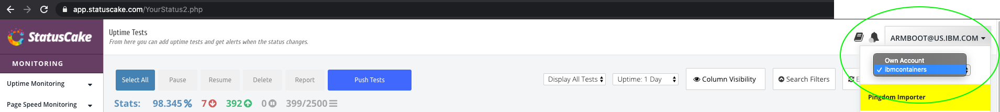
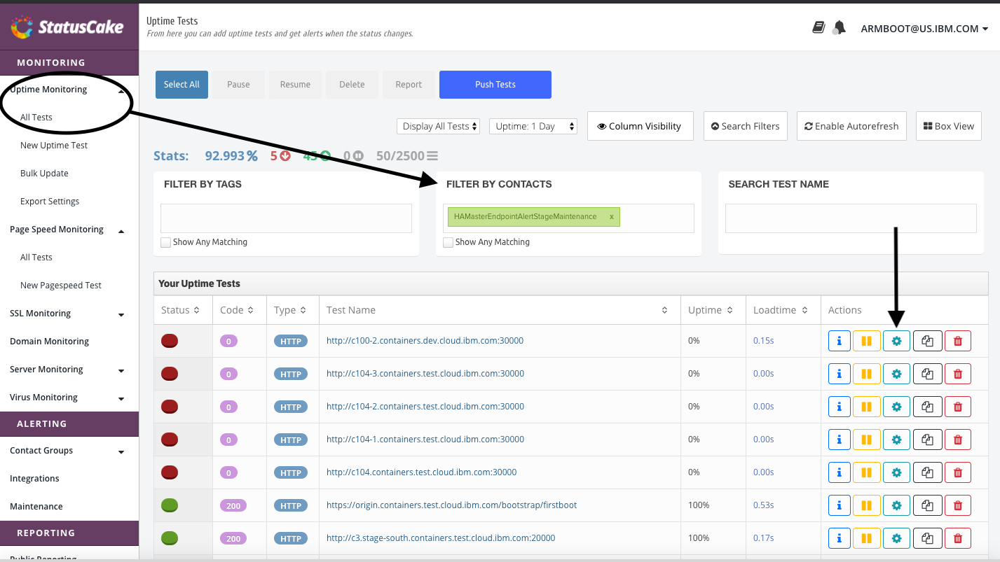
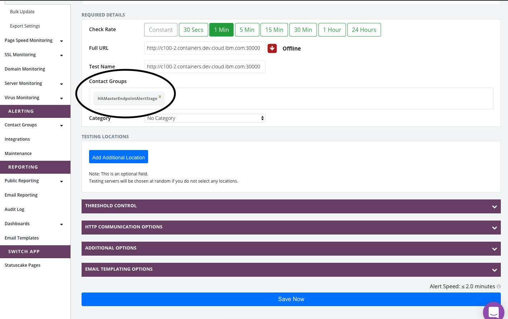

Informational
{: .label }

## Overview

This runbook details how to create and enable/disable statuscake Alerts

## Detailed Information

### Create Statuscake Alerts

Run [this job](https://alchemy-containers-jenkins.swg-devops.com/job/Containers-Runtime/job/bootstrap-statuscake-automation/build?delay=0sec) with the following parameters:

#### Tugboat
- DNS_ENTRY_NAME_1: Field `ha_managed_master_hostname` in carrier#.yml file located in the appropriate env folder in [armada-envs](https://github.ibm.com/alchemy-containers/armada-envs) e.g. `c1.eu-es.containers.cloud.ibm.com`
- DNS_ENTRY_NAME_2: Only needed for MZRs, field `ha_master_endpoints_csv[0]` in carrier#.yml file located in the appropriate env folder in [armada-envs](https://github.ibm.com/alchemy-containers/armada-envs) e.g. `c1-1.eu-es.containers.cloud.ibm.com`
- DNS_ENTRY_NAME_3: Only needed for MZRs, field `ha_master_endpoints_csv[1]` in carrier#.yml file located in the appropriate env folder in [armada-envs](https://github.ibm.com/alchemy-containers/armada-envs) e.g. `c1-2.eu-es.containers.cloud.ibm.com`
- DNS_ENTRY_NAME_4: Only needed for MZRs, field `ha_master_endpoints_csv[2]` in carrier#.yml file located in the appropriate env folder in [armada-envs](https://github.ibm.com/alchemy-containers/armada-envs) e.g. `c1-3.eu-es.containers.cloud.ibm.com`
- MONITOR_PORT: Tugboats use port 30000

#### Legacy Carrier
- DNS_ENTRY_NAME_1: Found in the [DNS Procurement](https://github.ibm.com/sre-bots/shepherd/blob/master/templates/DnsProcurementTemplate.yaml) ticket for netint. [Example](https://github.ibm.com/alchemy-conductors/firewall-requests-shepherd/issues/1769)
- DNS_ENTRY_NAME_[2-4]: Only needed for MZRs. Found in the [DNS Procurement](https://github.ibm.com/sre-bots/shepherd/blob/master/templates/DnsProcurementTemplate.yaml) ticket for netint. [Example](https://github.ibm.com/alchemy-conductors/firewall-requests-shepherd/issues/1769)
- MONITOR_PORT: Legacy Carriers use port 20000


This job will create a statuscake entry and put it into a maintenance contact group. Depending on if its stage or production, it will put it into their respective contact group: `HAMasterEndpointAlertStageMaintenance`, `HAMasterEndpointAlertMaintenance`.
When in maintenance mode, the statuscake alert will post messages to slack ([#ha-statuscake-maint](https://ibm-argonauts.slack.com/archives/CK4TTJH5W)) when it is triggering but NOT Pagerduty.

## When ready to go live

When ready to go live, the alert needs to be moved out of maintenance mode so that the alerts will trigger in Pagerduty.
Also, once moved, the alerts will be posted to their respective slack channels: #ha-statuscake-stage for staging and #ha-statuscake-prod for production.

1. Log into statuscake <https://app.statuscake.com/YourStatus2.php> using [these creds](https://pimconsole.sos.ibm.com/SecretServer/app/#/secret/43243/general)
  - make sure sub account is set to `ibmcontainers`
    

2. In the left hand panel hit the `Uptime monitoring` dropdown and select `All Tests`.
  - In the middle pane `Filter by Contacts` and search for `HAMasterEndpointAlertStageMaintenance` for stage or `HAMasterEndpointAlertMaintenance` for production
    

3. Click the gear next to the alert that needs to be switched over, see image above
4. Delete the existing Contact Group and put in the non maintenance contact group: `HAMasterEndpointAlertStage` for stage or `HAMasterEndpointAlert` for production
  
5. Click `Save Now`
6. Repeat for all entries

## Testing

1. Follow above steps to move alerts out of maintenance mode
1. ssh to carrier
1. Scale down health check deploy
```
kubectl -n kube-system scale deployment/health-check --replicas=0
```
1. If everything is setup correctly an alert will trigger on one of the following services:
[armada-ha-master-statuscake-prod](https://ibm.pagerduty.com/service-directory/P4TCFHW)
[armada-ha-master-statuscake-stage](https://ibm.pagerduty.com/service-directory/P3JH5MC)
1. Revert the change by scaling back to 3 replicas
```
kubectl -n kube-system scale deployment/health-check --replicas=3
```
1. The alerts should clear.
