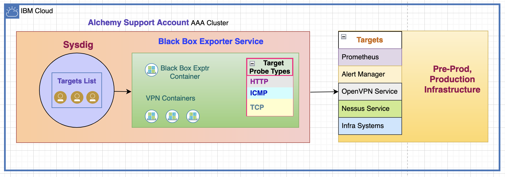
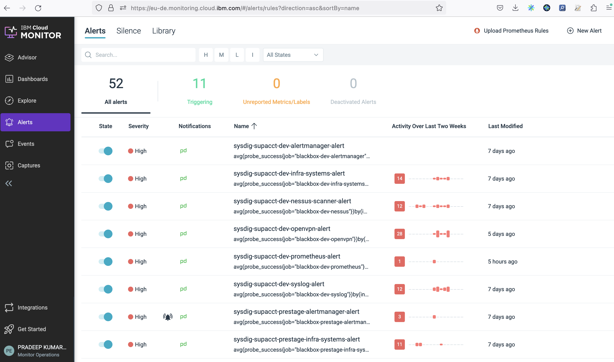
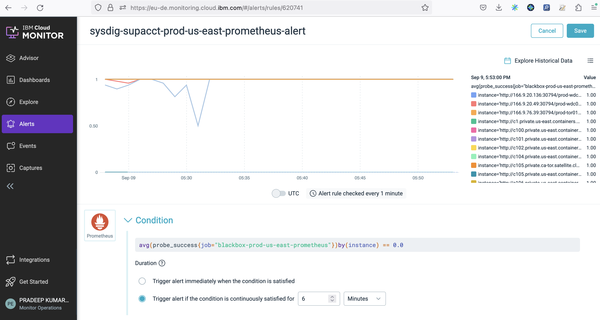
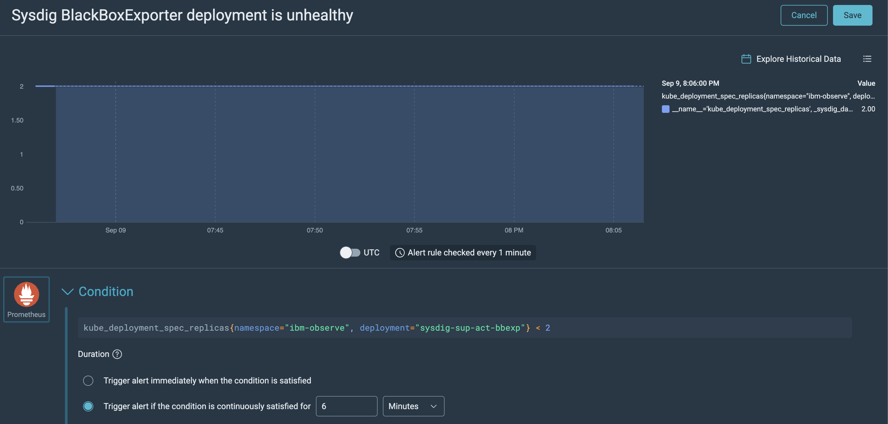

Troubleshooting
{: .label .label-red}

## Overview

This runbook provides the steps to access Sysdig monitoring on the Support Account and details how to troubleshoot accessibility issues reported for one or more targets. <br>

The below diagram gives an Overview of sysdig support account monitoring.



## Example Alerts

Example PD alerts: <br>
 - [Alertmanager instance(s) down in Pre-stage](https://ibm.pagerduty.com/incidents/Q24ISZFKVTQCJH)
 - [Prometheus Instance(s) down in Prod US-East](https://ibm.pagerduty.com/alerts/Q0KPRE8O25L8LW)

## Investigation and Action
### Accessing Sysdig Monitoring and Troubleshooting 

#### What is Sysdig monitoring ? Where is it installed ?
Sysdig monitoring has replaced the legacy Sensu monitoring following the decommissioning of Sensu systems. It is set up on the AAA cluster within the Alchemy Support Account. It monitors Carrier and Tugboat Prometheus, Alert Manager private endpoints, Nessus scanner (system and service), OpenVPN (system and service), Syslog (system and resource usage), and the apt-repo-mirror systems.

Sysdig monitoring maintains a list of targets (as mentioned above) and monitors/polls them using the Black Box Exporter service, which is integrated with the Sysdig agent for this purpose.

  
#### Details: 
Cluster Name: `infra-accessallareas` <br> 
Cluster ID: `19eef897d2934eb2914ca3486aa10276` <br>
Deployment name: `sysdig-sup-act-bbexp` (2 replicas) used by `sysdig-agent* (daemonset: one on every node)` <br>
Namespace: `ibm-observe` <br>
Deployment Process: `Razee`[Razee pipeline set up](https://github.ibm.com/alchemy-containers/sysdig-sup-act-bbexp/blob/master/setup-razee-pipeline.md)

##### Git Repo
- [Git Repo link](https://github.ibm.com/alchemy-containers/sysdig-sup-act-bbexp)
- Link to [Sysdig configmap.yaml](https://github.ibm.com/alchemy-containers/sysdig-sup-act-bbexp/blob/master/config/sysdig-configMap.yaml) which contains all the targets that are monitored
- Link to [Blackbox Exporter Service deployment yaml](https://github.ibm.com/alchemy-containers/sysdig-sup-act-bbexp/blob/master/services/sysdig-sup-act-bbexp/deployment.yaml). The Deployment name: sysdig-sup-act-bbexp.
- [Jenkins Job](https://alchemy-containers-jenkins.swg-devops.com/job/ConductorTestFolder/job/sysdig-sup-act-bbexp/) to integrate Blackbox Exporter Service to Sysdig Agent (apply configmap sysdig-sup-act-bbexp).

##### Sysdig alerts and Dashboard on cloud.ibm.com
###### Sysdig monitoring has 2 categories of alerts <br> 
1. Monitors a list of targets <br>
   - Prometheus
   - Alert Manager
   - OpenVPN Service
   - Nessus Service
   - Infra Systems
2. Monitors the `Black Box Exporter Service` that is responsible for querying the targets

###### Sysdig alerts
- [Sysdig alerts dashboard link](https://cloud.ibm.com/observability/embedded-view/monitoring/6589f4bf-7870-4f2c-b49d-b51a33a66e5f). This includes both categories of alerts. To goto `Alerts` page, on the left side of the dashboard, select `Alerts`. This includes both categories of alerts.
  - Screenshot of Sysdig alerts page <br>
    <br> <br>
- Category#1 alerts:
    
    - Sample Sysdig Alert Link: <br>
       Alert name = sysdig-supacct-prod-us-east-prometheus-alert <br>
       To goto this alert page, on the left side of [Dashboard](https://cloud.ibm.com/observability/embedded-view/monitoring/6589f4bf-7870-4f2c-b49d-b51a33a66e5f), select `Alerts`. In this page, go to `Search` option on the top and search for `sysdig-supacct-prod-us-east-prometheus-alert`.
       - Screenshot of this alert page <br>
          <br> 
- Cateogry#2 alerts:
   - To goto this alert page, on the left side of [Dashboard](https://cloud.ibm.com/observability/embedded-view/monitoring/6589f4bf-7870-4f2c-b49d-b51a33a66e5f), select `Alerts`. In this page, go to `Search` option on the top and search for `Sysdig BlackBoxExporter deployment is unhealthy`. <br>
   - Screenshot of monitoring Blackbox Exporter Replicas <br>
   
   

#### Steps to access the AAA cluster using CLI and review the Sysdig configuration
1. Login to ibmcloud using CLI <br>
   `ibmcloud login --sso`
2. Select Alchemy Support Account 278445
3. Access the IKS Jenkins cluster <br>
   `ibmcloud ks cluster config -c infra-accessallareas` <br>
   or `ibmcloud ks cluster config -c 19eef897d2934eb2914ca3486aa10276` <br>
4. Get the list of JJs pods <br>
   `kubectl get pods -n ibm-observe` <br>
   Sample output: <br>
   ``` 
   kubectl get pods -n ibm-observe
   NAME                                    READY   STATUS    RESTARTS   AGE
   sysdig-agent-2jnv7                      1/1     Running   0          3d3h
   sysdig-agent-5dzdh                      1/1     Running   0          4d3h
   sysdig-agent-5j8vp                      1/1     Running   0          4d3h
   sysdig-agent-5rd8t                      1/1     Running   0          4d3h
   sysdig-agent-b68gn                      1/1     Running   0          3d3h
   sysdig-agent-dpllq                      1/1     Running   0          3d3h
   sysdig-agent-frzl8                      1/1     Running   0          4d3h
   sysdig-agent-h4qk2                      1/1     Running   0          3d3h
   sysdig-agent-lvhx4                      1/1     Running   0          4d3h
   sysdig-agent-ncbgq                      1/1     Running   0          4d3h
   sysdig-agent-nf8zw                      1/1     Running   0          4d3h
   sysdig-agent-nnm87                      1/1     Running   0          4d3h
   sysdig-agent-s6r7s                      1/1     Running   0          4d3h
   sysdig-agent-xr5wd                      1/1     Running   0          4d3h
   sysdig-agent-zfbnn                      1/1     Running   0          4d3h
   sysdig-sup-act-bbexp-77974868d8-4252z   10/10   Running   0          3d3h
   sysdig-sup-act-bbexp-77974868d8-jx4cm   10/10   Running   0          3d3h
   ```


#### Troubleshooting: How to investigate scenarios where target(s) are reported as inaccessible 
- Exec to sysdig pod "_sysdig-sup-act-bbexp-*_" <br>
  `kubectl exec -it -n ibm-observe sysdig-sup-act-bbexp-<POD> /bin/bash` <br>
  Example: <br>
  `kubectl exec -it -n ibm-observe sysdig-sup-act-bbexp-77974868d8-4252z /bin/bash`
- Try to access the reported target: <br>
   `IF CURL is not installed on this pod, install it using below commands` <br>
   `sudo apt-get update`  <br>
   `sudo apt-get install curl` <br>

<table>
   <thead>
      <tr>
         <th>S.L.No</th>
         <th>Target=Alert Name</th>
         <th>Command to access</th>
      </tr>
   </thead>
   <tbody>
      <tr>
         <td>   1</td>
         <td>Prometheus=<code style="display: block; white-space: pre-wrap;">sysdig-supacct-ENV-REGION-prometheus-alert</code> <br> Alert Manager=<code style="display: block; white-space: pre-wrap;">sysdig-supacct-ENV-REGION-alertmanager-alert</code></td>
         <td>
            <em>Command:</em> <code>curl -s -w &quot;\n&quot; PROMETHEUS-INSTANCE</code> <br><br> 
            <strong>Example:</strong> <br> 
            <em>Command:</em> <code style="display: block; white-space: pre-wrap;">curl -s -w &quot;\n&quot; &quot;http://c9.private.sjc03.containers.cloud.ibm.com:30794/prod-sjc03/carrier9/prometheus/api/v1/query?query=up%7Bapp%3D%22armada-ops-prometheus%22%7D&quot;</code> <br> 
            <em>Output:</em> Successful output shows <code>{&quot;status&quot;:&quot;success&quot;,&quot;data&quot;:{&quot;resultType&quot;:&quot;vector&quot;,&quot;result&quot;:[]}}</code> <br> <br> 
            <em>Comments:</em> Above output shows the target is accessible. If its not &quot;success&quot; and if the issue still open/persists, snooze the alert and raise a GHE Issue in <a href="https://github.ibm.com/alchemy-containers/sysdig-sup-act-bbexp/issues">Sysdig-Git_Repo</a> and post in <a href="https://ibm-argonauts.slack.com/messages/G53NY6QH0">#conductors-for-life slack channel</a><br> </td>
      </tr>
      <tr>
         <td>   2</td>
         <td>OpenVPN=<code style="display: block; white-space: pre-wrap;">sysdig-supacct-ENV-REGION-openvpn-alert</code> <br>  Nessus=<code style="display: block; white-space: pre-wrap;">sysdig-supacct-ENV-REGION-nessus-scanner-alert</code></td>
         <td>
            <em>Command:</em> <code>nc -zv IP PORT-NUMBER</code> <br><br> 
            <strong>Example:</strong> <br> <code>instance = 10.143.143.4:1994</code> <br> <code>IP = 10.143.143.4 PORT-NUMBER = 1994</code> <br> <br> 
            <em>Command:</em> <code>nc -zv 10.141.38.9 1994</code> <br>
            Output: <code style="white-space: pre-wrap;">10.141.38.9: inverse host lookup failed: Unknown host (UNKNOWN) [10.141.38.9] 1994 (?) open</code> <br><br> 
            <em>Comments:</em> The above output shows <code>(?) open</code>, so its successful. If it shows message <code>(?) : Connection timed out</code> then its an error. If the issue still open/persists, snooze the alert and raise a GHE Issue in <a href="https://github.ibm.com/alchemy-containers/sysdig-sup-act-bbexp/issues">Sysdig-Git_Repo</a> and post in <a href="https://ibm-argonauts.slack.com/messages/G53NY6QH0">#conductors-for-life slack channel</a><br></td>
      </tr>
      <tr>
         <td>   3</td>
         <td>Infra Systems Keep Alive check=<code style="display: block; white-space: pre-wrap;">sysdig-supacct-ENV-REGION-infra-systems-alert</code> <br> Syslog keep alive check=<code style="display: block; white-space: pre-wrap;">sysdig-supacct-ENV-REGION-syslog-alert</code></td>
         <td>
            <em>Command:</em> <code>ping INSTANCE</code> <br><br> 
            <strong>Example:</strong> <br> <code>instance = 10.141.38.9</code> <br> <br>
            <em>Command:</em> <code>ping 10.141.38.9</code> <br> 
            <em>Output:</em> <code>PING 10.143.143.38 (10.143.143.38) 56(84) bytes of data.</code> <br> <code>64 bytes from 10.143.143.38: icmp_seq=1 ttl=64 time=121 ms</code> <br> <br>
            <em>Comments:</em> Above output shows the ping is successful. If it shows <code>Destination Host Unreachable</code> then its an error. If the issue still open/persists, snooze the alert and raise a GHE Issue in <a href="https://github.ibm.com/alchemy-containers/sysdig-sup-act-bbexp/issues">Sysdig-Git_Repo</a> and post in <a href="https://ibm-argonauts.slack.com/messages/G53NY6QH0">#conductors-for-life slack channel.  </a>
         </td>
      </tr>
   </tbody>
</table>


## PD Services for Sysdig Infra alerts (same as before i.e Legacy Sensu)
- [Alchemy - Infra - prod-dal09](https://ibm.pagerduty.com/service-directory/PT7YZIM)
- [Alchemy - Infra - prod-lon02](https://ibm.pagerduty.com/service-directory/PC891PN)
- [All Infra PD Services](https://ibm.pagerduty.com/service-directory/?direction=desc&query=Alchemy%20-%20Infra%20-&sort_by=score&team_ids=PFO08T8)

## Known Issues <br>
A list of known issues along with the explanation is present here -- [GHE Issue](https://github.ibm.com/alchemy-conductors/team/issues/23853)

## Escalation Policy

Involve the 
* `Alchemy Conductors` squad via the [{{ site.data.teams.containers-sre.escalate.name }}]({{ site.data.teams.armada-ops.escalate.link }}) escalation policy
* In the slack channel [Conductors-for-life Slack Channel](https://ibm-argonauts.slack.com/messages/G53NY6QH0)
