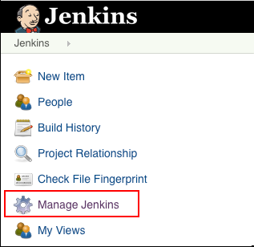
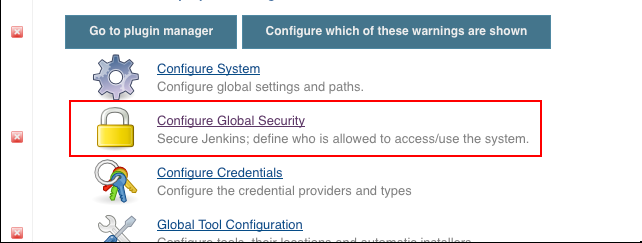
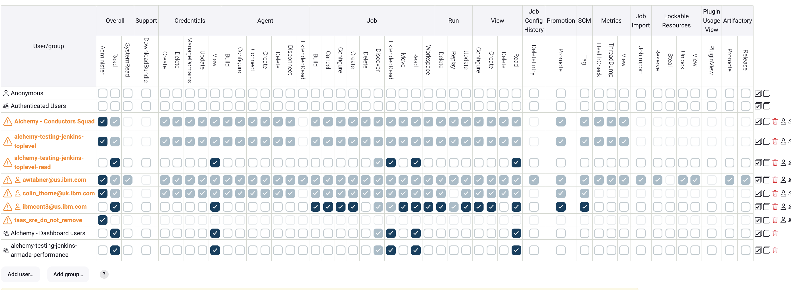

Ops
{: .label .label-green}

# Jenkins top-level permissions manual reconciliation

## Overview 
This runbook describes how to handle manual reconciliation of Jenkins top-level permissions

## Example alerts
None

## Detailed Information
The automatic USAM reconciliation cannot be performed on Jenkins top-level permissions because of missing APIs at the Jenkins datasource.

## Detailed Procedure
Note: this procedure requires administrative privileges on the Jenkins instance

1. login to the jenkins instance (e.g. https://alchemy-testing-jenkins.swg-devops.com/)

2. Select the Manage Jenkins menu item in the Navigator on the left of the screen
 

3. Select Configure Global Security item from the list
 

4. Scroll down in the configuration page, to identify the Authorization section and the access matrix
 

5. Make sure that only the following bluegroups are listed
 - `<jenkins-instance>-toplevel` (e.g. alchemy-testing-jenkins-toplevel). The group must have full permissions enabled. 
 - `<jenkins-instance>-toplevel-read` View, Read, ExtendedRead and Discover permissions only.
 - `Alchemy - Conductors Squad` required for conductors to manage the Jenkins servers
 - `taas_sre_do_not_remove` Admin authority and all other permissions are permitted. Needed for TaaS team to manage
 - `Alchemy - Dashboard users` replacing `Authenticated Users`
 - `alchemy-testing-jenkins-armada-performance` for Performance squad's automation.
 - Any current SRE squad lead may be included for when bluegroups are not available in an emergency.
 - `ibmcont3@us.ibm.com` Functional id for Jenkins automation.
 
6. If other groups or single users are listed, remove them from the access matrix

## Automation
None
