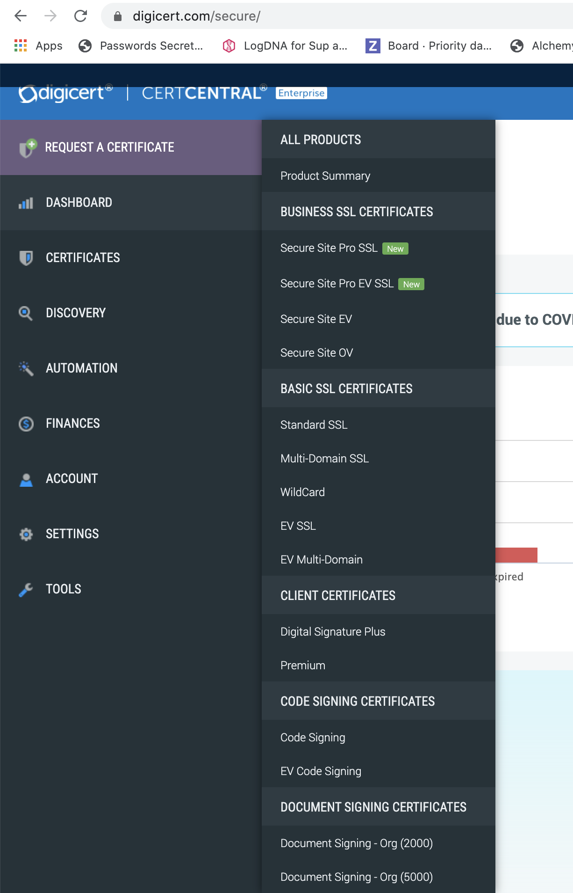
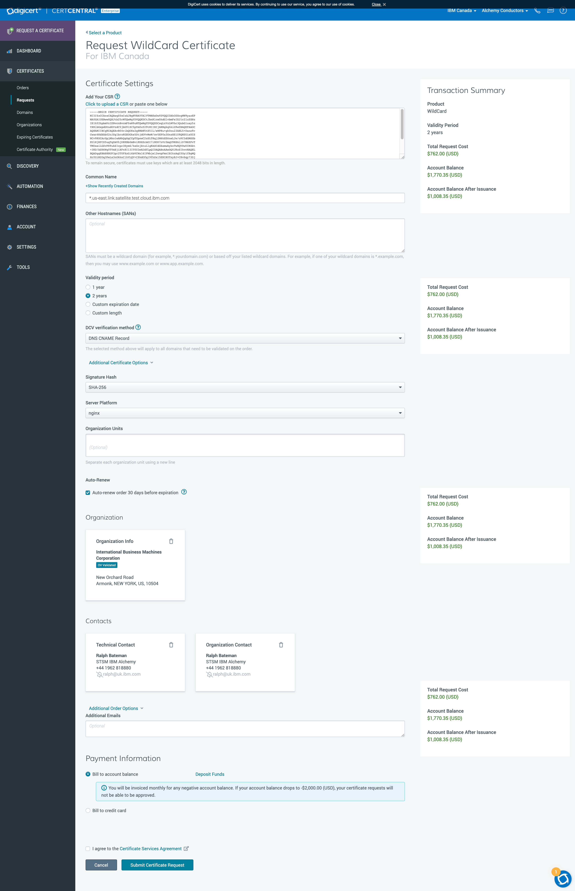
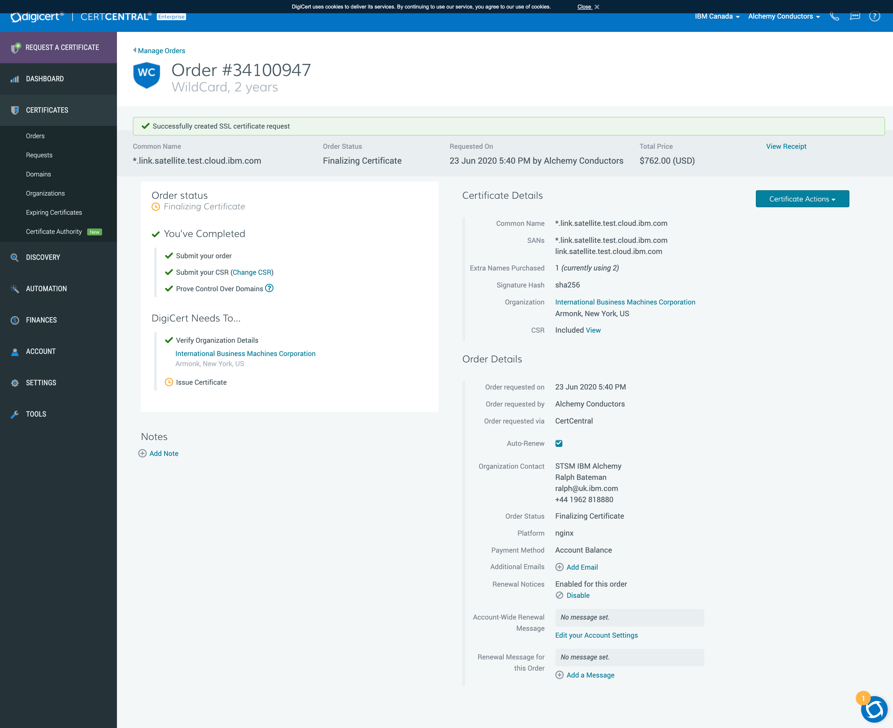
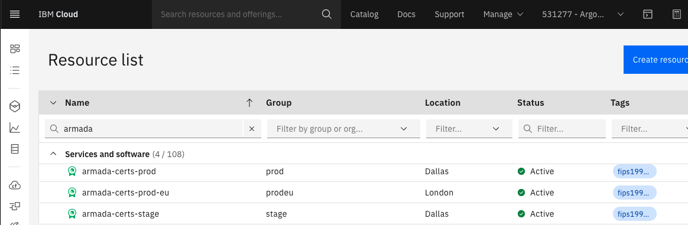
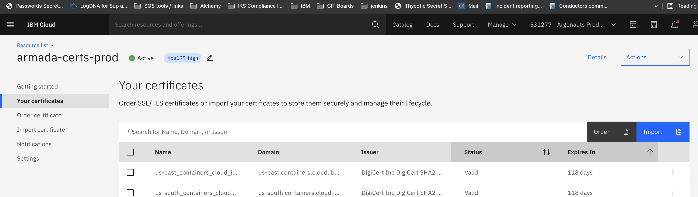
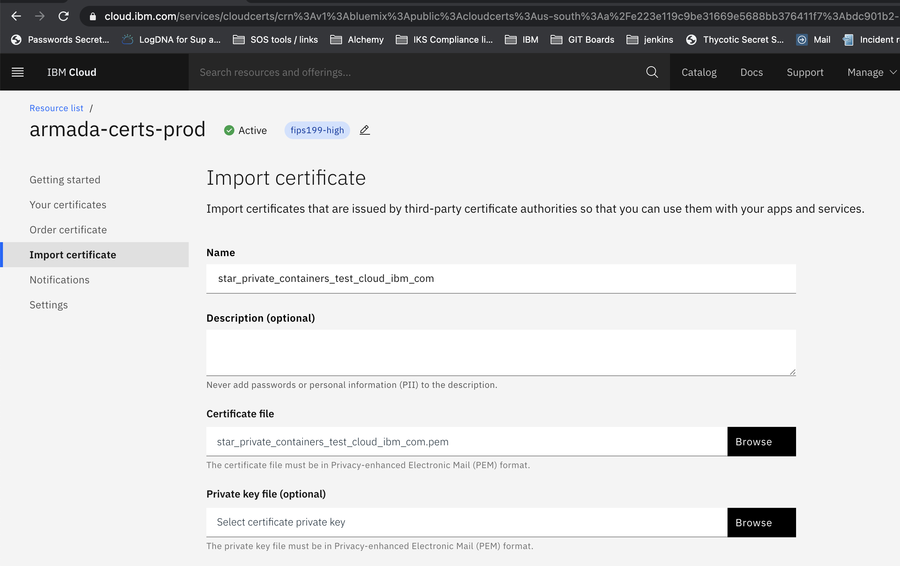
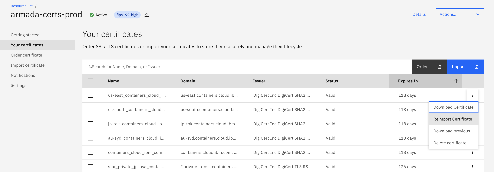

Informational
{: .label }

## Overview

This runbook describes the steps to order and renew certificates using Digicert Certificate Manager.

Digicert accounts consolidation [wiki] (https://w3.ibm.com/w3publisher/digital-certificates-wiki/digicert-accounts-consolidation)

## Detailed Information

1. Log into [Digicert website](https://www.digicert.com/account/login.php). 

   (Use `alchcond@uk.ibm.com` userid and password stored under `digicert` in [thycotic](https://pimconsole.sos.ibm.com/SecretServer/app/#/secret/27747/general))

## Ordering new certificates

### Presentation/playback

A presentation was given by SRE on this and slides can be found in [box here](https://ibm.box.com/s/yystkxnw8knq2pbcpp0ov0gyaghwjnln)

The presentation is available in the following [recording](https://ibm.box.com/s/0i76br8or8id0s01glfz9inyvq350m6y)

### Detailed information

## Creating a new CSR

When renewing or generating a new certificate, you should create a new CSR which you can then use to issue the certificate.
1. Generate a new CSR using the template script [here](https://github.ibm.com/sre-bots/shepherd/blob/903d6a5eb04dc08c6e020cd664f3fb67ce94927e/templates/CertTemplate.yaml#L17)  
_N.B. be sure to specify the region and double check to make sure the domain name is in the correct format before running the script_
2. Add the new CSR and key that are generated to armada secure (the key should be encrypted, the CSR doesn't need to be), details on how to encrypt can be found in the repo's [README](https://github.ibm.com/alchemy-containers/armada-secure/blob/master/README.md#defining-a-new-secure-environment-variable)

## Issuing/Reissuing certificates

The example here is for a wildcard certificate.  Please also note that some of the options do sometimes change, so if unsure, check with your squad lead.

1. Click on the correct certificate type. (example is wildcard on this request)
<br><br>
  <a href="images/cert_types.png">
  </a>

2. Fill out the details in the form, example values are shown in the screenshot (example is for a wildcard cert)
<br><br>
  <a href="images/cert_order.png">
  </a>
  
- Add the CSR to the box provided. This should then populate the `Common Name` box automatically. See [Creating a new CSR](#creating-a-new-csr) for instructions on generating a new one
- For `How long do you need to protect your site?` click `Select coverage length` and (unless directed otherwise) choose:
  - a **custom validity period** and set to `365 days`
- For **DCV**, select `DNS CNAME Record`
- Expand the additional options and choose `signature hash = SHA-256` and `Server platform = nginx`
- Select to `bill to account balance`. (We are no longer to use auto-renew as it does not create a new CSR)
- Add Ralph as contact

3. Place order for certificates. Order will then need to be approved by Lajos Andrejkovics.
'Organization contact'
'IBM GLOBAL ADMIN LajosAndrejkovics'
'IBM Global SSL Certificate Admin'
'SSL.Admin@bg.ibm.com'
'+421917632158'

 An order confirmation as below should be shown.
<br><br>
  <a href="images/place_order.png">
  </a>


An email will be sent to SRE Management when the transaction has gone through successfully.

4. Download the certificate

   - Server Platform: `Ngnix`
   - File Type: `A Single .pem file containing all the certs except for the root`

5. Ensure the certificate is in UNIX format  
   Lately, one or both of the certificates in the `.pem` file from Digicert have been DOS formatted - i.e. they contain carriage returns (`^M` characters) - which can cause failures when reading the certificate chain.
    - Use `dos2unix` to convert the file: e.g. `dos2unix star_us-south_containers_cloud_ibm_com.pem`
    - Check the results: `cat -vet star_us-south_containers_cloud_ibm_com.pem` and verify no `^M` characters are seen.
    
## Updating armada-secure

Sometimes it will be the SRE squads responsibility to update the expiring certificates.  
Some examples of how certificates are then updated in armada-secure can be seen by reviewing these SRE team tickets

- [Team ticket 8981 - renewing wildcard certs ](https://github.ibm.com/alchemy-conductors/team/issues/8981)

You will need to encrypt the `.pem` file that you downloaded earlier

Documentation on using and updating armada secure is available in the [armada-secure GHE Repo](https://github.ibm.com/alchemy-containers/armada-secure#defining-a-new-secure-environment-variable)

## Updating Certificate Manager

After a brand new certificate is ordered, or an existing certificate is renewed, we must add them to certificate manager in `Argonauts Production 531277 (e223e119c9be31669e5688bb376411f7) <-> 531277` account (if it is for the region eu-fr2, the certificate manager is in the account `IKS BNPP Prod (540245919b2d49d9ae40250bdf6fd929) <-> 2051458`).  This tool keeps track of our certificates and will inform us when they are about to expire.

- Navigate to [IBM Cloud](https://cloud.ibm.com/)

- Switch to `Argonauts Production 531277` (for eu-fr2, `IKS BNPP Prod 2051458`), select `Resources list` and filter on `Name = armada-certs` to find the certificate manager instances under `Services and Software`.

- We have 3 instances, `armada-certs-stage`, `armada-certs-prod` and `armada-certs-prod-eu` (eu-fr2 has one instance `armada-certs-prodfr2`)

  <a href="images/cert_manager1.png">
  </a>

- Depending which cert you've ordered, open the relevant certificate manager instance

- To add a brand new certificate, use the `Import` button and add the new certificate

  <a href="images/cert_manager2.png">
  </a>

    <a href="images/cert_manager3.png">
  </a>

- To update an existing certificate, first locate it, then using the three dots next to it, select the `reimport certificate` option, and replace the certificate with the renewed one.

   <a href="images/cert_manager4.png">
  </a>
  

## Running the named cert refresh job

When `containers` regional wildcard certificates (e.g. `*.<REGION>.containers.cloud.ibm.com` and `*.private.<REGION>.containers.cloud.ibm.com`) are renewed, ROKS clusters will not pick up the new certificate automatically, so the [armada-deploy-trigger-named-cert-refresh](https://alchemy-containers-jenkins.swg-devops.com/job/Containers-Runtime/job/armada-deploy-trigger-named-cert-refresh) Jenkins job must be run, using the steps below, to trigger the required master operations on those clusters.

1. Build the [armada-deploy-trigger-named-cert-refresh](https://alchemy-containers-jenkins.swg-devops.com/job/Containers-Runtime/job/armada-deploy-trigger-named-cert-refresh/build?delay=0sec) job in `DRY_RUN` mode with `REGION` set to the region that has the new certificate(s)
1. After the job completes, download the `results.txt` artifact, and run the command below to see how many refreshes will be required.
   ```
   grep -c "refresh requested" results.txt
   ```
1. Divide the result from the previous step by `50` to determine how many hours the job will take to run. Round up to the nearest whole number, then add 1 (for a buffer) to get the value to use in `PlannedEndTime` for your train. e.g. If there were `594` refreshes requested, then `594 / 50 = 11.88`, rounded up is `12`, plus 1 gives you `13h`.
1. Raise a train for approval to run the job. Example:
   ```
   Squad: SRE
   Title: Run the armada-deploy-trigger-named-cert-refresh job in production
   Environment: us-east
   Details: |
     Run the https://alchemy-containers-jenkins.swg-devops.com/job/Containers-Runtime/job/armada-deploy-trigger-named-cert-refresh/ 
     job to update the named certificates for eligible ROKS4 clusters. 
     Required for ROKS4 clusters in the region to pick up the new TLS certificate before the current one expires
     <LINK TO TEAM ISSUE FOR THE CERTIFICATE RENEWAL>
   Risk: low
   PlannedStartTime: now
   PlannedEndTime: now + 13h
   Ops: true
   BackoutPlan: |
     Investigate and resolve the name_cert_refresh master operation failure on the affected cluster
   ```
1. Build the [armada-deploy-trigger-named-cert-refresh](https://alchemy-containers-jenkins.swg-devops.com/job/Containers-Runtime/job/armada-deploy-trigger-named-cert-refresh/build?delay=0sec) job with `REGION` set to the region that has the new certificate(s), `PROD_TRAIN_REQUEST_ID` set to the train you raised, and `DRY_RUN` de-selected.


## Debugging and validating certificates

Useful commands to check certificates once they have been successfully updated in armada-secure and the certificate rolled out.

1. To review the certificate being used on tugboats you can run these commands

- Login to the tugboat [see accessing tugboats for information on how to do this](./armada/armada-tugboats.html#access-the-tugboats)
- Obtain the origin cert using this command:  `kubectl get -n armada secret armada-origin-cert -o jsonpath='{.data.tls\.crt}'`
- Place the origin cert into a file on your local machine then use this command to decode and view the certificate  
`cat cert | base64 -D | openssl x509 -text`

This should give details about the certificate which should match the one renewed, i.e. expiry dates etc.

2. Check that the certs have successfully updated by using the below commands and checking the start/end date of the cert.

`openssl s_client -showcerts -connect containers.test.testcloudibmcom.zone.akadns.net:443 2> /dev/null | openssl x509 -noout -subject -dates subject= /C=US/ST=New York/L=Armonk/O=International Business Machines Corporation/CN=*.containers.test.cloud.ibm.com subject= /C=US/ST=New York/L=Armonk/O=International Business Machines Corporation/CN=<domain-name>`


`curl -k -v <bootstrap-url>`

| Region      | Bootstrap URL |
| ----------- | ----------- |
| ap-north      | https://origin.jp-tok.containers.cloud.ibm.com/bootstrap/firstboot       |
| ap-south   | https://origin.au-syd.containers.cloud.ibm.com/bootstrap/firstboot        |
| us-east   | https://origin.us-east.containers.cloud.ibm.com/bootstrap/firstboot       |
| us-south   | https://origin.us-south.containers.cloud.ibm.com/bootstrap/firstboot        |
| eu-gb      | https://origin.eu-gb.containers.cloud.ibm.com/bootstrap/firstboot       |
| eu-central   | https://origin.eu-de.containers.cloud.ibm.com/bootstrap/firstboot        |
| ca-tor      | https://origin.ca-tor.containers.cloud.ibm.com/bootstrap/firstboot       |
| br-sao   | https://origin.br-sao.containers.cloud.ibm.com/bootstrap/firstboot        |
| jp-osa      | https://origin.jp-osa.containers.cloud.ibm.com/bootstrap/firstboot       |
| eu-fr2   | https://origin.eu-fr2.containers.cloud.ibm.com/bootstrap/firstboot        |


## Escalation Policy

If you are unable to run any of the above steps, escalate to [#conductors](https://ibm-argonauts.slack.com/archives/C54H08JSK/p1639669013349900)
